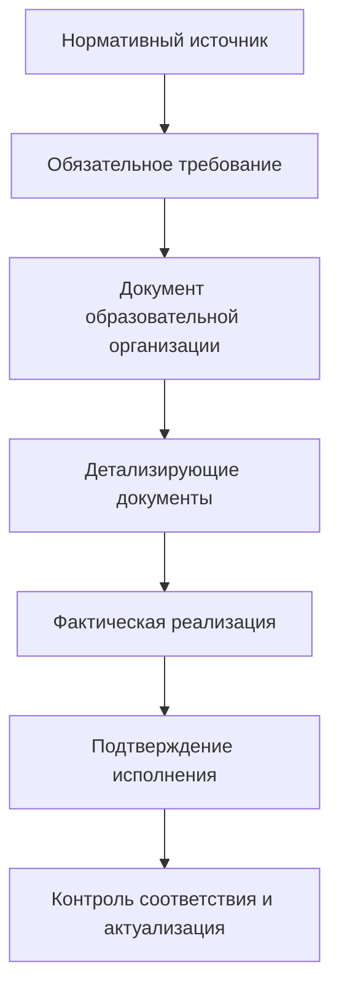
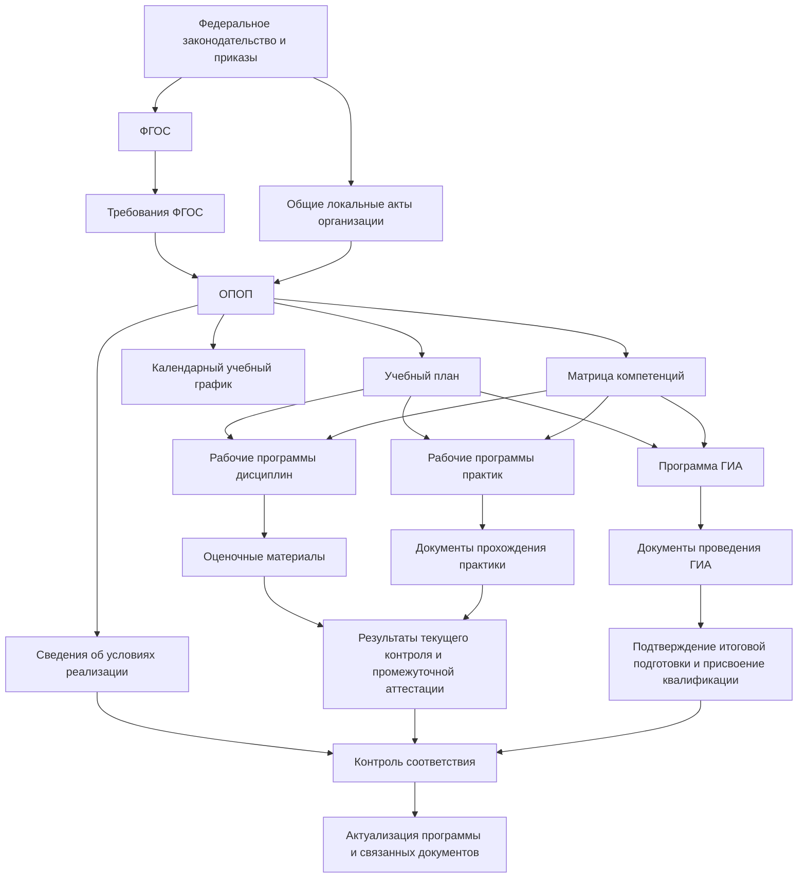
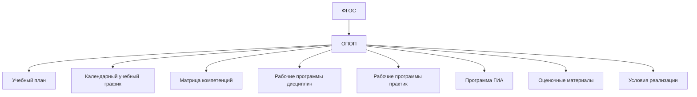
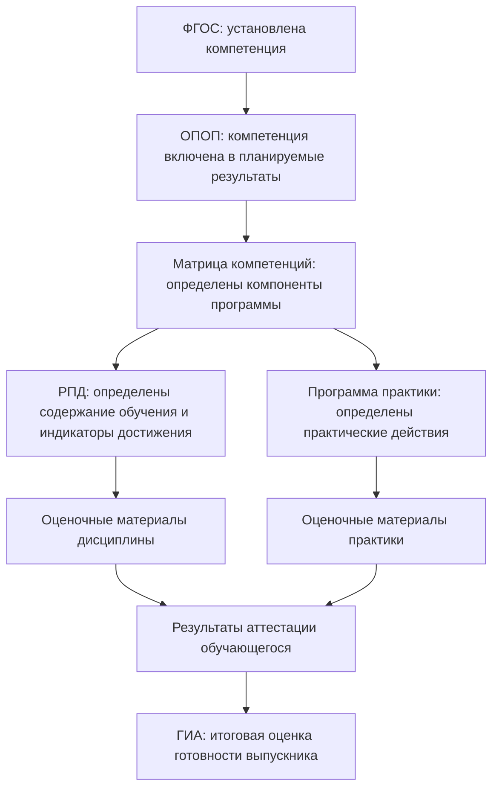
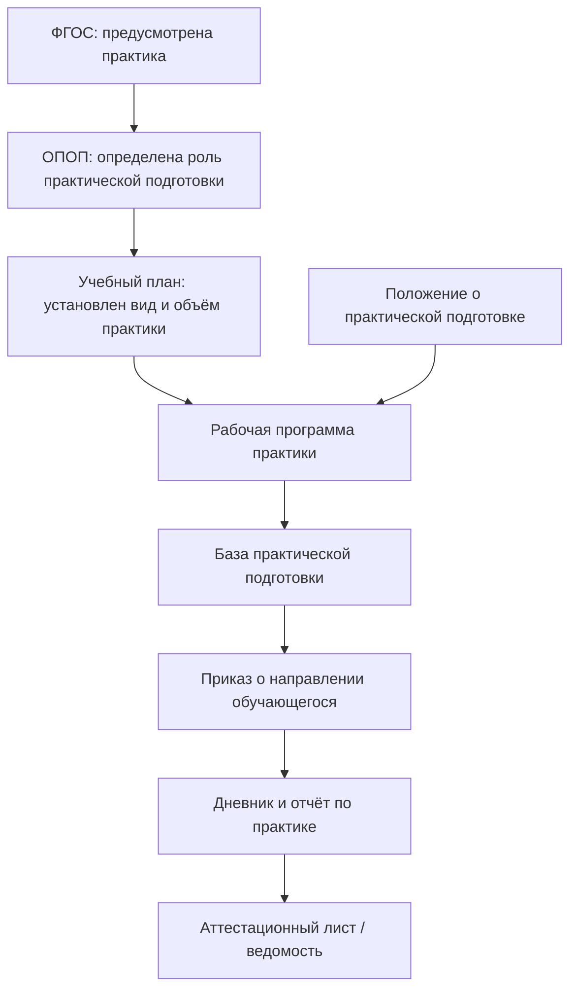

# Система документов образовательной деятельности: общий обзор

## 1. Назначение страницы

Данная страница описывает общую логику возникновения и взаимосвязи документов, используемых образовательной организацией при реализации образовательных программ.

Основная задача страницы — дать новому сотруднику упрощённое, но системное понимание:

- откуда возникают требования к образовательной деятельности;
- почему образовательная организация создаёт собственные документы;
- какую функцию выполняет каждый уровень документов;
- как требование проходит путь от нормативного источника до фактического подтверждения его исполнения.

В рамках данного репозитория основное внимание уделяется образовательным программам высшего образования и трассировке требований федеральных государственных образовательных стандартов.

---

## 2. Главный принцип модели

Образовательная деятельность не регулируется одним документом.

ФГОС устанавливает обязательные требования к образовательной программе, но сам по себе не описывает во всех деталях, как конкретный университет будет организовывать обучение, какие дисциплины включит в программу, в какие семестры они будут реализованы, какими заданиями будут проверяться результаты обучения и какими документами будет подтверждено фактическое исполнение требований.

Поэтому образовательная организация создаёт систему взаимосвязанных документов.

Упрощённо эта логика выглядит так:



Например, ФГОС может установить обязательность формирования определённой компетенции выпускника. Образовательная организация должна включить эту компетенцию в образовательную программу, определить дисциплины и практики, посредством которых она формируется, разработать оценочные материалы, провести обучение и зафиксировать результаты контроля.

---

## 3. От модели «цель и средства» к модели трассировки

Для первоначального понимания систему документов можно представить как последовательность целей и средств:

```text
ФГОС устанавливает требования к подготовке выпускника
→ образовательная программа определяет способ реализации этих требований
→ учебный план и иные компоненты детализируют программу
→ документы образовательного процесса подтверждают её фактическое исполнение
```

Однако для аналитического описания точнее использовать следующие понятия:

| Понятие | Смысл |
|---|---|
| **Нормативное основание** | Документ или норма, из-за которых возникает необходимость создать последующий документ |
| **Назначение документа** | Какую функцию выполняет документ в системе образовательной деятельности |
| **Реализуемые требования** | Какие обязательные положения документ принимает на вход и должен обеспечить |
| **Механизм реализации** | Посредством каких более детальных документов, процедур и данных требование исполняется |
| **Подтверждение исполнения** | Какими документами или сведениями можно доказать выполнение требования |
| **Контроль и актуализация** | Как выявляется несоответствие и какие документы требуется изменить |

Таким образом, в репозитории каждый документ будет рассматриваться не изолированно, а как элемент цепочки исполнения требований.

---

## 4. Основные уровни документов

### 4.1. Нормативные источники

Нормативные источники устанавливают обязательные требования, которые образовательная организация должна учитывать при разработке и реализации образовательных программ.

Примеры:

- Федеральный закон «Об образовании в Российской Федерации»;
- федеральный государственный образовательный стандарт;
- профессиональные стандарты, если они применимы;
- приказы, устанавливающие порядок организации образовательной деятельности;
- приказы, регулирующие практическую подготовку и государственную итоговую аттестацию;
- требования к лицензированию и государственной аккредитации.

Нормативный источник отвечает на вопрос:

> Какие обязательные требования должна учитывать образовательная организация?

---

### 4.2. Общие документы образовательной организации

Общие документы образовательной организации устанавливают единые правила, применимые ко всем образовательным программам или к определённой их группе.

Примеры:

- положение о порядке разработки и утверждения образовательных программ;
- положение о порядке разработки учебных планов;
- положение о рабочих программах дисциплин и практик;
- положение о текущем контроле и промежуточной аттестации;
- положение о практической подготовке;
- положение о государственной итоговой аттестации;
- положение об электронной информационно-образовательной среде;
- положение о внутренней оценке качества образования.

Такой документ отвечает на вопрос:

> По каким единым правилам университет создаёт и реализует свои образовательные программы?

---

### 4.3. Документы конкретной образовательной программы

Документы конкретной образовательной программы описывают, как требования нормативных источников реализуются для определённого направления подготовки или специальности, уровня образования, формы обучения и набора обучающихся.

Примеры:

- основная профессиональная образовательная программа;
- учебный план;
- календарный учебный график;
- матрица компетенций;
- рабочие программы дисциплин;
- рабочие программы практик;
- программа государственной итоговой аттестации;
- оценочные материалы;
- методические материалы;
- рабочая программа воспитания;
- календарный план воспитательной работы.

Такой документ отвечает на вопрос:

> Как именно данная образовательная программа реализует установленные требования?

---

### 4.4. Документы фактической реализации

Документы фактической реализации появляются в ходе образовательного процесса и подтверждают, что предусмотренные программой действия действительно выполнены.

Примеры:

- приказ об утверждении образовательной программы;
- приказ об утверждении учебного плана;
- расписание занятий;
- журналы проведения занятий;
- экзаменационные и зачётные ведомости;
- приказы о направлении на практику;
- дневники и отчёты по практике;
- приказы о допуске к государственной итоговой аттестации;
- протоколы государственной экзаменационной комиссии;
- приказы о завершении обучения;
- документы об образовании и квалификации.

Такой документ отвечает на вопрос:

> Что подтверждает, что программа действительно была реализована?

---

### 4.5. Документы и сведения об условиях реализации

Отдельную группу составляют документы и сведения, подтверждающие наличие необходимых условий для реализации образовательной программы.

Примеры:

- сведения о кадровом обеспечении;
- сведения об образовании и квалификации преподавателей;
- сведения о помещениях и оборудовании;
- сведения о базах практической подготовки;
- договоры с внешними организациями;
- сведения об электронной информационно-образовательной среде;
- сведения об электронных библиотечных ресурсах.

Такие документы отвечают на вопрос:

> Обеспечила ли организация необходимые условия для реализации программы?

---

### 4.6. Документы контроля и актуализации

Документы контроля позволяют определить, соответствует ли программа обязательным требованиям и требуется ли её изменение.

Примеры:

- отчёты о внутренней оценке качества образовательной программы;
- отчёты о самообследовании;
- результаты аккредитационного мониторинга;
- материалы государственной аккредитации;
- приказы о внесении изменений в образовательную программу;
- новые редакции учебных планов и рабочих программ.

Такой документ отвечает на вопрос:

> Как организация выявляет несоответствия и поддерживает документы в актуальном состоянии?

---

## 5. Базовая цепочка от ФГОС до результата обучения

Для основной профессиональной образовательной программы высшего образования базовая система документов может быть представлена следующим образом:



---

## 6. Роль ФГОС в системе документов

Федеральный государственный образовательный стандарт является одним из центральных нормативных источников для образовательной программы.

В рамках модели трассировки ФГОС рассматривается как документ, устанавливающий обязательные требования к:

- структуре образовательной программы и её объёму;
- условиям реализации образовательной программы;
- результатам освоения образовательной программы;
- срокам получения образования.

ФГОС не заменяет собой образовательную программу конкретной организации.

ФГОС отвечает на вопрос:

> Какие обязательные параметры и результаты должна обеспечить образовательная программа?

Образовательная организация отвечает на другой вопрос:

> Каким способом эти требования будут реализованы в конкретной программе?

---

## 7. Роль образовательной программы

В рамках данного репозитория под ОПОП понимается основная профессиональная образовательная программа, разработанная образовательной организацией для конкретного направления подготовки или специальности.

ОПОП является центральным документом внутреннего уровня, связывающим требования ФГОС с практической организацией обучения.

ОПОП:

- фиксирует нормативные основания реализации программы;
- определяет общую характеристику программы;
- устанавливает планируемые результаты освоения;
- отражает структуру подготовки;
- связывает программу с учебным планом, практиками и государственной итоговой аттестацией;
- определяет требования к условиям реализации;
- объединяет или связывает между собой документы, необходимые для реализации программы.

ОПОП не должна рассматриваться как документ, в который механически включается всё содержание образовательной деятельности. Она является ядром комплекта документов, часть положений которого детализируется в отдельных документах.



---

## 8. Почему система документов не является простым деревом

На первый взгляд система документов может выглядеть как последовательная иерархия:

```text
ФГОС
→ ОПОП
→ Учебный план
→ Рабочая программа дисциплины
→ Оценочные материалы
→ Результат обучения
```

Однако в действительности связи между документами являются множественными.

### Одно требование может реализовываться несколькими документами

Например, требование о формировании компетенции может отражаться одновременно в:

- ОПОП;
- матрице компетенций;
- рабочей программе дисциплины;
- рабочей программе практики;
- программе ГИА;
- оценочных материалах.

### Один документ может реализовывать несколько требований

Например, учебный план может одновременно отражать:

- общий объём образовательной программы;
- структуру блоков;
- перечень дисциплин;
- объём практической подготовки;
- наличие государственной итоговой аттестации;
- формы промежуточной аттестации.

### Документ может быть связан и с ФГОС, и с локальными актами

Например, программа практики может одновременно формироваться на основании:

- требований ФГОС;
- образовательной программы;
- учебного плана;
- матрицы компетенций;
- положения организации о практической подготовке.

Поэтому модель трассировки должна допускать связи типа «многие ко многим».

---

## 9. Основные типы связей трассировки

| Тип связи | Содержание связи | Пример |
|---|---|---|
| `based_on` | Документ создан на основании другого документа или нормативного источника | ОПОП основана на ФГОС |
| `implements` | Документ реализует отдельное требование | Учебный план реализует требование к структуре программы |
| `details` | Документ детализирует положение более общего документа | РПД детализирует дисциплину учебного плана |
| `assesses` | Документ содержит механизм проверки результата | Оценочные материалы проверяют достижение компетенции |
| `evidences` | Документ подтверждает факт исполнения | Ведомость подтверждает проведение аттестации |
| `applies_to` | Общий документ применяется к конкретной программе | Положение о ГИА применяется к ОПОП |
| `approves` | Документ вводит другой документ в действие | Приказ утверждает учебный план |
| `updates` | Документ изменяет ранее принятую редакцию | Приказ вносит изменения в ОПОП |
| `requires_update_of` | Изменение одного документа требует пересмотра других | Новая редакция ФГОС требует проверки учебного плана |

---

## 10. Пример трассировки требования к компетенции

### Исходная ситуация

ФГОС устанавливает обязательный результат подготовки выпускника в виде компетенции.

### Цепочка реализации



### Табличное представление

| Уровень | Документ | Функция |
|---|---|---|
| Нормативный источник | ФГОС | Устанавливает обязательную компетенцию |
| Документ программы | ОПОП | Включает компетенцию в результаты освоения программы |
| Документ распределения | Матрица компетенций | Определяет, где формируется компетенция |
| Документ детализации | Рабочая программа дисциплины или практики | Описывает содержание подготовки |
| Документ оценки | Оценочные материалы | Определяет способ проверки результата |
| Документ реализации | Ведомость, отчёт, протокол | Подтверждает прохождение контроля |
| Итоговый документ | Документы ГИА | Подтверждает итоговую готовность выпускника |

---

## 11. Пример трассировки требования к практической подготовке

### Исходная ситуация

ФГОС предусматривает наличие практики в структуре образовательной программы.

### Цепочка реализации



### Табличное представление

| Уровень | Документ | Функция |
|---|---|---|
| Нормативный источник | ФГОС | Устанавливает наличие практики в структуре программы |
| Документ программы | ОПОП | Определяет место практики в подготовке выпускника |
| Документ планирования | Учебный план | Устанавливает вид, объём и период практики |
| Общий локальный акт | Положение о практической подготовке | Определяет единые правила организации практики |
| Документ детализации | Рабочая программа практики | Описывает задачи, компетенции и оценивание |
| Документ обеспечения | Договор или сведения о базе практики | Подтверждает возможность проведения практики |
| Документ реализации | Приказ, дневник, отчёт | Подтверждает фактическое прохождение практики |
| Документ оценки | Аттестационный лист или ведомость | Подтверждает результат освоения практики |

---

## 12. Как должна использоваться трассировка

Трассировка требований необходима не только для описания документов, но и для практической работы образовательной организации.

Она позволяет:

- определить, каким документом реализуется каждое обязательное требование;
- выявить требования, для которых отсутствует документ реализации;
- понять, какие документы необходимо изменить при обновлении ФГОС;
- подготовить комплект подтверждений для внутреннего контроля или внешней проверки;
- связать документы образовательной программы с будущей информационной системой;
- объяснить новым сотрудникам происхождение и назначение документов.

Пример практического вопроса:

> Изменилось требование ФГОС к объёму практической подготовки. Какие документы требуется проверить?

Ответ в модели трассировки может включать:

```text
ФГОС
→ ОПОП
→ Учебный план
→ Календарный учебный график
→ Рабочие программы практик
→ Договоры и сведения о базах практики
→ Документы текущей реализации для соответствующих наборов обучающихся
```

---

## 13. Границы текущей модели

На первом этапе репозиторий описывает общую модель трассировки для образовательных программ высшего образования.

В первичную область исследования входят:

- ФГОС;
- ОПОП;
- учебный план;
- календарный учебный график;
- матрица компетенций;
- рабочие программы дисциплин;
- рабочие программы практик;
- программа ГИА;
- оценочные материалы;
- документы подтверждения реализации.

На следующих этапах модель может быть дополнена разделами:

- лицензирование образовательной деятельности;
- государственная аккредитация;
- кадровые условия реализации;
- материально-техническое обеспечение;
- электронная информационно-образовательная среда;
- специфика медицинских и фармацевтических образовательных программ;
- автоматизация модели трассировки в информационной системе.

---

## 14. Итоговая схема понимания

Основная идея репозитория может быть сведена к следующей формуле:

```text
Нормативный источник
→ формирует обязательное требование
→ требование реализуется документом образовательной организации
→ документ детализируется в компонентах образовательной программы
→ компоненты реализуются в образовательном процессе
→ исполнение подтверждается документами и сведениями
→ результаты проверяются и при необходимости требуют актуализации документов
```

Таким образом, документ рассматривается не просто как файл или локальный акт, а как элемент системы обеспечения соответствия образовательной деятельности установленным требованиям.

---

## 15. Нормативная опора страницы

При дальнейшем развитии репозитория положения данной страницы должны уточняться с учётом актуальных редакций следующих документов:

| Документ | Значение для модели |
|---|---|
| Федеральный закон № 273-ФЗ «Об образовании в Российской Федерации» | Устанавливает общую правовую основу образовательных программ, ФГОС и локальных нормативных актов |
| ФГОС по конкретному направлению подготовки или специальности | Содержит требования, подлежащие трассировке |
| Приказ Минобрнауки России № 245 | Определяет порядок организации образовательной деятельности по программам бакалавриата, специалитета и магистратуры |
| Нормативные акты о практической подготовке | Используются при детализации документов практики |
| Нормативные акты о государственной итоговой аттестации | Используются при детализации документов ГИА |

Конкретные нормативные источники и их роль будут описываться в разделе `docs/01-regulatory-sources`.
