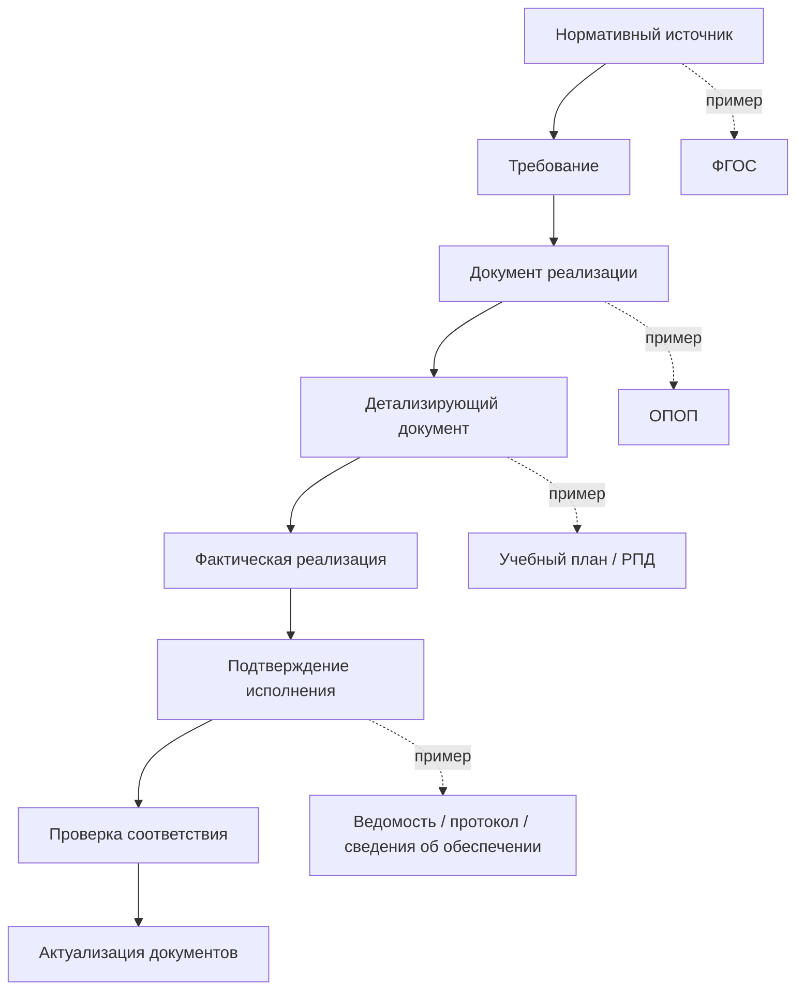

# Терминология и правила использования понятий

## 1. Назначение страницы

Данная страница фиксирует основные термины, используемые в репозитории для описания системы документов образовательной деятельности и трассировки требований.

Цель страницы — обеспечить единое понимание понятий:

- нормативный источник;
- ФГОС;
- образовательная программа;
- ОПОП;
- локальный нормативный акт;
- требование;
- документ реализации;
- подтверждение исполнения;
- связь трассировки;
- статус покрытия требования.

В репозитории используются две группы понятий:

1. **Нормативные термины** — понятия, закреплённые законодательством или нормативными актами в сфере образования.
2. **Аналитические термины проекта** — понятия, введённые для описания связей между требованиями, документами и подтверждениями их исполнения.

Аналитические термины не заменяют юридические формулировки и используются как инструмент системного анализа и последующей автоматизации.

---

## 2. Нормативные и аналитические термины

| Вид термина | Что означает | Примеры |
|---|---|---|
| Нормативный термин | Понятие, используемое в законодательстве и нормативных актах | ФГОС, образовательная программа, образовательная организация, локальный нормативный акт |
| Аналитический термин | Понятие, используемое в данном репозитории для построения модели связей | Атомарное требование, документ реализации, подтверждение исполнения, покрытие требования |
| Прикладной термин | Понятие, используемое в деятельности образовательной организации или информационной системе | Версия ОПОП, карточка документа, статус проверки, объект учёта |

---

# 3. Нормативные термины

## 3.1. Образование

**Образование** — процесс воспитания и обучения, в результате которого человек приобретает знания, умения, навыки, опыт деятельности и компетенции, необходимые для личностного и профессионального развития.

### Роль понятия в репозитории

Данный репозиторий рассматривает не весь процесс образования, а его документальное и нормативное обеспечение:

```text
требования к образованию
→ документы образовательной организации
→ реализация образовательной программы
→ подтверждение достигнутых результатов
```

---

## 3.2. Образовательная организация

**Образовательная организация** — организация, осуществляющая образовательную деятельность на основании лицензии в качестве основного вида деятельности.

### Роль понятия в репозитории

В рамках данного проекта образовательная организация рассматривается как субъект, который:

- принимает внешние нормативные требования;
- разрабатывает собственные документы;
- реализует образовательные программы;
- подтверждает соблюдение установленных требований;
- актуализирует документы при изменении нормативной базы.

Примером образовательной организации в рамках модели может выступать университет, реализующий программы высшего образования.

---

## 3.3. Федеральный государственный образовательный стандарт

**Федеральный государственный образовательный стандарт**, или **ФГОС**, — нормативный документ, устанавливающий обязательные требования к образовательным программам соответствующего уровня и направления подготовки или специальности.

Для образовательных программ высшего образования ФГОС устанавливает требования к:

- структуре образовательной программы и её объёму;
- условиям реализации программы;
- результатам освоения программы;
- срокам получения образования.

### Роль ФГОС в репозитории

ФГОС является одним из главных исходных нормативных источников для построения трассировки.

Он отвечает на вопрос:

> Какие обязательные требования должна выполнить образовательная программа?

ФГОС не описывает полностью внутреннюю организацию учебного процесса конкретного университета. На его основе образовательная организация разрабатывает собственную образовательную программу и связанные документы.

### Пример

```text
ФГОС устанавливает обязательную компетенцию
→ образовательная организация включает её в ОПОП
→ распределяет её формирование по дисциплинам и практикам
→ создаёт оценочные материалы
→ фиксирует результаты освоения студентом
```

---

## 3.4. Требования ФГОС

**Требования ФГОС** — обязательные положения стандарта, которым должна соответствовать образовательная программа и условия её реализации.

### Основные группы требований

| Группа требований | Что включает |
|---|---|
| Требования к структуре программы | Состав блоков программы, соотношение частей, общий объём |
| Требования к результатам освоения | Компетенции и иные планируемые результаты подготовки выпускника |
| Требования к условиям реализации | Кадровые, материально-технические, финансовые, информационные и иные условия |
| Требования к срокам получения образования | Продолжительность освоения программы с учётом формы обучения и иных условий |

### Роль в трассировке

В рамках репозитория ФГОС рассматривается не только как документ целиком, но и как источник отдельных требований, каждое из которых должно быть связано с документами организации и подтверждениями исполнения.

---

## 3.5. Образовательная программа

**Образовательная программа** — комплекс основных характеристик образования и организационно-педагогических условий, посредством которых организуется обучение по определённому направлению или специальности.

В образовательную программу могут входить:

- учебный план;
- календарный учебный график;
- рабочие программы дисциплин;
- программы практик;
- программа государственной итоговой аттестации;
- оценочные материалы;
- методические материалы;
- рабочая программа воспитания;
- календарный план воспитательной работы;
- иные компоненты, необходимые для реализации программы.

### Роль в репозитории

Образовательная программа рассматривается как центральный внутренний объект, посредством которого организация преобразует требования ФГОС в конкретную модель подготовки обучающихся.

Она отвечает на вопрос:

> Каким образом конкретная образовательная организация будет реализовывать обязательные требования?

---

## 3.6. Основная профессиональная образовательная программа

**Основная профессиональная образовательная программа**, или **ОПОП**, — образовательная программа, направленная на получение профессионального образования определённого уровня по конкретному направлению подготовки или специальности.

В рамках текущей версии репозитория под ОПОП преимущественно понимаются программы высшего образования:

- программа бакалавриата;
- программа специалитета;
- программа магистратуры.

### Роль ОПОП в модели

ОПОП связывает:

- требования ФГОС;
- профессиональные стандарты, если они применимы;
- локальные нормативные акты организации;
- учебный план;
- матрицу компетенций;
- рабочие программы дисциплин и практик;
- программу ГИА;
- оценочные материалы;
- сведения об условиях реализации.

### Важно

ОПОП не следует понимать как единственный файл, в котором обязательно физически содержатся все сведения о программе.

В данном репозитории ОПОП рассматривается как **центральный документ или комплект взаимосвязанных документов конкретной образовательной программы**.

---

## 3.7. Локальный нормативный акт

**Локальный нормативный акт**, или **ЛНА**, — внутренний документ образовательной организации, устанавливающий обязательные правила по вопросам её деятельности в пределах компетенции организации.

### Примеры ЛНА

- положение о порядке разработки и утверждения ОПОП;
- положение о текущем контроле и промежуточной аттестации;
- положение о практической подготовке;
- положение о государственной итоговой аттестации;
- положение об электронной информационно-образовательной среде;
- положение об индивидуальном учебном плане.

### Роль ЛНА в модели

ЛНА устанавливает общие правила, применяемые к одной или нескольким образовательным программам.

Он отличается от документа конкретной программы:

| Локальный нормативный акт | Документ конкретной программы |
|---|---|
| Устанавливает общие правила | Описывает конкретную реализацию |
| Может применяться ко многим ОПОП | Относится к конкретной ОПОП |
| Например, положение о ГИА | Например, программа ГИА по специальности |
| Например, положение о практике | Например, программа производственной практики |

---

## 3.8. Учебный план

**Учебный план** — документ образовательной программы, определяющий перечень и распределение учебных компонентов по периодам обучения.

### Обычно учебный план содержит

- дисциплины и модули;
- практики;
- государственную итоговую аттестацию;
- факультативные дисциплины;
- объём в зачётных единицах и часах;
- распределение по семестрам или курсам;
- формы промежуточной аттестации.

### Роль в трассировке

Учебный план является одним из основных документов, реализующих требования ФГОС к структуре и объёму программы.

Пример:

```text
ФГОС устанавливает общий объём программы и наличие блока практики
→ ОПОП фиксирует структуру подготовки
→ учебный план содержит конкретные дисциплины, практики, объёмы и формы контроля
```

---

## 3.9. Календарный учебный график

**Календарный учебный график** — документ, распределяющий этапы реализации образовательной программы во времени.

### Может включать

- периоды теоретического обучения;
- экзаменационные сессии;
- практики;
- каникулы;
- государственную итоговую аттестацию.

### Роль в трассировке

Календарный учебный график подтверждает, что структура обучения, установленная учебным планом, может быть реализована в установленный срок.

---

## 3.10. Компетенция

**Компетенция** — планируемый результат подготовки выпускника, отражающий его способность применять знания, умения и опыт деятельности для решения определённых задач.

### В рамках образовательной программы могут использоваться

| Вид компетенции | Общее назначение |
|---|---|
| Универсальные компетенции | Общие способности выпускника, не ограниченные одной профессиональной областью |
| Общепрофессиональные компетенции | Результаты, значимые для укрупнённой профессиональной области или направления подготовки |
| Профессиональные компетенции | Результаты, связанные с конкретной профессиональной деятельностью |

### Роль в трассировке

Компетенция проходит через несколько уровней документов:

```text
ФГОС
→ ОПОП
→ Матрица компетенций
→ Рабочая программа дисциплины или практики
→ Оценочные материалы
→ Результат аттестации
→ ГИА
```

---

## 3.11. Матрица компетенций

**Матрица компетенций** — документ или структурированное представление, показывающее, какими компонентами образовательной программы формируются и оцениваются компетенции.

### Типовая связь

| Компетенция | Дисциплина | Практика | ГИА |
|---|---|---|---|
| УК-1 | История, философия, исследовательская работа | Учебная практика | Может оцениваться в составе итоговой работы |
| ОПК-1 | Профильные дисциплины | Производственная практика | Проверяется на ГИА |

### Роль в трассировке

Матрица компетенций является связующим документом между:

- результатами, установленными ФГОС и ОПОП;
- учебными компонентами;
- оценочными материалами;
- итоговой проверкой подготовки выпускника.

---

## 3.12. Рабочая программа дисциплины

**Рабочая программа дисциплины**, или **РПД**, — документ, описывающий содержание и порядок реализации конкретной дисциплины или модуля образовательной программы.

### РПД может содержать

- место дисциплины в образовательной программе;
- объём дисциплины;
- формируемые компетенции и индикаторы их достижения;
- тематическое содержание;
- виды учебных занятий;
- самостоятельную работу;
- формы текущего контроля и промежуточной аттестации;
- учебно-методическое и ресурсное обеспечение.

### Роль в трассировке

РПД детализирует, каким образом отдельная дисциплина участвует в формировании результатов, предусмотренных ОПОП.

---

## 3.13. Рабочая программа практики

**Рабочая программа практики** — документ, описывающий содержание, организацию и оценку конкретного вида практической подготовки.

### Может содержать

- вид и тип практики;
- объём и сроки проведения;
- формируемые компетенции;
- содержание деятельности обучающегося;
- место прохождения практики;
- формы отчётности;
- критерии оценки результатов.

### Роль в трассировке

Рабочая программа практики детализирует реализацию требований к практической подготовке и связывается с документами, подтверждающими фактическое прохождение практики.

---

## 3.14. Государственная итоговая аттестация

**Государственная итоговая аттестация**, или **ГИА**, — процедура итоговой оценки соответствия подготовки выпускника требованиям образовательной программы и применимым нормативным требованиям.

### Документы, связанные с ГИА

- положение о ГИА;
- программа ГИА по конкретной образовательной программе;
- оценочные материалы ГИА;
- приказ о допуске обучающихся к ГИА;
- документы о формировании государственной экзаменационной комиссии;
- протоколы заседаний комиссии;
- приказ о завершении обучения;
- документ об образовании и квалификации.

### Роль в трассировке

ГИА завершает цепочку проверки результатов освоения образовательной программы.

---

## 3.15. Оценочные материалы

**Оценочные материалы** — совокупность заданий, критериев и процедур, предназначенных для проверки достижения планируемых результатов освоения образовательной программы или её отдельных компонентов.

В деятельности образовательных организаций также может использоваться термин **фонд оценочных средств**, или **ФОС**.

### Оценочные материалы могут относиться к

- дисциплине;
- модулю;
- практике;
- промежуточной аттестации;
- государственной итоговой аттестации.

### Роль в трассировке

Оценочные материалы обеспечивают переход от заявленного результата к его проверке:

```text
Компетенция предусмотрена программой
→ дисциплина или практика участвует в её формировании
→ оценочные материалы позволяют проверить достижение результата
→ результат фиксируется в документах аттестации
```

---

# 4. Аналитические термины проекта

## 4.1. Нормативный источник

**Нормативный источник** — внешний или внутренний документ, содержащий положение, которое является основанием для создания, изменения или проверки другого документа.

### Примеры

| Нормативный источник | Что может возникнуть на его основе |
|---|---|
| Федеральный закон | Локальные нормативные акты организации |
| ФГОС | ОПОП, учебный план, матрица компетенций |
| Порядок проведения ГИА | Положение о ГИА и программа ГИА |
| Положение организации о практике | Рабочие программы практик и документы их реализации |

### Примечание

Не каждый нормативный источник обязательно порождает отдельный новый документ. Иногда его требование реализуется в уже существующем документе или подтверждается сведениями информационной системы.

---

## 4.2. Требование

**Требование** — положение нормативного источника или документа более высокого уровня, которое должно быть реализовано, учтено либо подтверждено в документах и деятельности образовательной организации.

### Примеры требований

- образовательная программа должна иметь определённый общий объём;
- программа должна включать практическую подготовку;
- выпускник должен освоить установленную компетенцию;
- организация должна обеспечить необходимые кадровые условия;
- программа должна предусматривать ГИА.

### Роль в модели

Требование является центральной единицей трассировки.

Именно к требованию должны привязываться:

- источник его возникновения;
- документ реализации;
- подтверждение исполнения;
- результат проверки;
- необходимость актуализации.

---

## 4.3. Атомарное требование

**Атомарное требование** — отдельное, достаточно конкретное и проверяемое требование, которое можно связать с документом реализации и проверить на исполнение.

### Почему необходима атомарность

Формулировка «образовательная программа должна соответствовать ФГОС» слишком общая для практической трассировки.

Её необходимо разложить на отдельные проверяемые положения.

### Пример декомпозиции

| Общее положение | Атомарные требования |
|---|---|
| Программа соответствует структуре ФГОС | Установлен общий объём программы; предусмотрен блок дисциплин; предусмотрен блок практик; предусмотрена ГИА |
| Программа обеспечивает результаты освоения | Включена УК-1; определены компоненты, формирующие УК-1; предусмотрены средства оценки УК-1 |
| Обеспечены условия реализации | Имеются требуемые помещения; имеется оборудование; подтверждён кадровый состав |

### Пример идентификаторов

```text
FGOS-VO-44.03.04-STRUCT-001
FGOS-VO-44.03.04-RESULT-UK-01
FGOS-VO-44.03.04-COND-STAFF-001
```

---

## 4.4. Фрагмент источника

**Фрагмент источника** — конкретный раздел, пункт, абзац, таблица или структурированный элемент документа, из которого выделено требование.

### Пример

| Поле | Пример значения |
|---|---|
| Источник | ФГОС ВО по конкретной специальности |
| Фрагмент источника | Раздел III. Требования к структуре программы |
| Требование | Общий объём программы составляет установленное количество зачётных единиц |

### Роль в трассировке

Фрагмент источника позволяет:

- доказать происхождение требования;
- быстро проверить корректность его формулировки;
- определить влияние изменений новой редакции документа.

---

## 4.5. Документ реализации

**Документ реализации** — документ образовательной организации, в котором отражается способ выполнения конкретного требования.

### Примеры

| Требование | Документ реализации |
|---|---|
| Установленный объём программы | ОПОП, учебный план |
| Наличие практики | Учебный план, рабочая программа практики |
| Формирование компетенции | ОПОП, матрица компетенций, РПД |
| Требования к ГИА | Программа ГИА |
| Требования к помещениям и оборудованию | Сведения о материально-техническом обеспечении |

### Важно

Одно требование может иметь несколько документов реализации.

---

## 4.6. Детализирующий документ

**Детализирующий документ** — документ, который раскрывает положения более общего документа и переводит их на более прикладной уровень.

### Примеры

| Более общий документ | Детализирующий документ |
|---|---|
| ОПОП | Учебный план |
| Учебный план | Рабочая программа дисциплины |
| Учебный план | Рабочая программа практики |
| Матрица компетенций | Оценочные материалы |
| Положение о ГИА | Программа ГИА конкретной ОПОП |

### Отличие от документа реализации

Документ реализации связан с требованием.

Детализирующий документ связан с другим документом и раскрывает его положения.

Один и тот же документ может одновременно выполнять обе роли.

Например, рабочая программа практики:

- детализирует практику, предусмотренную учебным планом;
- реализует требование ФГОС о формировании определённых результатов;
- служит основанием для подготовки подтверждающих документов.

---

## 4.7. Документ фактической реализации

**Документ фактической реализации** — документ, возникающий в ходе образовательного процесса и подтверждающий, что предусмотренное действие было выполнено.

### Примеры

| Запланированное действие | Документ фактической реализации |
|---|---|
| Проведение дисциплины | Расписание, журнал занятий |
| Проведение экзамена | Экзаменационная ведомость |
| Прохождение практики | Приказ о направлении, дневник, отчёт |
| Проведение ГИА | Приказ о допуске, протокол комиссии |
| Завершение обучения | Приказ о выпуске, документ о квалификации |

---

## 4.8. Подтверждение исполнения

**Подтверждение исполнения** — документ, запись, расчёт или иной проверяемый факт, доказывающий выполнение требования.

### Подтверждение может быть

| Вид подтверждения | Пример |
|---|---|
| Документарное | Утверждённый учебный план содержит блок практики |
| Расчётное | Суммарный объём программы соответствует объёму ФГОС |
| Организационное | Утверждена программа ГИА |
| Ресурсное | За программой закреплены необходимые помещения и оборудование |
| Кадровое | Доля преподавателей установленной квалификации соответствует требованию |
| Результативное | Ведомость или протокол подтверждает успешное прохождение аттестации |

### Отличие от документа реализации

| Документ реализации | Подтверждение исполнения |
|---|---|
| Показывает, как требование предполагается выполнить | Показывает, что требование действительно выполнено или обеспечено |
| Например, рабочая программа практики | Например, отчёт и ведомость по практике |
| Например, учебный план | Например, расчёт объёма освоенных дисциплин |

---

## 4.9. Связь трассировки

**Связь трассировки** — зафиксированная зависимость между требованием, документом, его элементом или подтверждением исполнения.

### Основные типы связей

| Код связи | Русское обозначение | Значение |
|---|---|---|
| `based_on` | основан на | Документ создан на основании источника или другого документа |
| `implements` | реализует | Документ реализует требование |
| `details` | детализирует | Документ раскрывает положения другого документа |
| `assesses` | оценивает | Документ определяет способ проверки результата |
| `evidences` | подтверждает | Документ или сведения доказывают исполнение |
| `applies_to` | применяется к | Общий документ действует в отношении конкретной программы |
| `approves` | утверждает | Распорядительный документ вводит другой документ в действие |
| `updates` | изменяет | Документ формирует новую редакцию или корректирует действующую |
| `requires_update_of` | требует актуализации | Изменение источника требует пересмотра связанных документов |

---

## 4.10. Матрица трассировки

**Матрица трассировки** — структурированное представление связей между нормативными требованиями, документами организации и подтверждениями исполнения.

### Минимальная структура матрицы

| Поле | Содержание |
|---|---|
| `requirement_id` | Идентификатор требования |
| `source_document` | Документ-источник |
| `source_fragment` | Пункт или раздел источника |
| `requirement_text` | Формулировка требования |
| `requirement_type` | Тип требования |
| `implementation_document` | Документ реализации |
| `document_element` | Раздел или элемент документа, реализующий требование |
| `evidence` | Подтверждение исполнения |
| `coverage_status` | Статус покрытия |
| `notes` | Комментарий аналитика |

### Пример

| requirement_id | requirement_text | implementation_document | evidence | coverage_status |
|---|---|---|---|---|
| `FGOS-STRUCT-001` | Программа предусматривает практику | Учебный план | Раздел практик и расчёт объёма | Покрыто |
| `FGOS-RESULT-UK-01` | Формируется УК-1 | Матрица компетенций, РПД | ФОС и результаты контроля | Частично покрыто |

---

## 4.11. Покрытие требования

**Покрытие требования** — состояние, показывающее, насколько требование связано с документами реализации и подтверждениями исполнения.

### Предлагаемые статусы

| Статус | Значение |
|---|---|
| `not_analyzed` / Не проанализировано | Требование выявлено, но документы реализации ещё не определены |
| `not_covered` / Не покрыто | Документы, реализующие требование, отсутствуют или не найдены |
| `partially_covered` / Частично покрыто | Найдена только часть необходимых документов или подтверждений |
| `covered` / Покрыто | Установлены документы реализации и подтверждения исполнения |
| `requires_review` / Требует проверки | Связь определена, но требуется экспертная или юридическая проверка |
| `outdated` / Требует актуализации | Документ реализации существует, но основан на устаревшем требовании или редакции источника |

---

## 4.12. Версия документа

**Версия документа** — конкретная редакция документа, действующая в определённый период или применяемая к определённому набору обучающихся.

### Почему версия важна

Образовательная программа и связанные документы могут изменяться:

- при изменении ФГОС;
- при изменении законодательства;
- при изменении профессиональных стандартов;
- по результатам внутренней оценки качества;
- для новых годов набора обучающихся.

Поэтому для трассировки недостаточно знать, что существует учебный план. Необходимо понимать:

- какая его редакция применялась;
- для какой образовательной программы;
- для какого года набора;
- на основании какой редакции ФГОС он был разработан.

### Пример

```text
ФГОС, редакция 2026 года
→ ОПОП по специальности, версия 2026
→ Учебный план для набора 2026 года
→ РПД, применяемые к данному учебному плану
```

---

## 4.13. Актуализация документа

**Актуализация документа** — процесс проверки и изменения документа при изменении требований, условий реализации или результатов контроля.

### Причины актуализации

| Причина | Какие документы могут потребовать пересмотра |
|---|---|
| Изменение ФГОС | ОПОП, учебный план, матрица компетенций, РПД, программы практик, ГИА |
| Изменение порядка ГИА | Положение о ГИА, программы ГИА, оценочные материалы |
| Изменение порядка практической подготовки | Положение о практике, программы практик, договоры с базами |
| Изменение материальной базы | Сведения об обеспечении, привязка дисциплин и практик к помещениям |
| Результаты контроля качества | Компоненты ОПОП и документы реализации |

### Роль в трассировке

Трассировка позволяет определить область влияния изменения:

```text
изменилось требование
→ найдены документы, реализующие требование
→ определены подтверждения, которые могут стать неактуальными
→ сформирован перечень документов для проверки и обновления
```

---

# 5. Термины, которые важно не смешивать

## 5.1. ФГОС и ОПОП

| ФГОС | ОПОП |
|---|---|
| Внешний нормативный источник | Документ или комплект документов организации |
| Устанавливает обязательные требования | Определяет способ их реализации |
| Не относится к одному конкретному вузу | Разрабатывается конкретной образовательной организацией |
| Может быть основанием для многих программ | Относится к конкретному направлению, форме и условиям реализации |

---

## 5.2. ОПОП и учебный план

| ОПОП | Учебный план |
|---|---|
| Описывает образовательную программу в целом | Детализирует состав и распределение учебных компонентов |
| Содержит общую характеристику и результаты | Содержит дисциплины, практики, объёмы и формы контроля |
| Связывает весь комплект документов программы | Является одним из ключевых компонентов ОПОП |

---

## 5.3. Учебный план и РПД

| Учебный план | Рабочая программа дисциплины |
|---|---|
| Отвечает на вопрос: что, когда и в каком объёме изучается | Отвечает на вопрос: чему и каким образом обучают в рамках дисциплины |
| Содержит перечень дисциплин | Описывает содержание одной дисциплины |
| Указывает форму контроля | Раскрывает оценочные процедуры и содержание подготовки |

---

## 5.4. РПД и оценочные материалы

| РПД | Оценочные материалы |
|---|---|
| Описывает содержание дисциплины и ожидаемые результаты | Позволяет проверить достижение этих результатов |
| Устанавливает темы, занятия, самостоятельную работу | Содержит задания, критерии и шкалы оценки |
| Связана с формированием компетенций | Связаны с проверкой компетенций |

---

## 5.5. Документ реализации и подтверждение исполнения

| Документ реализации | Подтверждение исполнения |
|---|---|
| Описывает, как должно выполняться требование | Доказывает, что оно выполнено или обеспечено |
| Учебный план предусматривает практику | Отчёт и ведомость подтверждают прохождение практики |
| Программа ГИА описывает процедуру | Протокол комиссии подтверждает проведение ГИА |
| Сведения об обеспечении планируют ресурсы | Фактические данные подтверждают их наличие |

---

# 6. Рекомендуемые формулировки для репозитория

Для единообразия описаний рекомендуется использовать следующие формулировки.

| Вместо формулировки | Рекомендуется использовать |
|---|---|
| «Цель ФГОС — создать специалиста» | «ФГОС устанавливает обязательные требования к образовательной программе и подготовке выпускника» |
| «ОПОП соблюдает компетенции ФГОС» | «ОПОП реализует требования ФГОС к структуре, результатам и условиям реализации программы» |
| «Учебный план является целью ОПОП» | «Учебный план детализирует структуру и объём реализации ОПОП» |
| «РПД нужна для выполнения учебного плана» | «РПД детализирует содержание и результаты освоения дисциплины, предусмотренной учебным планом» |
| «Ведомость выполняет требования ФГОС» | «Ведомость подтверждает факт проведения и результат аттестации, предусмотренной документами программы» |
| «Средства документа» | «Механизмы реализации» или «документы и процедуры реализации» |

---

# 7. Базовая терминологическая схема



---

# 8. Пример использования терминов в одной цепочке

## Требование к практической подготовке

| Элемент модели | Пример |
|---|---|
| Нормативный источник | ФГОС |
| Фрагмент источника | Раздел о структуре образовательной программы |
| Атомарное требование | Программа должна предусматривать практическую подготовку установленного объёма |
| Документ реализации | ОПОП и учебный план |
| Детализирующий документ | Рабочая программа практики |
| Общий применимый ЛНА | Положение о практической подготовке |
| Документ фактической реализации | Приказ о направлении на практику, дневник, отчёт |
| Подтверждение исполнения | Аттестационный лист и ведомость |
| Статус покрытия | Покрыто / частично покрыто / требует проверки |

---

# 9. Как термины будут использоваться в следующих разделах

| Раздел репозитория | Какие термины являются ключевыми |
|---|---|
| `01-regulatory-sources` | Нормативный источник, ФГОС, требование, фрагмент источника |
| `02-organization-documents` | ЛНА, ОПОП, учебный план, РПД, документ реализации |
| `03-traceability-examples` | Атомарное требование, связь трассировки, подтверждение исполнения, покрытие |
| `04-implementation-evidence` | Документ фактической реализации, подтверждение исполнения |
| `05-conditions-of-implementation` | Условия реализации, кадровое и ресурсное обеспечение |
| `06-traceability-matrices` | Матрица трассировки, статус покрытия, актуализация |

---

# 10. Нормативная опора терминологии

Терминология репозитория основывается на положениях следующих нормативных документов:

| Документ | Какие понятия и связи определяет |
|---|---|
| Федеральный закон от 29.12.2012 № 273-ФЗ «Об образовании в Российской Федерации» | Образование, образовательная организация, образовательная программа, ФГОС, локальные нормативные акты |
| Статья 11 Федерального закона № 273-ФЗ | Назначение ФГОС и группы требований к образовательным программам |
| Статья 12 Федерального закона № 273-ФЗ | Общие положения об образовательных программах и их разработке организацией |
| Статья 30 Федерального закона № 273-ФЗ | Локальные нормативные акты образовательной организации |
| Приказ Минобрнауки России от 06.04.2021 № 245 | Порядок реализации программ бакалавриата, специалитета и магистратуры и состав документов образовательной программы |

При работе с конкретными образовательными программами должны дополнительно учитываться:

- конкретный ФГОС по направлению подготовки или специальности;
- нормативные акты о практической подготовке;
- нормативные акты о государственной итоговой аттестации;
- профессиональные стандарты, если они применимы;
- локальные нормативные акты конкретной образовательной организации.

---

## 11. Статус страницы

Данная страница является концептуальным словарём проекта.

По мере расширения репозитория она может дополняться:

- терминами лицензирования и аккредитации;
- понятиями кадрового и материально-технического обеспечения;
- специальными терминами медицинского образования;
- терминами информационной модели и реализации трассировки в информационной системе.
