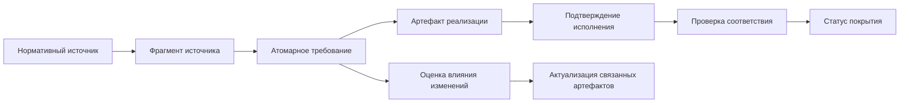
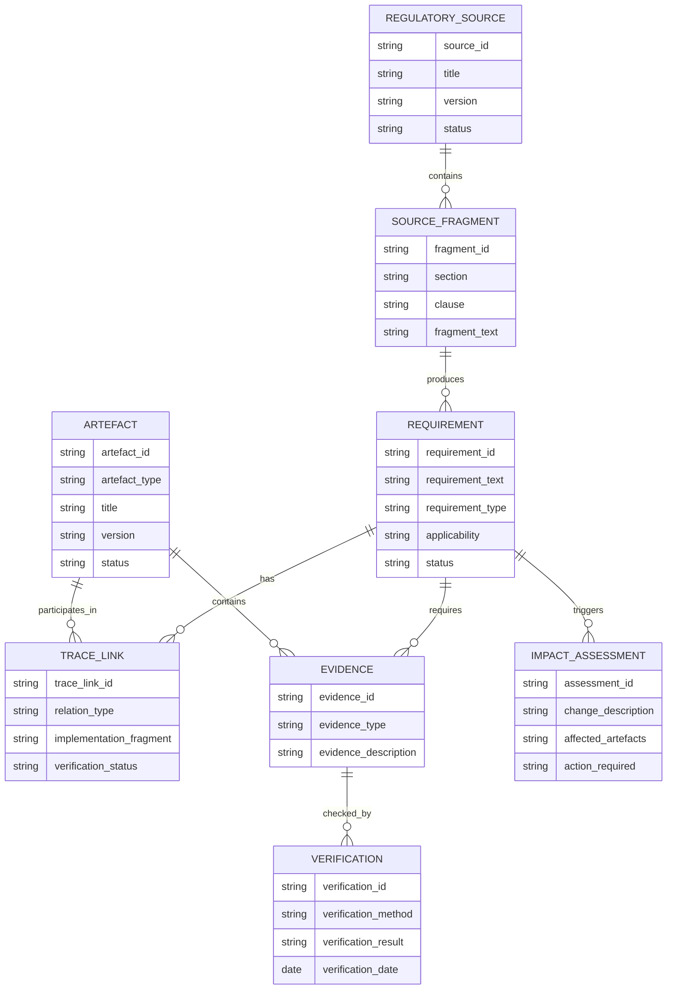
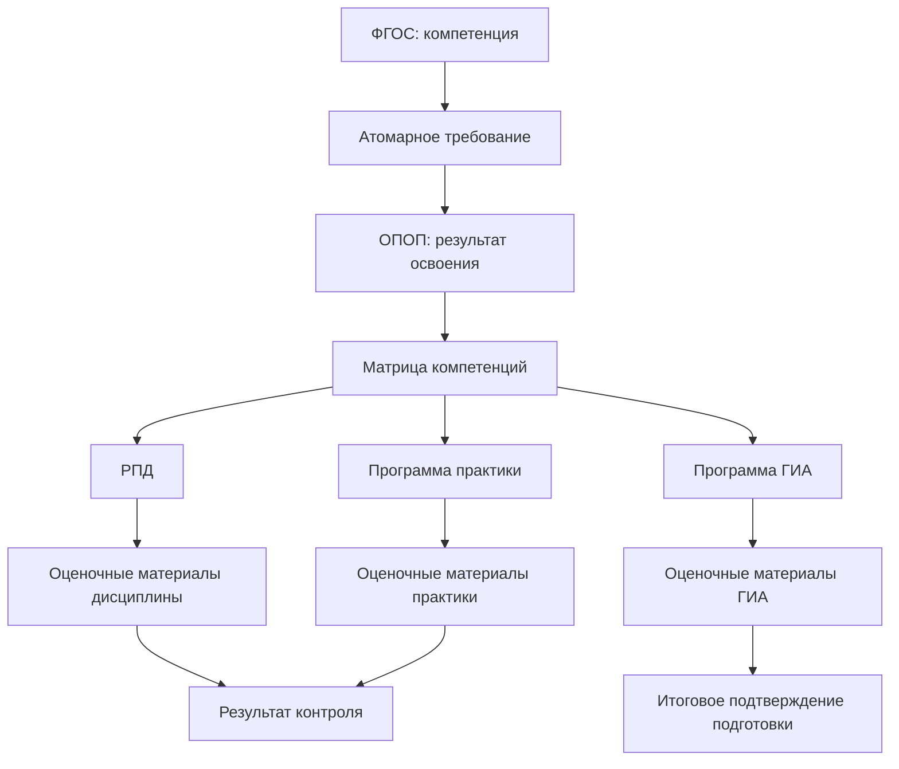
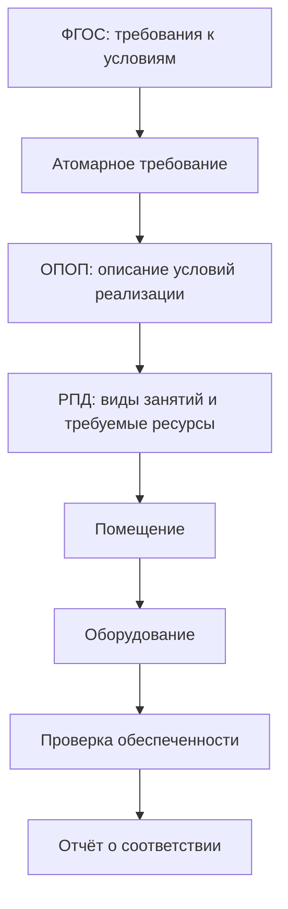
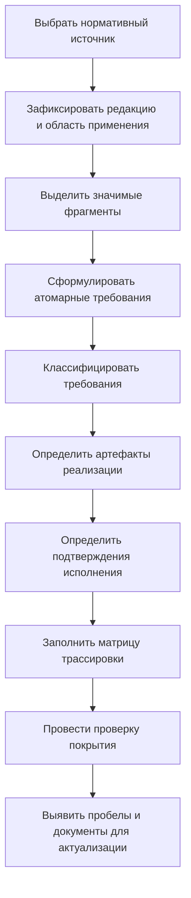

# Модель трассировки требований

## 1. Назначение документа

Данная страница описывает формальную модель трассировки требований в образовательной деятельности.

Если страница `system-overview.md` объясняет общую систему документов, а страница `terminology.md` фиксирует используемые понятия, то настоящая страница отвечает на практические вопросы:

- что именно необходимо трассировать;
- до какого уровня следует дробить требования;
- какие объекты должны быть связаны между собой;
- какие статусы необходимо фиксировать;
- как должна выглядеть матрица трассировки;
- как использовать модель при изменении ФГОС или связанных документов.

Модель предназначена для:

- аналитического описания образовательной деятельности;
- подготовки новых сотрудников;
- анализа комплектности документов образовательной программы;
- выявления непокрытых требований;
- оценки влияния изменений нормативных документов;
- последующей автоматизации контроля соответствия в информационной системе.

---

## 2. Основная идея трассировки

Трассировка рассматривается как возможность пройти путь:

```text
от обязательного требования
→ к способу его реализации
→ к доказательству исполнения
→ к результату проверки
→ к перечню документов, требующих изменения при актуализации нормы
```

Базовая модель имеет следующий вид:



---

## 3. Почему используется понятие «артефакт реализации»

Первоначально систему можно описывать через документы:

```text
ФГОС
→ ОПОП
→ Учебный план
→ Рабочая программа дисциплины
→ Оценочные материалы
→ Ведомость
```

Однако не каждое требование реализуется только документом.

Например, требование к материально-техническим условиям может быть связано с:

- помещением;
- оборудованием;
- электронной библиотечной системой;
- доступом к электронной информационно-образовательной среде;
- кадровыми сведениями;
- расчётным показателем обеспеченности.

Поэтому в модели используется более широкое понятие:

> **Артефакт реализации** — документ, объект учёта, запись информационной системы, ресурс, процедура или совокупность сведений, посредством которых реализуется требование.

### Примеры

| Требование | Артефакт реализации |
|---|---|
| Программа должна включать практику | Учебный план, рабочая программа практики |
| Должна формироваться компетенция | ОПОП, матрица компетенций, РПД |
| Должна проводиться ГИА | Программа ГИА, приказ о допуске, протокол комиссии |
| Должны быть обеспечены необходимые помещения | Паспорт помещения, данные об аудитории, оборудование |
| Должен быть обеспечен доступ к электронной среде | Сведения об ЭИОС, учётные записи, электронные курсы |

Для ознакомительных страниц репозитория основной акцент может сохраняться на документах. Для формальной трассировки необходимо учитывать и недокументарные объекты.

---

## 4. Объекты модели трассировки

### 4.1. Нормативный источник

**Нормативный источник** — документ, содержащий обязательные требования или правила, которые должны быть учтены образовательной организацией.

### Примеры

- федеральный закон;
- ФГОС;
- приказ, устанавливающий порядок реализации образовательных программ;
- порядок проведения государственной итоговой аттестации;
- порядок организации практической подготовки;
- профессиональный стандарт;
- локальный нормативный акт организации.

### Основные поля

| Поле | Содержание |
|---|---|
| `source_id` | Уникальный идентификатор источника |
| `source_type` | Тип источника: закон, ФГОС, приказ, ЛНА, профессиональный стандарт |
| `title` | Наименование документа |
| `number` | Номер документа |
| `approval_date` | Дата утверждения |
| `effective_from` | Дата начала действия |
| `effective_to` | Дата окончания действия, если применимо |
| `version` | Редакция документа |
| `status` | Действует, утратил силу, заменён, проект |
| `scope` | Область применения |

---

### 4.2. Фрагмент источника

**Фрагмент источника** — конкретное место нормативного документа, из которого выделяется требование.

### Фрагментом может быть

- статья закона;
- пункт;
- подпункт;
- абзац;
- таблица;
- приложение;
- структурированный блок машиночитаемого ФГОС.

### Основные поля

| Поле | Содержание |
|---|---|
| `fragment_id` | Идентификатор фрагмента |
| `source_id` | Ссылка на нормативный источник |
| `section` | Раздел документа |
| `clause` | Пункт или подпункт |
| `fragment_text` | Исходный текст фрагмента |
| `fragment_note` | Комментарий аналитика |

### Правило

Требование должно быть связано не только с документом-источником, но и с конкретным фрагментом, из которого оно было выделено.

Это необходимо для:

- проверки корректности интерпретации;
- юридической и экспертной верификации;
- анализа изменений новой редакции документа;
- поиска связанных документов при актуализации требований.

---

### 4.3. Требование

**Требование** — обязательное положение, выделенное из нормативного источника или документа более высокого уровня и подлежащее реализации, учёту либо подтверждению.

### Основные поля

| Поле | Содержание |
|---|---|
| `requirement_id` | Уникальный идентификатор требования |
| `fragment_id` | Фрагмент источника, из которого выделено требование |
| `requirement_text` | Нормализованная формулировка требования |
| `requirement_type` | Тип требования |
| `mandatory_level` | Обязательное, применимое при условии, рекомендательное |
| `applicability` | К каким программам или условиям применяется |
| `verification_type` | Способ проверки |
| `parent_requirement_id` | Родительское требование, если выполнялась декомпозиция |
| `status` | Статус анализа требования |

---

### 4.4. Артефакт реализации

**Артефакт реализации** — объект, посредством которого образовательная организация реализует требование.

### Виды артефактов

| Вид | Примеры |
|---|---|
| Нормативный документ организации | Положение об ОПОП, положение о ГИА |
| Документ конкретной программы | ОПОП, учебный план, РПД, программа практики |
| Распорядительный документ | Приказ об утверждении, приказ о допуске |
| Документ фактической реализации | Ведомость, протокол, дневник практики |
| Объект ресурсного обеспечения | Помещение, оборудование, база практики |
| Информационный объект | Электронный курс, запись об ЭИОС, учётная запись |
| Расчётный показатель | Сумма зачётных единиц, доля преподавателей с квалификацией |
| Процедура | Проведение экзамена, проведение ГИА, внутренний аудит |

### Основные поля

| Поле | Содержание |
|---|---|
| `artefact_id` | Уникальный идентификатор артефакта |
| `artefact_type` | Тип артефакта |
| `title` | Наименование |
| `program_id` | Образовательная программа, если артефакт относится к конкретной программе |
| `version` | Версия или редакция |
| `effective_from` | Дата начала применения |
| `effective_to` | Дата окончания применения |
| `approval_document` | Документ об утверждении, если применимо |
| `owner` | Ответственное подразделение |
| `status` | Проект, действует, заменён, архивный |

---

### 4.5. Связь трассировки

**Связь трассировки** — зафиксированная зависимость между требованием и артефактом либо между двумя артефактами.

### Основные поля

| Поле | Содержание |
|---|---|
| `trace_link_id` | Идентификатор связи |
| `source_object_id` | Исходный объект связи |
| `target_object_id` | Целевой объект связи |
| `relation_type` | Тип связи |
| `implementation_fragment` | Раздел, таблица, реквизит или элемент целевого объекта |
| `comment` | Пояснение аналитика |
| `verification_status` | Статус проверки корректности связи |

### Типы связей

| Код связи | Значение | Пример |
|---|---|---|
| `derived_from` | Требование выделено из фрагмента источника | Требование об объёме программы выделено из ФГОС |
| `based_on` | Артефакт создан на основании другого документа | ОПОП основана на ФГОС |
| `implements` | Артефакт реализует требование | Учебный план реализует требование к структуре программы |
| `details` | Артефакт детализирует другой артефакт | РПД детализирует дисциплину учебного плана |
| `allocates` | Артефакт распределяет результат по компонентам | Матрица компетенций распределяет компетенции по дисциплинам |
| `assesses` | Артефакт определяет оценку результата | ФОС оценивает достижение компетенции |
| `evidences` | Артефакт подтверждает фактическое исполнение | Ведомость подтверждает проведение экзамена |
| `applies_to` | Общий документ применяется к программе | Положение о практике применяется к ОПОП |
| `approves` | Документ утверждает другой документ | Приказ утверждает учебный план |
| `uses_resource` | Программа использует ресурс для исполнения требования | РПД использует лабораторию |
| `requires_update_of` | Изменение объекта требует проверки другого объекта | Изменение ФГОС требует пересмотра ОПОП |

---

### 4.6. Подтверждение исполнения

**Подтверждение исполнения** — проверяемый факт, позволяющий утверждать, что требование реализовано или соблюдается.

Подтверждение может быть самостоятельным артефактом либо конкретным свойством артефакта.

### Примеры

| Требование | Подтверждение исполнения |
|---|---|
| Объём программы должен соответствовать ФГОС | Расчёт суммы зачётных единиц в учебном плане |
| Программа должна предусматривать практику | Наличие соответствующего раздела учебного плана и утверждённой программы практики |
| Компетенция должна формироваться в процессе обучения | Матрица компетенций и связанные РПД |
| Результаты освоения должны оцениваться | Оценочные материалы и ведомости аттестации |
| Должны быть обеспечены помещения | Закреплённые аудитории и сведения об их оснащении |
| Должна быть проведена ГИА | Протокол государственной экзаменационной комиссии |

### Основные поля

| Поле | Содержание |
|---|---|
| `evidence_id` | Идентификатор подтверждения |
| `requirement_id` | Требование, которое подтверждается |
| `artefact_id` | Артефакт, содержащий подтверждение |
| `evidence_type` | Документарное, расчётное, ресурсное, результативное |
| `evidence_description` | Что именно подтверждает выполнение |
| `verification_method` | Как производится проверка |
| `verification_result` | Результат проверки |
| `verification_date` | Дата проверки |
| `verified_by` | Ответственное лицо или роль |

---

### 4.7. Проверка соответствия

**Проверка соответствия** — действие, посредством которого устанавливается наличие и достаточность реализации требования.

### Виды проверки

| Вид проверки | Описание | Пример |
|---|---|---|
| Документарная | Проверяется наличие документа или необходимого раздела | В учебном плане предусмотрена практика |
| Структурная | Проверяется структура документа | В ОПОП присутствуют обязательные компоненты |
| Расчётная | Проверяется числовое соответствие | Сумма зачётных единиц соответствует нормативу |
| Содержательная | Эксперт оценивает достаточность содержания | РПД действительно формирует заявленную компетенцию |
| Ресурсная | Проверяется наличие необходимых условий | Имеется лаборатория и оборудование |
| Процессная | Проверяется факт выполнения процедуры | ГИА была проведена в установленном порядке |
| Результативная | Проверяется зафиксированный результат | Имеются ведомости и протоколы аттестации |

---

## 5. Типы требований

Для единообразного анализа требования рекомендуется классифицировать.

| Код типа | Тип требования | Содержание | Примеры артефактов реализации |
|---|---|---|---|
| `STRUCTURE` | Требование к структуре программы | Состав блоков, частей и компонентов программы | ОПОП, учебный план |
| `VOLUME` | Требование к объёму | Зачётные единицы, часы, доли частей программы | Учебный план, расчёт объёма |
| `DURATION` | Требование к срокам | Срок обучения, сроки по формам обучения | ОПОП, календарный график |
| `RESULT` | Требование к результатам освоения | Компетенции и индикаторы | ОПОП, матрица компетенций, РПД |
| `ASSESSMENT` | Требование к оценке результатов | Контроль, промежуточная аттестация, ГИА | ФОС, программа ГИА, ведомости |
| `PRACTICE` | Требование к практической подготовке | Практики, базы, формы отчётности | Учебный план, программа практики |
| `STAFFING` | Требование к кадровым условиям | Квалификация и состав работников | Сведения о ППС, кадровые данные |
| `FACILITIES` | Требование к материально-техническим условиям | Помещения, оборудование, ресурсы | Паспорт помещения, оборудование |
| `DIGITAL` | Требование к электронной среде | ЭИОС, дистанционные технологии, электронные ресурсы | Электронные системы и сведения о доступе |
| `INFORMATION` | Требование к открытости и публикации | Размещение информации и документов | Официальный сайт, опубликованные документы |
| `MANAGEMENT` | Требование к процедурам управления | Утверждение, актуализация, контроль | Приказы, ЛНА, отчёты |

---

## 6. Правила выделения атомарных требований

### 6.1. Что такое атомарность

Требование считается атомарным, если для него возможно однозначно определить:

- источник;
- содержание обязательства;
- объект, к которому оно применяется;
- артефакт реализации;
- способ проверки;
- статус исполнения.

### 6.2. Неподходящая формулировка

```text
Образовательная программа должна соответствовать ФГОС.
```

Эта формулировка слишком общая. По ней невозможно установить, что именно проверять и какими документами подтверждать соответствие.

### 6.3. Подходящая декомпозиция

| ID требования | Формулировка |
|---|---|
| `FGOS-STRUCT-001` | Образовательная программа должна включать предусмотренный ФГОС блок дисциплин или модулей |
| `FGOS-STRUCT-002` | Образовательная программа должна включать предусмотренный ФГОС блок практики |
| `FGOS-VOLUME-001` | Общий объём программы должен соответствовать установленному ФГОС значению |
| `FGOS-RESULT-UK-001` | В программе должна быть обеспечена возможность достижения компетенции УК-1 |
| `FGOS-ASSESSMENT-001` | В программе должна быть предусмотрена итоговая аттестация, если она установлена нормативными требованиями |

### 6.4. Правила формулирования требования

| Правило | Пояснение |
|---|---|
| Одно требование — одна проверяемая обязанность | Не следует объединять объём программы, компетенции и кадровые условия в одной записи |
| Не изменять смысл источника | Нормализованная формулировка не должна добавлять обязательства, которых нет в исходном документе |
| Сохранять связь с оригинальным фрагментом | Всегда должен быть указан пункт или раздел источника |
| Отделять требование от способа реализации | ФГОС может требовать результат, а вуз самостоятельно определяет документы его достижения |
| Фиксировать условность требования | Некоторые требования применяются только при определённых формах, технологиях или типах программы |

---

## 7. Идентификаторы требований

### 7.1. Назначение идентификатора

Идентификатор необходим, чтобы:

- однозначно ссылаться на требование в разных документах;
- строить матрицы трассировки;
- отслеживать изменения;
- связывать требование с объектами информационной системы.

### 7.2. Предлагаемая структура

```text
<Источник>-<Уровень/Программа>-<Категория>-<Номер>
```

### Примеры

```text
FGOS-VO-44.03.04-STRUCT-001
FGOS-VO-44.03.04-VOLUME-001
FGOS-VO-44.03.04-RESULT-UK-001
FGOS-VO-44.03.04-PRACTICE-001
FGOS-VO-44.03.04-STAFFING-001
```

### Расшифровка

| Элемент | Значение |
|---|---|
| `FGOS` | Источник требования — ФГОС |
| `VO` | Уровень — высшее образование |
| `44.03.04` | Код направления или специальности |
| `STRUCT` | Тип требования |
| `001` | Порядковый номер внутри категории |

### Правило версионности

Идентификатор требования не должен автоматически меняться только из-за появления новой редакции источника.

Рекомендуется отдельно хранить:

- источник;
- редакцию источника;
- версию требования;
- статус изменения требования.

Это позволит определить, осталось ли требование прежним, было изменено или утратило силу.

---

## 8. Уровни трассировки

В модели выделяются следующие уровни.

| Уровень | Объект | Основной вопрос |
|---|---|---|
| 1 | Нормативный источник | Из какого документа возникает обязательство? |
| 2 | Фрагмент источника | Где именно зафиксировано требование? |
| 3 | Атомарное требование | Что конкретно необходимо выполнить? |
| 4 | Артефакт реализации | Посредством чего организация реализует требование? |
| 5 | Подтверждение исполнения | Чем доказывается выполнение требования? |
| 6 | Проверка соответствия | Как определяется достаточность исполнения? |
| 7 | Влияние изменений | Что потребуется пересмотреть при изменении требования? |

---

## 9. Модель связей



---

## 10. Статусы требования

Статус требования показывает, на каком этапе аналитической обработки оно находится.

| Статус | Значение |
|---|---|
| `identified` | Требование выявлено в нормативном источнике |
| `normalized` | Сформулировано в виде атомарного требования |
| `mapped` | Определены связанные артефакты реализации |
| `verified` | Корректность выделения и связей подтверждена |
| `changed` | Требование изменилось в новой редакции источника |
| `cancelled` | Требование утратило применимость |
| `requires_review` | Необходима экспертная или юридическая проверка |

---

## 11. Статусы покрытия требования

Статус покрытия показывает, насколько требование обеспечено артефактами реализации и подтверждениями.

| Статус | Значение |
|---|---|
| `not_analyzed` | Требование ещё не сопоставлялось с артефактами |
| `not_covered` | Артефакты реализации не найдены |
| `partially_covered` | Найдена только часть необходимых артефактов или подтверждений |
| `covered` | Определены необходимые артефакты и подтверждения |
| `verified` | Покрытие подтверждено проверкой |
| `outdated` | Связанные артефакты требуют актуализации из-за изменения источника |
| `not_applicable` | Требование не применяется к рассматриваемой программе |

### Важно

Статус `covered` не равен статусу `verified`.

Например, аналитик может определить, что требование о наличии практики связано с учебным планом и программой практики. Это означает, что требование покрыто на уровне модели. Однако только проверка утверждённых документов конкретной ОПОП позволит подтвердить, что оно действительно исполнено.

---

## 12. Статусы проверки

| Статус | Значение |
|---|---|
| `not_checked` | Проверка ещё не проводилась |
| `checking` | Проверка выполняется |
| `compliant` | Соответствие подтверждено |
| `partially_compliant` | Требование выполнено частично |
| `non_compliant` | Требование не выполнено |
| `insufficient_evidence` | Недостаточно подтверждающих материалов |
| `requires_expert_review` | Требуется содержательная оценка эксперта |

---

## 13. Матрица трассировки требований

### 13.1. Назначение матрицы

Матрица трассировки является основным рабочим инструментом аналитика.

Она должна позволять ответить на вопросы:

- какое требование было выделено;
- из какого документа и пункта оно возникло;
- какие артефакты реализуют требование;
- чем подтверждается исполнение;
- каков текущий статус покрытия;
- что необходимо изменить при обновлении источника.

### 13.2. Минимальный шаблон матрицы

| ID требования | Источник | Фрагмент источника | Формулировка требования | Тип | Артефакт реализации | Подтверждение | Метод проверки | Статус покрытия | Комментарий |
|---|---|---|---|---|---|---|---|---|---|
|  |  |  |  |  |  |  |  |  |  |

### 13.3. Расширенный шаблон матрицы

| Поле | Содержание |
|---|---|
| `requirement_id` | Уникальный идентификатор требования |
| `source_document` | Наименование нормативного источника |
| `source_version` | Редакция источника |
| `source_fragment` | Пункт или раздел документа |
| `original_text` | Исходная формулировка источника |
| `requirement_text` | Нормализованная формулировка требования |
| `requirement_type` | Категория требования |
| `applicability` | Условия применимости |
| `implementation_artefact` | Артефакт реализации |
| `implementation_fragment` | Конкретный раздел или реквизит артефакта |
| `relation_type` | Тип связи |
| `evidence` | Подтверждение исполнения |
| `verification_method` | Метод проверки |
| `coverage_status` | Статус покрытия |
| `verification_status` | Результат проверки |
| `affected_by_change` | Признак необходимости актуализации |
| `notes` | Комментарий аналитика |

---

## 14. Учебный пример матрицы трассировки

> Данный пример демонстрирует структуру анализа. Перед применением к реальной образовательной программе требования должны быть сверены с конкретной действующей редакцией ФГОС и утверждёнными документами организации.

| ID требования | Требование | Тип | Артефакт реализации | Подтверждение исполнения | Метод проверки | Статус покрытия |
|---|---|---|---|---|---|---|
| `FGOS-VO-XX.XX.XX-VOLUME-001` | Общий объём образовательной программы должен соответствовать значению, установленному ФГОС | `VOLUME` | ОПОП, учебный план | Итоговый расчёт зачётных единиц | Расчётная проверка | `not_analyzed` |
| `FGOS-VO-XX.XX.XX-STRUCT-001` | В структуре программы должен быть предусмотрен блок дисциплин или модулей | `STRUCTURE` | Учебный план | Наличие соответствующего блока | Структурная проверка | `not_analyzed` |
| `FGOS-VO-XX.XX.XX-PRACTICE-001` | В программе должна быть предусмотрена практическая подготовка, если она установлена ФГОС | `PRACTICE` | ОПОП, учебный план, программа практики | Приказ, отчёт, ведомость по практике | Документарная и процессная проверка | `not_analyzed` |
| `FGOS-VO-XX.XX.XX-RESULT-001` | Программа должна обеспечивать достижение установленной компетенции | `RESULT` | ОПОП, матрица компетенций, РПД | ФОС, ведомости, материалы ГИА | Содержательная проверка | `not_analyzed` |
| `FGOS-VO-XX.XX.XX-ASSESSMENT-001` | В программе должна быть предусмотрена итоговая аттестация в установленной форме | `ASSESSMENT` | Учебный план, программа ГИА | Протоколы комиссии | Документарная и процессная проверка | `not_analyzed` |
| `FGOS-VO-XX.XX.XX-FACILITIES-001` | Организация должна обеспечить требуемые материально-технические условия | `FACILITIES` | Сведения о помещениях и оборудовании | Карточки помещений, перечень оборудования | Ресурсная проверка | `not_analyzed` |

---

## 15. Пример трассировки компетенции

### 15.1. Требование

```text
Выпускник должен обладать компетенцией, установленной ФГОС.
```

### 15.2. Декомпозиция связи



### 15.3. Таблица связей

| Объект | Тип связи | Что фиксируется |
|---|---|---|
| ФГОС → Требование | `derived_from` | Требование выделено из стандарта |
| Требование → ОПОП | `implements` | Компетенция включена в результаты программы |
| ОПОП → Матрица компетенций | `details` | Определено распределение формирования компетенции |
| Матрица → РПД | `allocates` | Дисциплина участвует в формировании компетенции |
| РПД → ФОС | `assesses` | Определены задания и критерии оценки |
| ФОС → Ведомость | `evidences` | Зафиксирован результат проверки |
| Результаты → ГИА | `assesses` | Подтверждается итоговая готовность выпускника |

---

## 16. Пример трассировки материально-технического условия

### 16.1. Требование

```text
Для реализации образовательной программы должны быть обеспечены необходимые материально-технические условия.
```

### 16.2. Цепочка реализации



### 16.3. Значение для информационной системы

Данная связь особенно важна для автоматизации в 1С.

В информационной системе может быть зафиксировано:

| Объект учёта | Его роль в трассировке |
|---|---|
| Образовательная программа | Объект, для которого проверяются условия реализации |
| Дисциплина | Компонент программы, нуждающийся в помещении или оборудовании |
| Вид занятия | Определяет требования к ресурсу |
| Помещение | Материальный ресурс |
| Оборудование | Оснащение, необходимое для проведения занятия |
| Связь программы с помещением | Подтверждает ресурсную обеспеченность |
| Отчёт о проверке | Фиксирует результат соответствия |

---

## 17. Процесс работы аналитика

### 17.1. Общий процесс



### 17.2. Пошаговое описание

| Шаг | Действие аналитика | Результат |
|---|---|---|
| 1 | Выбрать ФГОС или иной источник | Определён объект анализа |
| 2 | Зафиксировать действующую редакцию | Исключён риск работы с устаревшим текстом |
| 3 | Выделить требования | Получен перечень обязательств |
| 4 | Разложить сложные требования на атомарные | Появились проверяемые единицы анализа |
| 5 | Определить документы и иные артефакты реализации | Построены связи исполнения |
| 6 | Определить подтверждения | Понятно, чем доказывать соответствие |
| 7 | Установить методы проверки | Определён способ контроля |
| 8 | Назначить статусы покрытия | Видны пробелы модели |
| 9 | Провести экспертную проверку | Подтверждена корректность трассировки |
| 10 | Использовать модель при изменениях | Определяется область актуализации |

---

## 18. Анализ влияния изменений

### 18.1. Назначение

Одно из главных преимуществ трассировки — возможность определить последствия изменения нормативного источника.

### 18.2. Пример

Если новая редакция ФГОС изменяет требования к практической подготовке, необходимо проверить:

```text
ФГОС
→ требования к практике
→ ОПОП
→ учебный план
→ календарный учебный график
→ рабочие программы практик
→ оценочные материалы практик
→ сведения о базах практической подготовки
→ договоры и документы фактической реализации
```

### 18.3. Карточка анализа влияния

| Поле | Содержание |
|---|---|
| `change_id` | Идентификатор изменения |
| `source_document` | Изменившийся источник |
| `old_version` | Предыдущая редакция |
| `new_version` | Новая редакция |
| `changed_fragment` | Изменённый пункт |
| `affected_requirements` | Затронутые требования |
| `affected_artefacts` | Документы и объекты, требующие проверки |
| `required_action` | Проверить, изменить, утвердить новую редакцию |
| `responsible_role` | Ответственный сотрудник или подразделение |
| `completion_status` | Статус выполнения |

---

## 19. Представление модели в репозитории

На первом этапе модель может реализовываться в Markdown-файлах.

### Предлагаемая структура

```text
docs/
├── 00-concept/
│   ├── system-overview.md
│   ├── terminology.md
│   └── traceability-model.md
│
├── 01-regulatory-sources/
│   └── fgos.md
│
├── 02-organization-documents/
│   ├── opop.md
│   ├── curriculum.md
│   ├── competence-matrix.md
│   ├── discipline-program.md
│   ├── practice-program.md
│   └── gia-program.md
│
└── 03-traceability-examples/
    ├── fgos-to-opop.md
    ├── competence-traceability.md
    └── practice-traceability.md
```

### Перспективное развитие

После проверки модели на реальных примерах можно добавить:

```text
data/
├── sources/
├── requirements/
├── artefacts/
└── traceability-matrices/
```

В этих папках требования и связи могут храниться в структурированном формате, например JSON или YAML, что позволит:

- автоматически строить матрицы;
- проверять полноту покрытия;
- анализировать влияние изменений;
- использовать данные при проектировании функциональности 1С.

---

## 20. Ограничения модели

Модель трассировки не заменяет:

- юридическую экспертизу нормативных документов;
- экспертную оценку содержания образовательных программ;
- официальную процедуру утверждения документов организации;
- процедуры лицензирования или государственной аккредитации.

Модель предназначена для систематизации информации и поддержки анализа.

При заполнении реальных матриц необходимо:

- использовать действующую редакцию нормативного источника;
- указывать точный фрагмент документа;
- отличать прямое требование источника от аналитической интерпретации;
- подтверждать связи документами конкретной образовательной организации;
- привлекать профильных экспертов при содержательной проверке.

---

## 21. Следующие шаги

После утверждения данной модели необходимо:

1. Описать ФГОС как нормативный источник в файле `docs/01-regulatory-sources/fgos.md`.
2. Описать ОПОП как центральный документ реализации требований в файле `docs/02-organization-documents/opop.md`.
3. Создать первый пример трассировки:
   - требование к компетенции;
   - требование к практической подготовке;
   - требование к объёму образовательной программы.
4. После проверки подхода подготовить полноценную матрицу для одного конкретного ФГОС.
5. Определить, какие элементы модели в будущем необходимо хранить и обрабатывать в информационной системе.

---

## 22. Итог

Модель трассировки строится вокруг требования как центральной единицы анализа.

```text
Нормативный источник
→ Фрагмент источника
→ Атомарное требование
→ Артефакт реализации
→ Подтверждение исполнения
→ Проверка соответствия
→ Анализ влияния изменений
```

Такой подход позволяет перейти от простого перечня образовательных документов к управляемой системе связей, в которой можно определить:

- почему существует каждый документ;
- какое требование он реализует;
- чем подтверждается выполнение требования;
- какие пробелы существуют в комплекте документов;
- что потребуется обновить при изменении нормативной базы.
