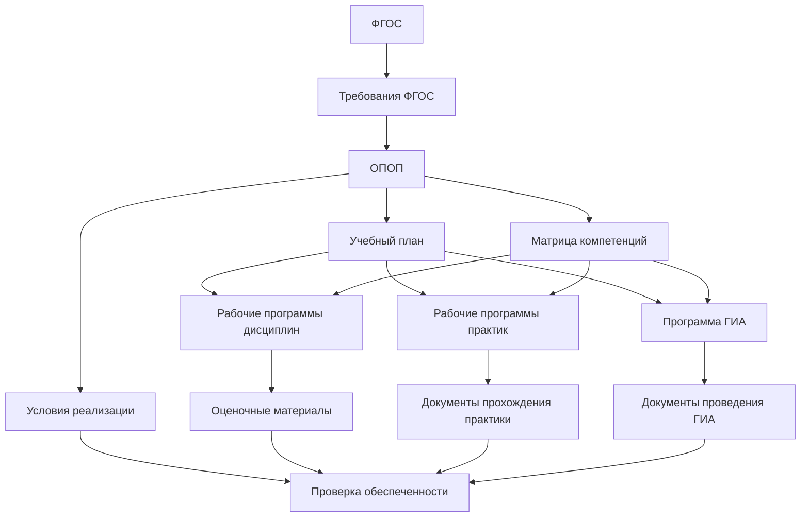
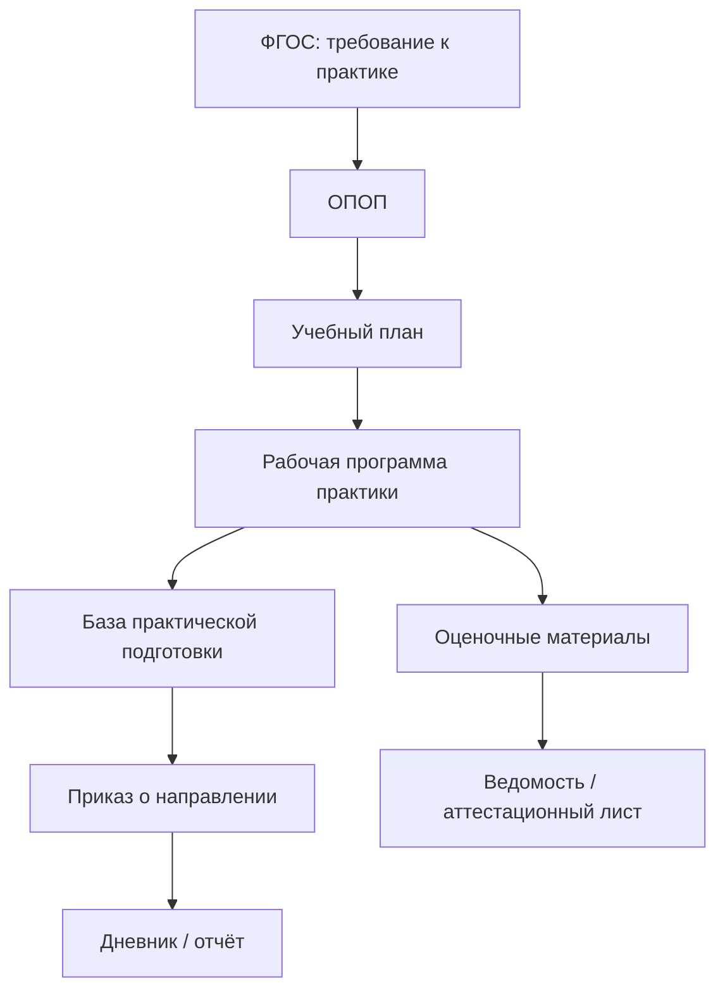
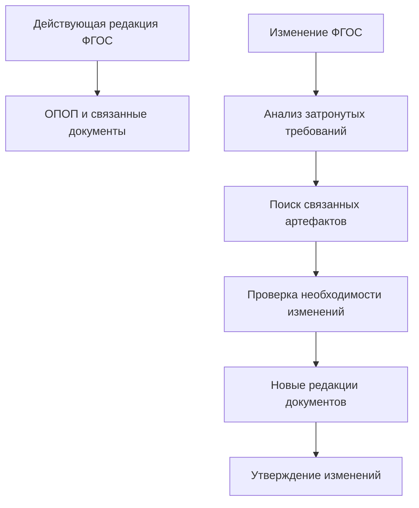

# Федеральный государственный образовательный стандарт как источник требований

## 1. Назначение страницы

Данная страница описывает роль федерального государственного образовательного стандарта в системе документов образовательной организации и в модели трассировки требований.

Страница отвечает на следующие вопросы:

- что представляет собой ФГОС;
- почему именно с него начинается анализ конкретной образовательной программы;
- какие группы требований могут быть выделены из ФГОС;
- какие документы образовательной организации создаются или проверяются с учётом требований ФГОС;
- какие требования ФГОС могут быть проверены автоматически, а какие требуют экспертной оценки;
- как учитывать редакции и изменения ФГОС.

В рамках текущей версии репозитория основное внимание уделяется ФГОС высшего образования и документам программ бакалавриата, специалитета и магистратуры.

---

## 2. Место ФГОС в общей модели трассировки

ФГОС является внешним нормативным источником, устанавливающим обязательные требования к образовательной программе.

Для образовательной организации ФГОС не является готовой образовательной программой. Он задаёт обязательные параметры и результаты, которые организация должна преобразовать в собственную систему документов и фактических действий.



Основная логика может быть выражена так:

```text
ФГОС устанавливает обязательные требования
→ образовательная организация разрабатывает ОПОП
→ компоненты ОПОП детализируют способ реализации требований
→ документы и сведения образовательного процесса подтверждают исполнение
```

---

## 3. Что такое ФГОС

**Федеральный государственный образовательный стандарт**, или **ФГОС**, — нормативный источник, устанавливающий обязательные требования к образованию определённого уровня и, для профессионального образования, к соответствующей профессии, специальности или направлению подготовки.

Для целей данного репозитория ФГОС рассматривается в двух значениях:

| Значение | Содержание |
|---|---|
| ФГОС как вид нормативного документа | Общая категория государственных стандартов в сфере образования |
| Конкретный ФГОС | Утверждённый стандарт по определённому уровню образования и направлению подготовки или специальности |

### Пример различия

| Формулировка | Что имеется в виду |
|---|---|
| «Требования ФГОС должны быть трассируемыми» | Общий принцип модели |
| «ФГОС ВО по специальности 31.05.01 Лечебное дело» | Конкретный нормативный источник для определённой программы |

---

## 4. Почему анализ конкретной программы начинается с ФГОС

Для основной профессиональной образовательной программы, реализуемой в соответствии с федеральным государственным образовательным стандартом, ФГОС является исходным документом, который определяет обязательную рамку программы.

Он позволяет установить:

- к какому уровню образования относится программа;
- по какому направлению подготовки или специальности она реализуется;
- какую квалификацию получает выпускник;
- какой объём должна иметь программа;
- какие сроки обучения предусмотрены;
- какие результаты должен достичь выпускник;
- какие блоки или компоненты должны быть предусмотрены;
- какие условия реализации необходимо обеспечить.

Таким образом, при анализе конкретной программы работа аналитика начинается не с учебного плана и не с рабочей программы дисциплины, а с установления нормативной рамки:

```text
Какой ФГОС применяется?
→ Какая редакция ФГОС действует?
→ Какие требования из него применимы к программе?
→ Какими документами организации эти требования реализуются?
→ Какими сведениями подтверждается их исполнение?
```

---

## 5. Что ФГОС устанавливает и чего он не устанавливает

### 5.1. Что задаёт ФГОС

ФГОС задаёт обязательные требования, которые должны учитываться образовательной организацией.

| Группа требований | Что может относиться к группе |
|---|---|
| Требования к структуре программы | Блоки программы, состав обязательных компонентов, соотношение частей |
| Требования к объёму | Общий объём программы, объёмы отдельных блоков или частей |
| Требования к срокам | Срок освоения программы в зависимости от формы обучения и иных условий |
| Требования к результатам освоения | Универсальные, общепрофессиональные и иные установленные результаты |
| Требования к условиям реализации | Кадровые, материально-технические, информационные, финансовые и иные условия |
| Требования к итоговой подготовке | Положения, связанные с итоговой аттестацией и результатом подготовки, если они определены стандартом |

### 5.2. Что образовательная организация определяет самостоятельно

ФГОС не заменяет собой внутренние документы конкретной образовательной организации.

На основании требований ФГОС и иных применимых нормативных актов организация определяет:

| Область решения организации | Примеры документов или результатов |
|---|---|
| Конкретную модель образовательной программы | ОПОП |
| Перечень и распределение учебных компонентов | Учебный план |
| Порядок реализации по периодам | Календарный учебный график |
| Распределение компетенций по компонентам программы | Матрица компетенций |
| Содержание дисциплин | Рабочие программы дисциплин |
| Содержание практической подготовки | Рабочие программы практик |
| Способ оценки результатов | Оценочные материалы |
| Конкретную организацию ГИА | Программа ГИА и связанные документы |
| Описание обеспечивающих ресурсов | Сведения о кадровом, материально-техническом и информационном обеспечении |

### 5.3. Основной вывод для трассировки

ФГОС не должен связываться только с ОПОП как с одним итоговым документом.

Одно требование ФГОС может быть реализовано и подтверждено сразу несколькими артефактами:

```text
Требование ФГОС к компетенции
→ ОПОП
→ Матрица компетенций
→ РПД
→ Оценочные материалы
→ Результаты аттестации
→ Документы ГИА
```

---

## 6. Карточка ФГОС в модели трассировки

Для каждого конкретного ФГОС в репозитории или информационной системе рекомендуется создавать карточку нормативного источника.

### 6.1. Минимальные реквизиты карточки

| Поле | Назначение |
|---|---|
| `source_id` | Уникальный идентификатор нормативного источника |
| `source_type` | Вид источника: `FGOS` |
| `education_level` | Уровень образования |
| `program_type` | Бакалавриат, специалитет, магистратура или иной тип |
| `code` | Код направления подготовки или специальности |
| `title` | Наименование направления подготовки или специальности |
| `qualification` | Квалификация выпускника |
| `approval_order` | Приказ об утверждении ФГОС |
| `approval_date` | Дата утверждения |
| `effective_from` | Дата начала применения |
| `version` | Редакция стандарта |
| `status` | Действует, заменён, утратил силу, требует проверки |
| `source_reference` | Источник опубликованного текста |
| `notes` | Комментарии аналитика |

### 6.2. Пример карточки

> Значения в таблице ниже приведены только как пример структуры. При создании карточки реального ФГОС сведения необходимо брать из официального текста конкретного стандарта.

| Поле | Пример значения |
|---|---|
| `source_id` | `FGOS-VO-31.05.01` |
| `source_type` | `FGOS` |
| `education_level` | Высшее образование |
| `program_type` | Специалитет |
| `code` | `31.05.01` |
| `title` | Лечебное дело |
| `qualification` | В соответствии с конкретным ФГОС |
| `approval_order` | Указывается по официальному документу |
| `version` | Действующая редакция |
| `status` | `requires_review` до проверки источника |

---

## 7. Группы требований, выделяемых из ФГОС

Для единообразной трассировки требования ФГОС рекомендуется классифицировать по следующим категориям.

| Код | Группа требований | Основной вопрос аналитика | Основные документы реализации |
|---|---|---|---|
| `IDENTITY` | Идентификация программы | Какую именно программу вправе и должна реализовать организация? | ОПОП, лицензирование, сведения о программе |
| `VOLUME` | Объём программы | Соответствует ли объём программы требованиям стандарта? | ОПОП, учебный план |
| `DURATION` | Сроки получения образования | Соответствуют ли сроки и формы обучения установленным параметрам? | ОПОП, учебный план, календарный график |
| `STRUCTURE` | Структура программы | Все ли обязательные блоки и компоненты предусмотрены? | ОПОП, учебный план |
| `RESULT` | Результаты освоения | Какие результаты должен достичь выпускник? | ОПОП, матрица компетенций |
| `COMPETENCE` | Компетенции | Где и каким образом формируется компетенция? | Матрица компетенций, РПД, практики, ГИА |
| `ASSESSMENT` | Оценка результатов | Какими средствами проверяется достижение результатов? | Оценочные материалы, программа ГИА |
| `PRACTICE` | Практическая подготовка | Как реализуется практический компонент подготовки? | Учебный план, программы практик, базы практики |
| `STAFFING` | Кадровые условия | Имеются ли требуемые сотрудники и квалификация? | Сведения о кадровом обеспечении |
| `FACILITIES` | Материально-технические условия | Имеются ли необходимые помещения и оборудование? | Паспорта помещений, сведения об оборудовании |
| `DIGITAL` | Информационные и электронные условия | Обеспечена ли требуемая электронная среда и доступ к ресурсам? | Сведения об ЭИОС, электронные курсы, ЭБС |
| `QUALITY` | Обеспечение качества | Каким образом проверяется качество реализации программы? | Внутренняя оценка качества, отчёты, мониторинг |

---

## 8. Связь ФГОС с документами образовательной организации

### 8.1. Центральная связь: ФГОС и ОПОП

ОПОП является основным документом конкретной образовательной программы, посредством которого образовательная организация определяет способ реализации требований ФГОС.

| ФГОС устанавливает | ОПОП отражает |
|---|---|
| Уровень и направленность подготовки | Общую характеристику программы |
| Требуемый объём | Объём реализуемой программы |
| Требования к срокам | Сроки и формы реализации программы |
| Результаты освоения | Планируемые результаты конкретной ОПОП |
| Требования к условиям | Описание обеспеченности программы |
| Требования к структуре | Состав компонентов программы |

Связь в модели:

```text
ФГОС --implements through--> ОПОП
```

Для записи в матрице используется более точная формулировка:

```text
ОПОП implements требование, derived_from ФГОС
```

---

### 8.2. ФГОС и учебный план

Учебный план используется для детализации структуры и объёма программы.

| Требование ФГОС | Что ищем в учебном плане |
|---|---|
| Общий объём программы | Итоговую сумму зачётных единиц |
| Наличие обязательных блоков | Разделы дисциплин, практик, ГИА и иных компонентов |
| Объём отдельных компонентов | Зачётные единицы соответствующих разделов |
| Требования к срокам | Распределение компонентов по периодам обучения |
| Формы контроля | Привязку дисциплин и практик к аттестации |

Связь в модели:

```text
Учебный план implements требования к структуре и объёму программы
```

---

### 8.3. ФГОС и матрица компетенций

ФГОС может устанавливать результаты освоения программы. Матрица компетенций показывает, какими компонентами программы организация обеспечивает достижение этих результатов.

| Требование ФГОС | Что ищем в матрице компетенций |
|---|---|
| Установлена компетенция | Наличие компетенции в матрице |
| Необходимо обеспечить достижение результата | Связь компетенции с дисциплинами, практиками и ГИА |
| Требуется оценка результата | Связь с оценочными материалами или формами контроля |

Связь в модели:

```text
Матрица компетенций allocates результат освоения по компонентам ОПОП
```

---

### 8.4. ФГОС и рабочие программы дисциплин

Рабочая программа дисциплины детализирует вклад конкретной дисциплины в реализацию образовательной программы.

| Требование верхнего уровня | Что ищем в РПД |
|---|---|
| Формирование компетенции | Компетенции и индикаторы, связанные с дисциплиной |
| Необходимость освоения содержания | Темы, занятия, самостоятельную работу |
| Необходимость оценки результата | Формы контроля и связь с оценочными материалами |
| Условия реализации | Требования к помещениям, оборудованию и ресурсам |

Связь в модели:

```text
РПД details дисциплину учебного плана
РПД implements часть требований к результатам освоения
```

---

### 8.5. ФГОС и практическая подготовка

Если ФГОС предусматривает практическую подготовку, требование должно быть прослеживаемым от структуры программы до фактического результата обучающегося.



---

### 8.6. ФГОС и условия реализации

Требования к условиям реализации отличаются от требований к структуре программы тем, что они могут подтверждаться не только документами, но и фактическими ресурсами.

| Требование | Возможные артефакты реализации | Возможные подтверждения |
|---|---|---|
| Кадровое обеспечение | Сведения о ППС, распределение нагрузки | Расчёт долей, документы о квалификации |
| Материально-техническое обеспечение | Помещения, оборудование | Карточки помещений, инвентарные сведения |
| Электронная среда | ЭИОС, электронные курсы, ЭБС | Доступы, перечни ресурсов, отчёты |
| Практическая подготовка | Базы практики | Договоры, паспорта баз, приказы |

Именно этот слой особенно важен для будущей реализации в 1С, поскольку часть подтверждений может храниться как структурированные объекты учёта, а не как текстовые документы.

---

## 9. Какие требования ФГОС поддаются автоматической проверке

Не все требования могут проверяться одинаковым способом.

### 9.1. Требования, потенциально пригодные для автоматической проверки

| Требование | Возможная автоматическая проверка |
|---|---|
| Общий объём программы | Сравнение суммы зачётных единиц учебного плана с нормативом |
| Наличие обязательного блока | Проверка наличия блока в структуре учебного плана |
| Объём практики | Сравнение объёма соответствующих практик с требованием |
| Наличие компетенции | Проверка присутствия кода компетенции в матрице |
| Наличие ГИА | Проверка соответствующего компонента учебного плана |
| Наличие утверждённого документа | Проверка карточки документа и статуса утверждения |

### 9.2. Требования, требующие экспертной оценки

| Требование | Почему автоматической проверки недостаточно |
|---|---|
| Достаточность содержания дисциплины для формирования компетенции | Необходим содержательный анализ РПД |
| Соответствие оценочных материалов заявленным результатам | Требуется оценка качества заданий и критериев |
| Достаточность материально-технической базы | Требуется сопоставление назначения ресурсов и содержания обучения |
| Реальность формирования профессиональной готовности | Требуется экспертная и практическая оценка |

### 9.3. Правило модели

```text
Автоматическая проверка может подтвердить наличие и формальное соответствие.
Экспертная проверка необходима для подтверждения содержательной достаточности.
```

---

## 10. Трассировка требования ФГОС: шаблон записи

Для каждого атомарного требования, выделенного из конкретного ФГОС, рекомендуется заполнять следующую карточку.

| Поле | Содержание |
|---|---|
| `requirement_id` | Уникальный идентификатор требования |
| `source_id` | Идентификатор конкретного ФГОС |
| `source_version` | Редакция ФГОС |
| `source_fragment` | Раздел, пункт или таблица ФГОС |
| `original_text` | Исходная формулировка |
| `normalized_requirement` | Нормализованная формулировка требования |
| `requirement_type` | Категория требования |
| `applicability` | Условия применимости |
| `implementation_artefacts` | Документы и объекты реализации |
| `evidence` | Подтверждения исполнения |
| `verification_method` | Метод проверки |
| `coverage_status` | Статус покрытия |
| `notes` | Комментарии аналитика |

---

## 11. Учебный пример декомпозиции ФГОС

> Пример ниже предназначен для демонстрации подхода. Конкретные значения и формулировки должны извлекаться из действующего текста выбранного ФГОС.

### 11.1. Требование к объёму программы

| Элемент | Описание |
|---|---|
| Источник | Конкретный ФГОС ВО |
| Тип требования | `VOLUME` |
| Нормализованное требование | Общий объём образовательной программы должен соответствовать значению, установленному ФГОС |
| Документы реализации | ОПОП, учебный план |
| Подтверждение | Расчёт суммарного объёма в зачётных единицах |
| Метод проверки | Расчётная проверка |
| Возможность автоматизации | Высокая |

### 11.2. Требование к компетенции

| Элемент | Описание |
|---|---|
| Источник | Конкретный ФГОС ВО |
| Тип требования | `COMPETENCE` |
| Нормализованное требование | Образовательная программа должна обеспечивать достижение установленной компетенции |
| Документы реализации | ОПОП, матрица компетенций, РПД, программы практик, программа ГИА |
| Подтверждение | Оценочные материалы, результаты аттестации, документы ГИА |
| Метод проверки | Структурная и содержательная проверка |
| Возможность автоматизации | Частичная |

### 11.3. Требование к условиям реализации

| Элемент | Описание |
|---|---|
| Источник | Конкретный ФГОС ВО |
| Тип требования | `FACILITIES` или `STAFFING` |
| Нормализованное требование | Организация должна обеспечить предусмотренные стандартом условия реализации программы |
| Документы реализации | Сведения о кадровом и материально-техническом обеспечении |
| Подтверждение | Карточки сотрудников, помещений, оборудования, расчёты показателей |
| Метод проверки | Ресурсная и расчётная проверка |
| Возможность автоматизации | Частичная |

---

## 12. Версионность ФГОС и актуализация связанных документов

### 12.1. Почему редакция ФГОС обязательна для учёта

При построении трассировки недостаточно зафиксировать только наименование стандарта.

Одна и та же образовательная программа может быть связана с:

- первоначально утверждённой редакцией ФГОС;
- изменённой редакцией стандарта;
- документами программы, созданными до изменения стандарта;
- документами программы, обновлёнными для нового набора обучающихся.

Поэтому каждая связь должна учитывать редакцию источника.

### 12.2. Базовый сценарий изменения



### 12.3. Что необходимо проверить при изменении ФГОС

| Изменившаяся группа требований | Документы и объекты для проверки |
|---|---|
| Объём программы | ОПОП, учебный план, календарный график |
| Структура программы | ОПОП, учебный план, программы практик, ГИА |
| Компетенции | ОПОП, матрица компетенций, РПД, ФОС, программа ГИА |
| Кадровые условия | Сведения о ППС и расчёты показателей |
| Материально-технические условия | Помещения, оборудование, базы практики |
| Электронная среда | ЭИОС, электронные ресурсы, локальные акты |

---

## 13. Связь ФГОС с будущей информационной системой

В информационной системе ФГОС может рассматриваться не только как прикреплённый файл, но и как структурированный источник требований.

### 13.1. Возможные объекты учёта

| Объект информационной системы | Назначение |
|---|---|
| Карточка ФГОС | Хранение сведений о нормативном источнике |
| Редакция ФГОС | Учёт версии и срока действия |
| Требование ФГОС | Хранение атомарных требований |
| Образовательная программа | Связь конкретной программы со стандартом |
| Документ программы | Учебный план, РПД, программа практики и иные документы |
| Артефакт реализации | Помещения, оборудование, сведения о ППС, электронные ресурсы |
| Связь трассировки | Соответствие требования и артефакта |
| Результат проверки | Зафиксированное соответствие или несоответствие |
| Задача актуализации | Задание на пересмотр документов после изменения источника |

### 13.2. Возможный сценарий пользователя

```text
Аналитик выбирает конкретный ФГОС
→ система показывает выделенные требования
→ аналитик связывает требования с документами ОПОП
→ система показывает непокрытые требования
→ после изменения редакции ФГОС система формирует перечень документов для проверки
```

---

## 14. Ограничения страницы

Данная страница описывает ФГОС как тип нормативного источника и не заменяет анализ конкретного стандарта.

Для реального анализа образовательной программы необходимо дополнительно:

- выбрать конкретный ФГОС;
- установить действующую редакцию;
- получить официальный текст стандарта;
- выделить требования из конкретных пунктов и приложений;
- определить документы конкретной образовательной организации;
- подтвердить связи утверждёнными документами и фактическими сведениями;
- при необходимости привлечь профильного эксперта и юриста.

---

## 15. Нормативная опора страницы

При разработке и актуализации данной страницы используются следующие нормативные и информационные источники:

| Источник | Значение для страницы |
|---|---|
| Федеральный закон от 29.12.2012 № 273-ФЗ «Об образовании в Российской Федерации», статья 11 | Определяет назначение ФГОС и группы требований |
| Федеральный закон от 29.12.2012 № 273-ФЗ «Об образовании в Российской Федерации», статья 12 | Определяет роль образовательных программ и порядок их разработки |
| Приказ Минобрнауки России от 06.04.2021 № 245 | Устанавливает порядок организации образовательной деятельности по программам бакалавриата, специалитета и магистратуры |
| Портал федеральных государственных образовательных стандартов высшего образования | Используется для поиска и проверки конкретных ФГОС ВО |
| Конкретный ФГОС по направлению подготовки или специальности | Используется для формирования реальной матрицы трассировки |

> Перед использованием страницы при анализе реальной образовательной программы необходимо проверить действующую редакцию соответствующего ФГОС и связанных нормативных актов.

---

## 16. Следующие связанные страницы

После описания ФГОС необходимо подготовить следующие документы репозитория:

| Страница | Назначение |
|---|---|
| `docs/02-organization-documents/opop.md` | Описать ОПОП как основной внутренний документ реализации требований |
| `docs/02-organization-documents/curriculum.md` | Описать учебный план как документ детализации структуры и объёма программы |
| `docs/02-organization-documents/competence-matrix.md` | Описать распределение компетенций по компонентам программы |
| `docs/03-traceability-examples/fgos-to-opop.md` | Показать первую практическую цепочку трассировки |
| `docs/03-traceability-examples/competence-traceability.md` | Показать трассировку результата освоения программы |
| `docs/03-traceability-examples/practice-traceability.md` | Показать трассировку практической подготовки |

---

## 17. Итог

В рамках модели трассировки ФГОС рассматривается как исходный нормативный источник требований к конкретной образовательной программе.

```text
ФГОС
→ устанавливает обязательные требования
→ требования выделяются и классифицируются
→ образовательная организация реализует их через ОПОП и связанные артефакты
→ исполнение подтверждается документами, ресурсами и результатами образовательного процесса
→ изменение ФГОС приводит к анализу влияния и актуализации связанных документов
```

Такой подход позволяет превратить работу с ФГОС из формального хранения нормативного документа в управляемую систему контроля происхождения, реализации и исполнения требований.
