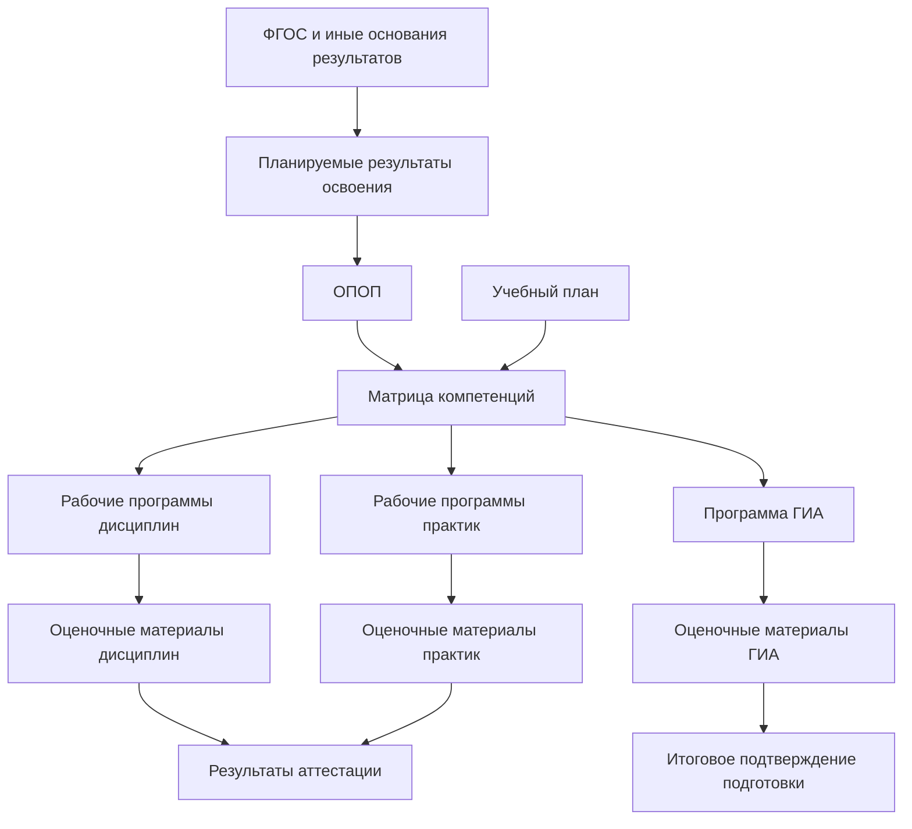
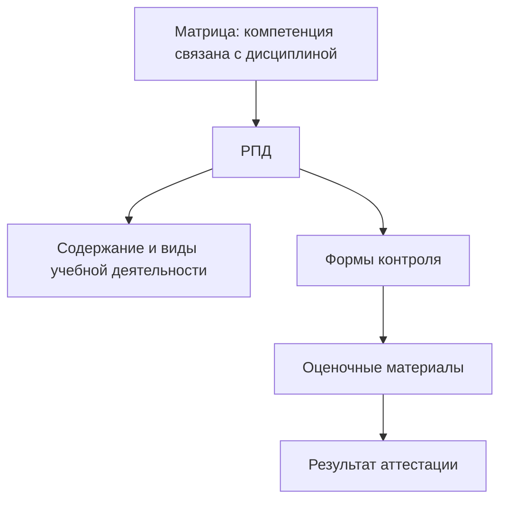
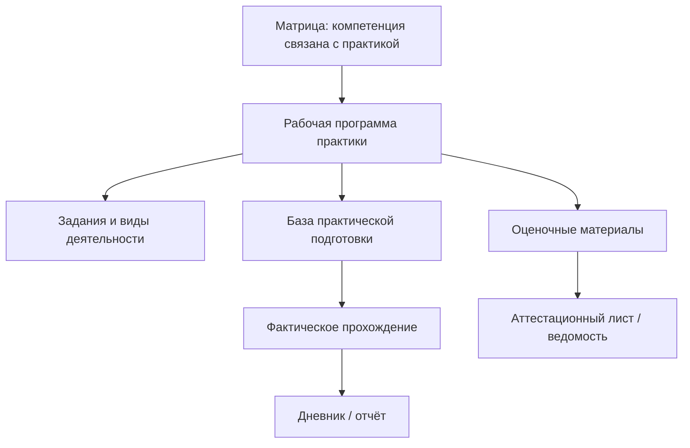
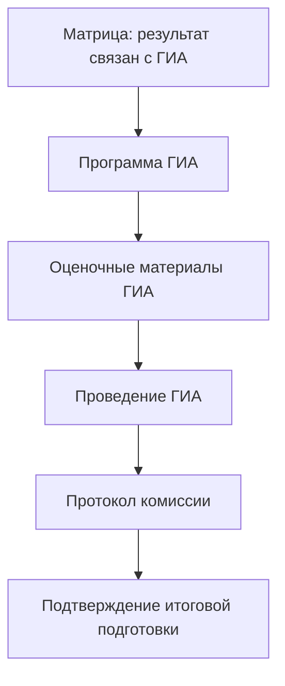
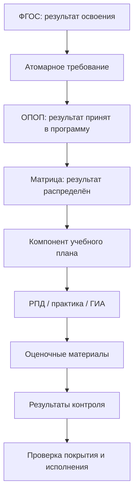
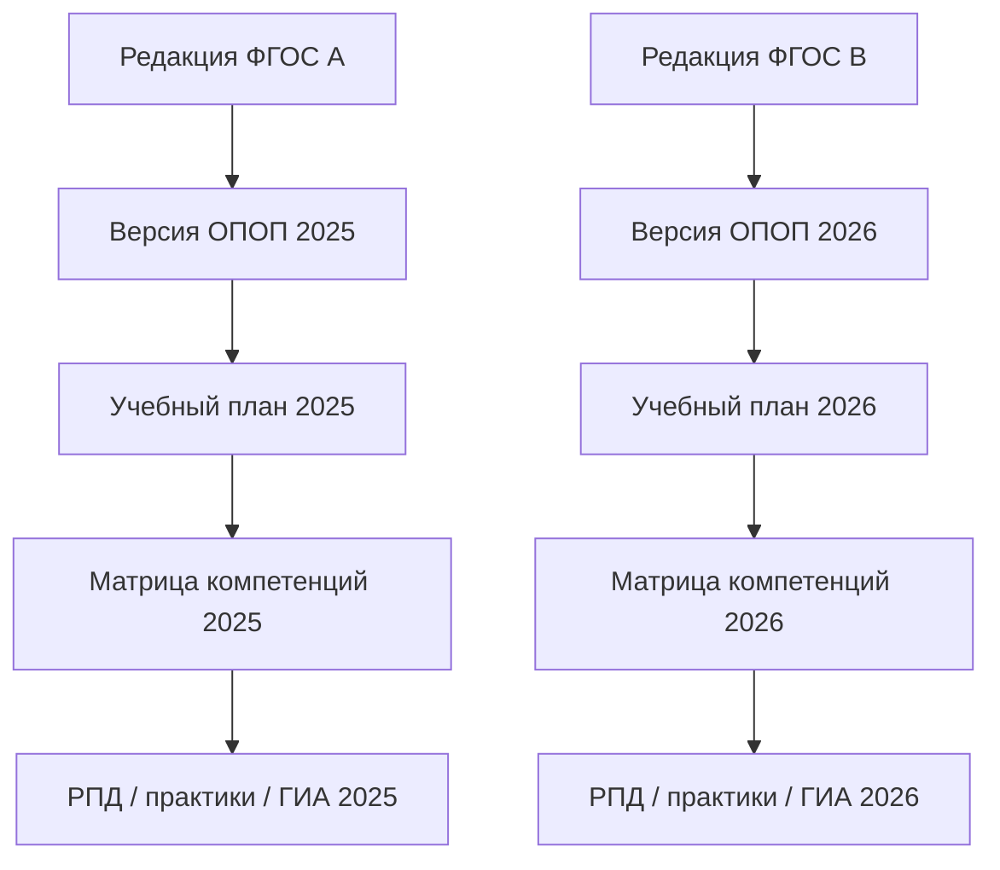
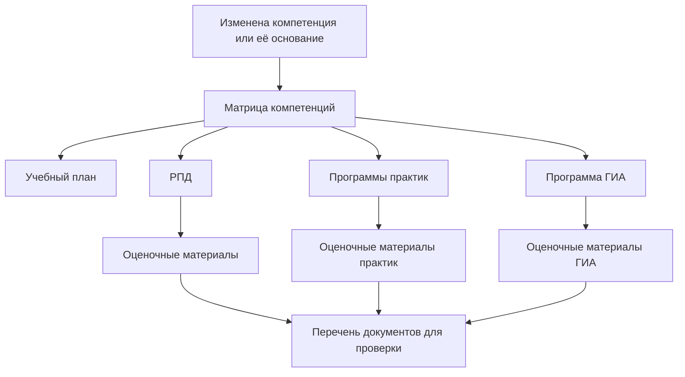

# Матрица компетенций как артефакт связи результатов освоения с компонентами образовательной программы

## 1. Назначение страницы

Данная страница описывает матрицу компетенций как аналитический и организационный артефакт, посредством которого образовательная организация связывает планируемые результаты освоения образовательной программы с её конкретными компонентами.

Страница отвечает на следующие вопросы:

- что представляет собой матрица компетенций;
- почему она необходима для трассировки требований к результатам освоения;
- является ли она обязательным самостоятельным документом;
- какие компетенции и иные результаты могут в ней отражаться;
- как матрица связана с ФГОС, ОПОП, учебным планом, рабочими программами, практиками, ГИА и оценочными материалами;
- какие проверки матрицы могут быть формальными, а какие требуют экспертной оценки;
- как данный артефакт может быть представлен в будущей информационной системе.

В рамках текущей версии репозитория рассматриваются образовательные программы высшего образования:

- программы бакалавриата;
- программы специалитета;
- программы магистратуры.

---

## 2. Важный статус матрицы компетенций

Матрицу компетенций необходимо отличать от документов, прямо предусмотренных федеральными нормативными основаниями как составные части или характеристики образовательной программы.

В рамках данного репозитория применяется следующее правило:

> **Матрица компетенций** — документ или структурированное представление, используемое образовательной организацией для распределения планируемых результатов освоения по компонентам образовательной программы и для построения трассировки их формирования и оценки.

Матрица компетенций может:

- быть отдельным документом в комплекте ОПОП;
- быть приложением к ОПОП;
- быть разделом описания образовательной программы;
- храниться как структурированный набор данных в информационной системе;
- формироваться автоматически на основании связей между компетенциями, дисциплинами, практиками и оценочными материалами.

### Почему это уточнение важно

Не следует утверждать, что любой вуз обязан иметь отдельный файл с названием `Матрица компетенций`, если такая обязанность не установлена применимым нормативным или локальным документом.

Для трассировки важно не название файла, а наличие проверяемой связи:

```text
Планируемый результат освоения
→ компонент образовательной программы
→ способ формирования результата
→ способ оценки результата
→ подтверждение фактического достижения
```

---

## 3. Место матрицы компетенций в системе документов

Матрица компетенций находится между уровнем планируемых результатов образовательной программы и уровнем конкретных документов, обеспечивающих обучение и оценивание.



В упрощённом виде:

```text
ФГОС устанавливает или обусловливает результаты подготовки
→ ОПОП включает планируемые результаты
→ матрица показывает, где эти результаты формируются и оцениваются
→ РПД, практики и ГИА детализируют способы формирования
→ оценочные материалы и результаты контроля подтверждают достижение
```

---

## 4. Почему возникает матрица компетенций

ФГОС и ОПОП позволяют установить, какие результаты должны быть достигнуты в результате освоения программы.

Учебный план позволяет определить, какие дисциплины, практики и формы аттестации входят в программу.

Однако без дополнительной связи остаются неотвеченными вопросы:

- какая дисциплина участвует в формировании конкретной компетенции;
- какая практика обеспечивает практическое проявление результата;
- какие результаты проверяются на ГИА;
- нет ли компетенции, которая заявлена в ОПОП, но не закреплена ни за одним компонентом;
- нет ли дисциплины, которая включена в план, но не связана ни с одним результатом;
- где должны находиться оценочные материалы для подтверждения достижения результата.

Матрица компетенций предназначена для устранения этого разрыва.

### Логика возникновения


### В модели трассировки

| Объект | Основной вопрос |
|---|---|
| ФГОС | Какие результаты являются исходными нормативными требованиями? |
| ОПОП | Какие результаты закреплены за конкретной программой? |
| Учебный план | Какие компоненты входят в программу? |
| Матрица компетенций | Какими компонентами формируется и оценивается каждый результат? |
| РПД и программы практик | Как содержание компонента обеспечивает результат? |
| Оценочные материалы | Каким способом результат проверяется? |
| Документы фактической реализации | Был ли результат оценён у обучающегося? |

---

## 5. Что понимается под результатом освоения

В матрице компетенций объектом распределения являются планируемые результаты освоения образовательной программы.

В зависимости от применимого ФГОС, локальной модели образовательной организации и уровня детализации в матрице могут учитываться:

- универсальные компетенции;
- общепрофессиональные компетенции;
- профессиональные компетенции;
- индикаторы достижения компетенций, если они применяются в документах программы;
- результаты освоения отдельных компонентов программы;
- этапы или уровни формирования результата, если такая модель принята организацией.

### Важное правило

```text
Матрица не должна создавать результаты произвольно.
Каждый отражённый в ней результат должен иметь основание:
ФГОС, ОПОП, профессиональный стандарт, иной применимый источник
или установленное организацией решение в пределах её полномочий.
```

---

## 6. Виды компетенций в модели

### 6.1. Универсальные компетенции

**Универсальные компетенции** отражают результаты, значимые для выпускника независимо от узкой профессиональной специализации.

В модели трассировки необходимо определить:

- из какого источника взята компетенция;
- включена ли она в ОПОП;
- какие компоненты программы участвуют в её формировании;
- какими материалами оценивается её достижение.

### 6.2. Общепрофессиональные компетенции

**Общепрофессиональные компетенции** отражают результаты, связанные с соответствующей областью профессиональной подготовки.

В модели трассировки они могут связываться с:

- профильными дисциплинами;
- практической подготовкой;
- комплексными оценочными материалами;
- ГИА.

### 6.3. Профессиональные компетенции

**Профессиональные компетенции** отражают готовность выпускника к выполнению профессиональных задач.

Для их анализа особенно важно фиксировать основание формирования:

| Возможное основание | Что необходимо зафиксировать |
|---|---|
| Профессиональный стандарт | Наименование стандарта и связанные трудовые функции или действия |
| Требования профессиональной деятельности | Документ или анализ, на основании которого определена компетенция |
| Консультации с работодателями | Зафиксированное основание принятия решения |
| Иной применимый источник | Ссылка на источник и комментарий аналитика |

### Правило для репозитория

Нельзя описывать профессиональную компетенцию только как строку в матрице. Необходимо указывать, почему она включена в программу и с какими источниками связана.

---

## 7. Индикаторы достижения и уровни детализации

Образовательная организация может использовать более детальный уровень описания результата — индикаторы достижения компетенций.

В рамках модели трассировки рекомендуется разделять:

| Уровень | Пример объекта | Основной вопрос |
|---|---|---|
| Компетенция | `УК-1` | Какой общий результат должна обеспечить программа? |
| Индикатор достижения | Конкретизированное проявление компетенции | По каким признакам можно судить о достижении результата? |
| Результат компонента | Результат освоения дисциплины или практики | Какой вклад вносит конкретный компонент? |
| Оценочный показатель | Критерий или шкала оценивания | Как результат будет проверяться? |

### Важное ограничение

Использование индикаторов и конкретная форма их представления должны определяться с учётом применимого ФГОС, документов ОПОП и локальных правил организации.

В репозитории индикатор следует рассматривать как объект трассировки только тогда, когда он фактически используется в документах анализируемой программы.

---

## 8. Основные функции матрицы компетенций

| Функция | Что обеспечивает |
|---|---|
| Распределение результатов | Показывает, какие дисциплины, практики и формы аттестации связаны с компетенцией |
| Проверка полноты | Позволяет выявить компетенции, не закреплённые за компонентами программы |
| Проверка согласованности | Позволяет сопоставить учебный план, РПД, практики и ГИА |
| Основание для оценки | Показывает, по каким компонентам должны быть предусмотрены оценочные материалы |
| Анализ изменений | Позволяет найти документы, которые нужно проверить при изменении компетенции |
| Поддержка автоматизации | Позволяет хранить связи как данные информационной системы |
| Обучение сотрудников | Показывает логику перехода от результата ФГОС к конкретной учебной деятельности |

---

## 9. Что содержит матрица компетенций

### 9.1. Минимальная структура

В минимальном варианте матрица показывает связь между компетенцией и компонентом образовательной программы.

| Компетенция | Дисциплина | Практика | ГИА |
|---|---|---|---|
| Результат 1 | Связанные дисциплины | Связанные практики | Признак участия ГИА |
| Результат 2 | Связанные дисциплины | Связанные практики | Признак участия ГИА |

### 9.2. Расширенная структура

Для трассировки требований рекомендуется использовать более подробную структуру.

| Поле | Содержание |
|---|---|
| `matrix_id` | Идентификатор матрицы |
| `program_id` | Образовательная программа |
| `program_version_id` | Версия ОПОП |
| `curriculum_id` | Связанный учебный план |
| `result_id` | Идентификатор компетенции или результата |
| `result_type` | УК, ОПК, ПК или иной используемый тип |
| `result_source` | Основание включения результата |
| `indicator_id` | Индикатор, если применяется |
| `component_id` | Компонент учебного плана |
| `component_type` | Дисциплина, практика, ГИА |
| `formation_role` | Роль компонента в формировании результата |
| `assessment_role` | Роль компонента в оценивании результата |
| `related_document` | РПД, программа практики или программа ГИА |
| `assessment_material` | Связанные оценочные материалы |
| `status` | Статус проверки связи |
| `notes` | Комментарий аналитика |

---

## 10. Модель роли компонента в формировании результата

Один компонент программы может иметь различную роль в отношении одной и той же компетенции.

Для модели можно использовать следующие значения:

| Код роли | Значение | Пример интерпретации |
|---|---|---|
| `introduces` | Формирует исходное представление | Дисциплина впервые вводит необходимое содержание |
| `develops` | Развивает результат | Дисциплина или практика углубляет применение компетенции |
| `practices` | Обеспечивает практическое применение | Практика позволяет использовать результат в деятельности |
| `assesses` | Проверяет достижение | Контроль или ГИА оценивают результат |
| `final_assesses` | Проверяет итоговую готовность | ГИА используется как итоговая проверка |
| `supports` | Поддерживает достижение результата | Компонент обеспечивает дополнительный вклад |

### Ограничение

Такая классификация является аналитическим инструментом проекта.

Она должна использоваться только в том случае, если организация принимает подобную модель распределения результатов. Если в фактических документах программы используется только признак связи компетенции с компонентом, матрица не должна искусственно назначать этапы формирования.

---

## 11. Карточка матрицы компетенций

Для каждой матрицы рекомендуется фиксировать общие сведения.

### 11.1. Идентификация

| Поле | Содержание |
|---|---|
| `matrix_id` | Уникальный идентификатор матрицы |
| `title` | Наименование |
| `program_id` | Связанная образовательная программа |
| `program_version_id` | Версия ОПОП |
| `curriculum_id` | Связанный учебный план |
| `education_form` | Форма обучения |
| `admission_year` | Год набора |
| `status` | Проект, действует, заменена, архивная |

### 11.2. Нормативные и организационные основания

| Поле | Содержание |
|---|---|
| `fgos_id` | Применимый ФГОС |
| `fgos_version` | Редакция ФГОС |
| `opop_approval_document` | Документ об утверждении ОПОП |
| `local_regulation` | Локальный документ, предусматривающий использование матрицы, если имеется |
| `professional_standard_links` | Основания профессиональных компетенций |
| `effective_from` | Дата начала применения |
| `effective_to` | Дата окончания применения, если установлена |

---

## 12. Связь матрицы с ФГОС и ОПОП

### 12.1. ФГОС и матрица

Матрица компетенций не заменяет ФГОС и не должна искажать установленные им требования.

| ФГОС или иное основание определяет | Матрица показывает |
|---|---|
| Компетенцию или требование к результату | Через какие компоненты программы обеспечивается результат |
| Требование к структуре программы | Какие из предусмотренных компонентов участвуют в формировании результата |
| Основание для профессиональной компетенции | Какими профильными компонентами она реализуется |

### 12.2. ОПОП и матрица

ОПОП фиксирует планируемые результаты конкретной программы, а матрица раскрывает их распределение.

| ОПОП | Матрица компетенций |
|---|---|
| Устанавливает перечень планируемых результатов | Распределяет результаты по компонентам |
| Определяет общую модель подготовки | Показывает механизм формирования результатов |
| Связывается с ФГОС и иными основаниями | Связывается с учебным планом, РПД, практиками и ГИА |

### Типы связей

```text
ФГОС --derived_from requirement--> Планируемый результат
ОПОП --contains--> Планируемый результат
Матрица --allocates--> Результат по компонентам программы
```

### Дополнение к справочнику типов связей

Для описания матрицы рекомендуется использовать новые связи:

| Код связи | Значение | Пример |
|---|---|---|
| `contains` | Объект включает другой объект в свой состав | ОПОП включает компетенцию в планируемые результаты |
| `maps_to` | Один объект сопоставляется с другим | Компетенция сопоставляется с дисциплиной |
| `contributes_to` | Компонент вносит вклад в результат | Практика участвует в формировании ПК |

---

## 13. Связь матрицы с учебным планом

Матрица компетенций должна строиться на основании реально существующих компонентов учебного плана.

### Взаимосвязь

| Учебный план | Матрица компетенций |
|---|---|
| Показывает перечень компонентов программы | Показывает связь компонентов с результатами |
| Фиксирует объём и период реализации | Может учитывать этап формирования результата |
| Определяет форму контроля | Связывает контроль с оцениваемым результатом |
| Является источником состава компонентов | Не должна содержать отсутствующие в плане компоненты |

### Обязательные проверки согласованности

| Проверка | Ожидаемый результат |
|---|---|
| Каждый компонент матрицы найден в учебном плане | Отсутствуют ссылки на несуществующие дисциплины или практики |
| Каждая компетенция ОПОП присутствует в матрице, если матрица используется как полный инструмент покрытия | Нет непокрытых результатов |
| Для компонентов, участвующих в формировании результата, имеются документы детализации | Есть РПД, программы практик или программа ГИА |
| Для компонентов, оценивающих результат, предусмотрены оценочные материалы | Есть способ проверки достижения |
| Версии матрицы и учебного плана согласованы | Матрица относится к действующей версии комплекта ОПОП |

### Цепочка


---

## 14. Связь матрицы с рабочей программой дисциплины

Матрица показывает, что конкретная дисциплина связана с результатом освоения. Рабочая программа дисциплины должна раскрывать эту связь содержательно.

### Что проверяется

| В матрице указано | Что должно быть проверено в РПД |
|---|---|
| Дисциплина связана с компетенцией | Та же компетенция или её применимый результат отражены в РПД |
| Дисциплина участвует в формировании результата | Содержание дисциплины позволяет обосновать вклад в результат |
| Дисциплина участвует в оценивании результата | Предусмотрены формы контроля и оценочные материалы |
| Используется индикатор, если применимо | Индикатор согласован с РПД и оценочными средствами |

### Трассировка



### Важное правило

```text
Связь компетенции с дисциплиной в матрице является заявлением о реализации результата.
РПД и оценочные материалы должны позволять обосновать и проверить это заявление.
```

---

## 15. Связь матрицы с программой практики

Практика имеет особое значение для результатов, связанных с применением знаний и навыков в профессиональной или приближённой к ней деятельности.

### Что проверяется

| В матрице указано | Что должно быть найдено в программе практики |
|---|---|
| Практика формирует компетенцию | Результаты практики связаны с данной компетенцией |
| Практика развивает профессиональный результат | Задания и виды деятельности соответствуют результату |
| Практика оценивает результат | Определены критерии и формы оценивания |
| Практика является значимым подтверждением | Имеются документы фактического прохождения и оценки |

### Трассировка



---

## 16. Связь матрицы с ГИА

ГИА может выступать итоговым уровнем оценки достижения результатов освоения образовательной программы.

### Что проверяется

| В матрице указано | Что должно быть найдено в документах ГИА |
|---|---|
| Компетенция проверяется на ГИА | Она отражена в программе ГИА или связанных материалах |
| ГИА является итоговым подтверждением результата | Определены формы и критерии итоговой оценки |
| Оценивание проводится фактически | Имеются протоколы, ведомости и решения комиссии |

### Трассировка



---

## 17. Связь матрицы с оценочными материалами

Матрица позволяет определить, для каких результатов должны существовать механизмы оценки.

### Базовая цепочка

```text
Результат освоения
→ компонент программы
→ оценочные материалы компонента
→ процедура контроля
→ зафиксированный результат обучающегося
```

### Типы проверки

| Уровень | Что проверяется |
|---|---|
| Формальный | Для результата указан хотя бы один оценивающий компонент |
| Документарный | Для оценивающего компонента имеются оценочные материалы |
| Содержательный | Задания действительно позволяют оценить заявленный результат |
| Фактический | Оценивание проведено и результат зафиксирован |

### Важное различие

Матрица может показать, **где предполагается оценивать результат**, но сама по себе не доказывает:

- качество оценочных материалов;
- корректность критериев оценки;
- факт проведения контроля;
- фактическое достижение результата обучающимся.

---

## 18. Матрица как инструмент трассировки требования ФГОС

### 18.1. Общая цепочка



### 18.2. Пример карточки требования

| Поле | Пример содержания |
|---|---|
| `requirement_id` | `FGOS-VO-XX.XX.XX-COMPETENCE-001` |
| `source_document` | Конкретный ФГОС ВО |
| `source_fragment` | Раздел требований к результатам освоения |
| `normalized_requirement` | Образовательная программа должна обеспечивать достижение установленной компетенции |
| `implementation_artefact` | ОПОП, матрица компетенций |
| `detailing_artefacts` | РПД, программы практик, программа ГИА |
| `evidence` | Оценочные материалы, результаты аттестации, документы ГИА |
| `verification_method` | Структурная и содержательная проверка |
| `coverage_status` | `not_analyzed` / `covered` / `requires_review` |

---

## 19. Матрица покрытия результатов

### 19.1. Назначение

Матрица покрытия позволяет выявить, все ли результаты программы связаны с компонентами обучения и оценивания.

### 19.2. Минимальный шаблон

| Код результата | Наименование результата | Дисциплины | Практики | ГИА | Оценочные материалы | Статус покрытия |
|---|---|---|---|---|---|---|
|  |  |  |  |  |  |  |

### 19.3. Расширенный шаблон

| Код результата | Источник результата | Индикатор, если применяется | Компонент плана | Тип компонента | Роль в формировании | Роль в оценивании | Связанный документ | Подтверждение | Статус |
|---|---|---|---|---|---|---|---|---|---|
|  |  |  |  |  |  |  |  |  |  |

---

## 20. Учебный пример заполнения матрицы

> Пример предназначен только для демонстрации структуры. Коды, формулировки и связи реальной программы должны извлекаться из утверждённых документов конкретной ОПОП и применимого ФГОС.

| Результат | Источник | Компонент программы | Роль компонента | Документ детализации | Оценочное подтверждение | Статус |
|---|---|---|---|---|---|---|
| `УК-X` | ФГОС | Дисциплина А | `introduces` | РПД дисциплины А | Оценочные материалы дисциплины | `not_analyzed` |
| `УК-X` | ФГОС | Практика Б | `practices` | Рабочая программа практики Б | Отчёт и аттестационный лист | `not_analyzed` |
| `ОПК-X` | ФГОС | Дисциплина В | `develops` | РПД дисциплины В | Экзаменационная ведомость | `not_analyzed` |
| `ПК-X` | Установленное основание профессиональной компетенции | Практика Г | `practices` | Рабочая программа практики Г | Аттестационный лист | `not_analyzed` |
| `ПК-X` | Установленное основание профессиональной компетенции | ГИА | `final_assesses` | Программа ГИА | Протокол комиссии | `not_analyzed` |

---

## 21. Возможные статусы покрытия результата

| Статус | Значение |
|---|---|
| `not_analyzed` | Результат ещё не сопоставлялся с компонентами программы |
| `not_mapped` | Результат включён в программу, но компоненты формирования не определены |
| `mapped_for_formation` | Определены компоненты формирования, но не определён способ оценки |
| `mapped_for_assessment` | Определены компоненты оценки, но требуется проверка содержания |
| `covered` | Определены компоненты формирования и оценивания |
| `verified` | Корректность связей подтверждена экспертной проверкой |
| `inconsistent` | Обнаружены противоречия между матрицей и связанными документами |
| `outdated` | Матрица требует актуализации из-за изменения ФГОС, ОПОП или учебного плана |
| `not_applicable` | Результат или связь не применимы к рассматриваемой версии программы |

---

## 22. Возможные проверки матрицы компетенций

### 22.1. Проверки, пригодные для автоматизации

| Проверка | Что выявляется |
|---|---|
| Все результаты ОПОП представлены в матрице | Отсутствующие связи для компетенций |
| Все компоненты матрицы существуют в учебном плане | Ошибочные или устаревшие ссылки |
| Для каждого результата имеется хотя бы один компонент формирования | Непокрытые результаты |
| Для каждого результата имеется хотя бы один компонент оценки, если это предусмотрено моделью организации | Отсутствие уровня оценивания |
| Для каждой дисциплины в матрице существует РПД | Неполный комплект документов |
| Для каждой практики в матрице существует программа практики | Неполный комплект документов практической подготовки |
| Для связи с ГИА существует программа ГИА | Отсутствие документа детализации |
| Версия матрицы согласована с версией учебного плана и ОПОП | Использование устаревших связей |

### 22.2. Проверки, требующие эксперта

| Проверка | Почему не может быть полностью автоматизирована |
|---|---|
| Действительно ли дисциплина формирует указанную компетенцию | Требуется анализ содержания дисциплины |
| Достаточна ли совокупность компонентов для достижения результата | Требуется профессиональная оценка модели подготовки |
| Соответствуют ли оценочные задания компетенции | Необходим содержательный анализ заданий и критериев |
| Обоснована ли связь профессиональной компетенции с источником | Требуется анализ профессиональной деятельности и оснований |
| Адекватно ли ГИА подтверждает итоговые результаты | Требуется экспертная оценка итоговой аттестации |

### Принцип проверки

```text
Автоматическая проверка выявляет отсутствие, несогласованность и структурные пробелы.
Экспертная проверка подтверждает содержательную обоснованность связей.
```

---

## 23. Версионность и актуализация матрицы

### 23.1. Почему матрица должна быть версионируемой

Матрица компетенций зависит от нескольких изменяемых объектов:

- редакции ФГОС;
- версии ОПОП;
- версии учебного плана;
- перечня компетенций;
- состава дисциплин и практик;
- программы ГИА;
- оценочных материалов;
- профессиональных стандартов или иных оснований профессиональных компетенций.

Изменение любого из этих объектов может потребовать проверки матрицы.

### 23.2. Модель версионности



### 23.3. Основания актуализации

| Изменение | Что проверить в матрице |
|---|---|
| Изменился перечень компетенций ФГОС | Наличие новых, изменённых или отменённых результатов |
| Изменены профессиональные компетенции | Основания, компоненты формирования и оценивания |
| Изменился учебный план | Соответствие компонентов матрицы актуальному плану |
| Изменилась РПД | Корректность связи дисциплины с результатом |
| Изменилась программа практики | Корректность практического формирования результатов |
| Изменилась программа ГИА | Корректность итоговой оценки |
| Изменились оценочные материалы | Достаточность подтверждения результата |

---

## 24. Анализ влияния изменения компетенции

### 24.1. Сценарий

Если в применимом нормативном источнике или в утверждённой модели ОПОП изменяется компетенция, матрица позволяет определить связанные документы.



### 24.2. Карточка анализа влияния

| Поле | Содержание |
|---|---|
| `change_id` | Идентификатор изменения |
| `changed_result_id` | Компетенция или результат, который был изменён |
| `change_source` | ФГОС, ОПОП, профессиональный стандарт или иной источник |
| `old_formulation` | Предыдущая формулировка |
| `new_formulation` | Новая формулировка |
| `affected_components` | Дисциплины, практики и ГИА |
| `affected_documents` | РПД, программы практик, ФОС, программа ГИА |
| `required_actions` | Проверить, изменить, исключить или дополнить |
| `status` | Статус выполнения анализа |

---

## 25. Матрица компетенций как объект информационной системы

Для автоматизации матрицу компетенций целесообразно хранить в структурированном виде, а не только как таблицу в Word или PDF.

### 25.1. Возможные объекты данных

| Объект | Назначение |
|---|---|
| Образовательная программа | Центральный объект программы |
| Версия ОПОП | Контекст действия матрицы |
| Учебный план | Источник компонентов программы |
| Версия учебного плана | Конкретная структура компонентов |
| Результат освоения | Компетенция или иной планируемый результат |
| Источник результата | ФГОС, профессиональный стандарт или иное основание |
| Индикатор достижения | Детализация результата, если применяется |
| Компонент программы | Дисциплина, практика, ГИА |
| Связь результата с компонентом | Основная запись матрицы |
| Документ детализации | РПД, программа практики, программа ГИА |
| Оценочный материал | Средство проверки результата |
| Результат проверки | Статус покрытия и экспертной оценки |

### 25.2. Возможные функции системы

| Функция | Значение |
|---|---|
| Импорт компетенций из карточки ФГОС или ОПОП | Формирование основы матрицы |
| Загрузка компонентов из учебного плана | Исключение ссылок на несуществующие компоненты |
| Создание связей компетенция — компонент | Формирование матрицы |
| Указание роли компонента | Различение формирования, практики и оценки |
| Проверка покрытия компетенций | Выявление результатов без компонентов |
| Проверка комплектности документов | Выявление компонентов без РПД или оценочных материалов |
| Анализ изменения компетенции | Поиск всех связанных артефактов |
| Формирование отчёта | Представление трассировки для аналитика или проверки |

---

## 26. Возможная модель для 1С

При реализации в 1С матрица компетенций может быть представлена следующими объектами.

| Объект 1С | Возможное назначение |
|---|---|
| Справочник `ОбразовательныеПрограммы` | Хранение ОПОП |
| Справочник `ВерсииОбразовательныхПрограмм` | Учёт применимости по годам набора |
| Справочник `ФГОС` | Хранение нормативных источников |
| Справочник `Компетенции` | Хранение планируемых результатов |
| Справочник `ИндикаторыДостижения` | Детализация результатов, если применяется |
| Документ или справочник `УчебныеПланы` | Хранение учебных планов |
| Справочник `КомпонентыОбразовательнойПрограммы` | Дисциплины, практики, ГИА |
| Регистр сведений `МатрицаКомпетенций` | Связи результатов с компонентами |
| Справочник `ДокументыКомпонентов` | РПД, программы практик, программа ГИА |
| Регистр сведений `ОценочныеМатериалыПоРезультатам` | Связь оценивания с результатами |
| Регистр сведений `СтатусыПокрытияРезультатов` | Результаты проверок |
| Документ `АнализВлиянияИзменений` | Обработка изменений компетенций и связанных документов |

### 26.1. Возможная запись регистра `МатрицаКомпетенций`

| Измерение или реквизит | Содержание |
|---|---|
| Образовательная программа | Конкретная ОПОП |
| Версия программы | Применимая редакция |
| Учебный план | Связанный план |
| Компетенция | Планируемый результат |
| Индикатор | Значение при использовании |
| Компонент программы | Дисциплина, практика или ГИА |
| Роль компонента | Формирует, развивает, оценивает, итогово оценивает |
| Документ детализации | РПД, программа практики или программа ГИА |
| Статус проверки | Проверено / требует проверки / несогласовано |
| Комментарий | Пояснение аналитика |

### 26.2. Пользовательский сценарий

```text
Пользователь открывает версию ОПОП
→ выбирает раздел «Матрица компетенций»
→ система загружает результаты программы и компоненты учебного плана
→ пользователь связывает компетенции с дисциплинами, практиками и ГИА
→ система проверяет:
   - есть ли компетенции без компонентов;
   - есть ли компоненты, отсутствующие в учебном плане;
   - есть ли связи без документов детализации;
   - есть ли результаты без оценочных материалов;
→ пользователь фиксирует результат экспертной проверки
→ при изменении ФГОС система показывает затронутые связи и документы.
```

---

## 27. Ограничения страницы

Данная страница описывает матрицу компетенций как аналитический артефакт модели трассировки.

Она не утверждает, что:

- отдельный файл с названием `Матрица компетенций` обязателен для каждой образовательной программы независимо от нормативных и локальных оснований;
- само наличие связи в матрице доказывает содержательное формирование компетенции;
- автоматическая проверка может заменить экспертную оценку РПД, практик, ГИА и оценочных материалов;
- перечень и структура компетенций одинаковы для всех ФГОС и всех программ.

Для применения модели к реальной образовательной программе необходимо:

- определить конкретный действующий ФГОС;
- проверить перечень результатов, предусмотренных стандартом и ОПОП;
- установить основания профессиональных компетенций;
- изучить локальные правила организации о составе документов ОПОП;
- сопоставить матрицу с действующим учебным планом;
- проверить РПД, практики, ГИА и оценочные материалы;
- зафиксировать результаты экспертной проверки.

---

## 28. Нормативная и организационная опора страницы

При разработке и последующей актуализации данной страницы должны учитываться:

| Источник | Значение для страницы |
|---|---|
| Федеральный закон от 29.12.2012 № 273-ФЗ «Об образовании в Российской Федерации» | Определяет общую роль образовательной программы и ФГОС |
| Федеральный закон № 273-ФЗ, статья 11 | Определяет требования ФГОС к результатам освоения образовательных программ |
| Федеральный закон № 273-ФЗ, статья 12 | Определяет разработку и утверждение образовательных программ организацией |
| Приказ Минобрнауки России от 06.04.2021 № 245 | Определяет порядок организации образовательной деятельности по программам бакалавриата, специалитета и магистратуры |
| Конкретный ФГОС по направлению подготовки или специальности | Определяет состав и особенности результатов для конкретной программы |
| Профессиональные стандарты и иные основания профессиональных компетенций | Используются при анализе профессиональных компетенций в случаях, предусмотренных применимой моделью |
| Локальные нормативные и методические документы организации | Определяют, используется ли матрица как отдельный документ и как она должна оформляться |

> Перед применением данной модели к реальной ОПОП необходимо проверить действующие редакции применимых нормативных источников и локальные документы конкретной образовательной организации.

---

## 29. Следующие связанные страницы

После описания матрицы компетенций необходимо перейти к документам, которые раскрывают формирование и оценивание результатов на уровне конкретных компонентов программы.

| Страница | Назначение |
|---|---|
| `docs/02-organization-documents/discipline-program.md` | Рабочая программа дисциплины как детализация содержания обучения |
| `docs/02-organization-documents/practice-program.md` | Рабочая программа практики как детализация практической подготовки |
| `docs/02-organization-documents/gia-program.md` | Программа ГИА как итоговый уровень оценки |
| `docs/02-organization-documents/assessment-materials.md` | Оценочные материалы как механизм проверки результатов |
| `docs/03-traceability-examples/competence-traceability.md` | Прикладной пример трассировки компетенции |
| `docs/03-traceability-examples/practice-traceability.md` | Прикладной пример трассировки практической подготовки |

---

## 30. Итог

Матрица компетенций является связующим артефактом между планируемыми результатами образовательной программы и её конкретными компонентами.

```text
ФГОС и иные основания результатов
→ ОПОП
→ планируемые результаты
→ матрица компетенций
→ дисциплины, практики и ГИА
→ оценочные материалы
→ результаты контроля
→ подтверждение подготовки выпускника
```

Для модели трассировки матрица особенно важна, потому что она позволяет:

- увидеть, где формируется каждый результат;
- выявить непокрытые компетенции;
- связать учебный план с РПД, практиками, ГИА и оцениванием;
- определить документы, затронутые изменением компетенции;
- перевести связь результатов и компонентов в структурированные данные информационной системы.

При этом матрица должна использоваться корректно: как средство обоснования и проверки связей, а не как самостоятельное доказательство фактического достижения результата.
