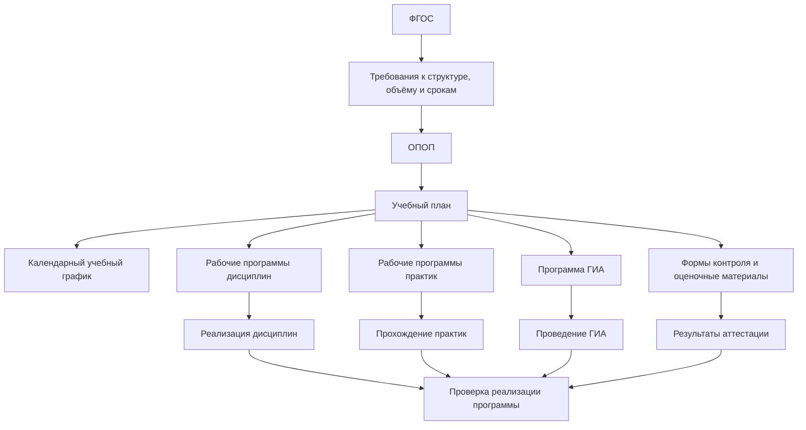
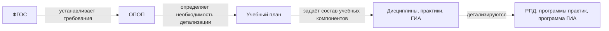
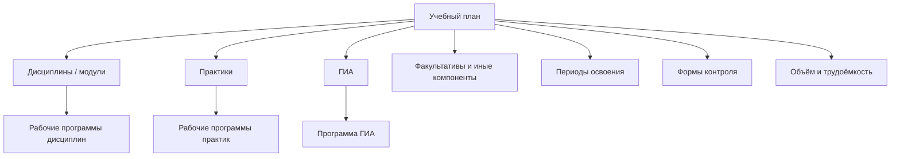
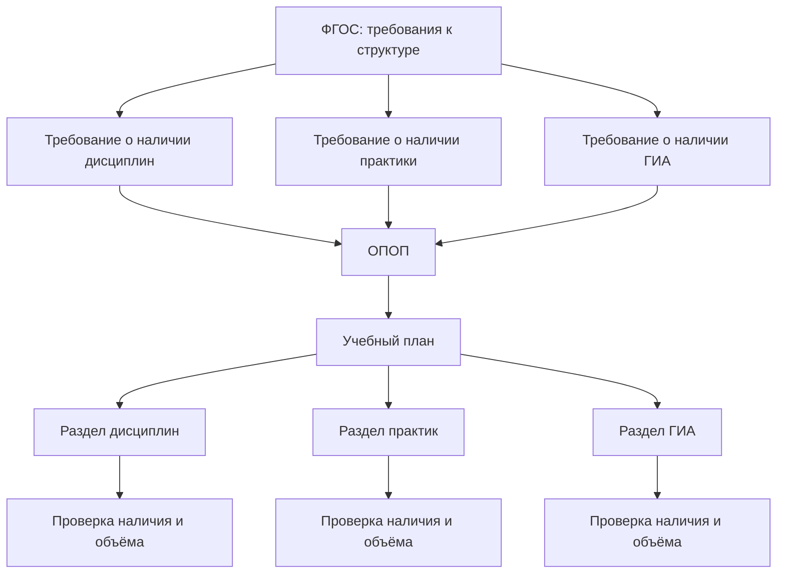
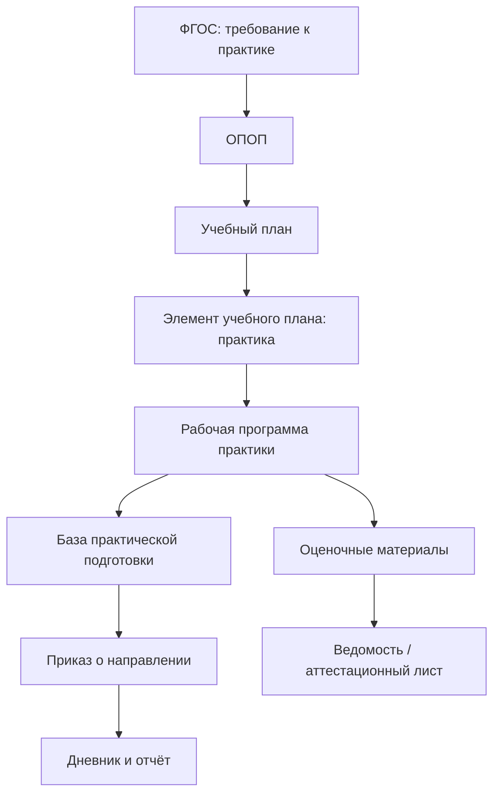
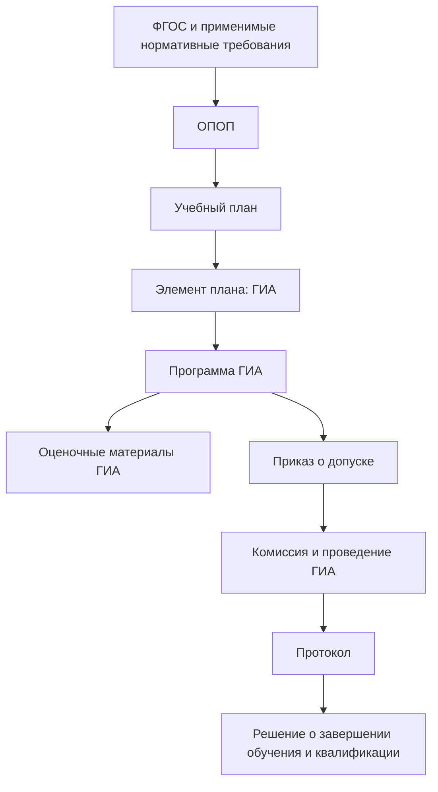
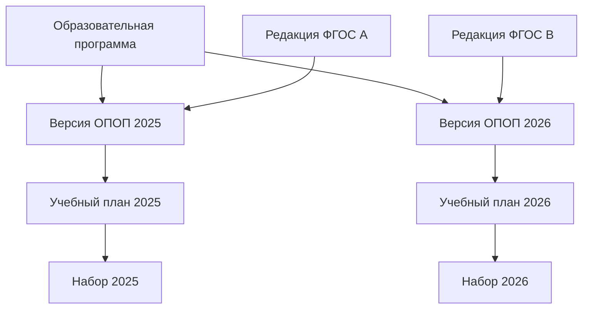
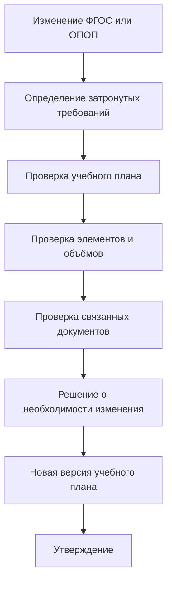

# Учебный план как документ детализации структуры и объёма образовательной программы

## 1. Назначение страницы

Данная страница описывает учебный план как один из основных компонентов образовательной программы и как один из ключевых артефактов реализации требований ФГОС.

Страница отвечает на следующие вопросы:

- что представляет собой учебный план;
- почему он создаётся на основании ОПОП и требований ФГОС;
- какие сведения он содержит;
- какие требования могут быть трассированы на учебный план;
- какие документы возникают или применяются на его основе;
- какие проверки учебного плана могут быть автоматизированы;
- какое место учебный план занимает в будущей информационной системе.

В рамках текущей версии репозитория рассматриваются учебные планы образовательных программ высшего образования:

- программ бакалавриата;
- программ специалитета;
- программ магистратуры.

---

## 2. Место учебного плана в системе документов

Учебный план занимает промежуточное положение между общей моделью образовательной программы и документами, описывающими реализацию отдельных дисциплин, практик и форм аттестации.



В упрощённом виде:

```text
ФГОС задаёт обязательную структуру и параметры программы
→ ОПОП определяет общую модель подготовки
→ учебный план раскладывает программу на конкретные учебные компоненты
→ рабочие программы и документы реализации обеспечивают фактическое обучение
```

---

## 3. Что такое учебный план

**Учебный план** — документ образовательной программы, в котором фиксируются состав учебных компонентов, их трудоёмкость, последовательность освоения, распределение по периодам обучения и формы промежуточной аттестации, если они применимы к соответствующим компонентам.

В контексте высшего образования учебный план обычно позволяет увидеть:

- какие дисциплины и модули входят в программу;
- какие практики предусмотрены;
- предусмотрена ли государственная итоговая аттестация;
- какой объём закреплён за каждым компонентом;
- в какие семестры или курсы реализуется компонент;
- какие формы контроля используются;
- как суммарный объём компонентов соотносится с параметрами программы.

### Учебный план отвечает на вопрос

> Из каких конкретных учебных компонентов состоит образовательная программа, в каком объёме и в какой последовательности они осваиваются?

---

## 4. Почему возникает учебный план

ОПОП описывает образовательную программу как целостную модель подготовки выпускника.

Однако на уровне общей характеристики программы невозможно в достаточной степени зафиксировать:

- полный перечень дисциплин;
- точный объём каждой дисциплины;
- распределение компонентов по семестрам;
- перечень и объём практик;
- положение ГИА в структуре обучения;
- формы промежуточной аттестации;
- расчёт суммарной трудоёмкости программы.

Поэтому образовательная организация создаёт учебный план как документ детализации ОПОП.

### Логика возникновения



### В модели трассировки

| Объект | Основная функция |
|---|---|
| ФГОС | Устанавливает требования к структуре, объёму, срокам и результатам |
| ОПОП | Определяет способ реализации требований в конкретной программе |
| Учебный план | Детализирует структуру программы через конкретные учебные компоненты |
| РПД и программы практик | Раскрывают содержание отдельных компонентов |
| Документы контроля | Подтверждают освоение предусмотренных компонентов |

---

## 5. Учебный план как компонент ОПОП

Учебный план не существует изолированно. Он является компонентом конкретной образовательной программы и должен рассматриваться в связи с её параметрами.

### Контекст учебного плана

| Связанный объект | Что необходимо учитывать |
|---|---|
| ОПОП | К какой программе относится учебный план |
| Версия ОПОП | Для какой редакции программы он действует |
| ФГОС | Какие требования к структуре и объёму должны быть соблюдены |
| Редакция ФГОС | Какая нормативная версия использовалась при разработке |
| Форма обучения | Для какой формы составлен план |
| Год набора | К какому контингенту применяется план |
| Календарный учебный график | Как компоненты распределены по времени |
| РПД | Какими программами раскрываются дисциплины |
| Программы практик | Какими документами раскрываются практики |
| Программа ГИА | Каким документом раскрывается итоговая аттестация |

### Важное правило

```text
Учебный план должен быть связан не просто с названием программы,
а с конкретной версией ОПОП, формой обучения и годом набора.
```

---

## 6. Основные сведения учебного плана

### 6.1. Идентификационные сведения

| Поле | Содержание |
|---|---|
| `curriculum_id` | Уникальный идентификатор учебного плана |
| `title` | Наименование учебного плана |
| `program_id` | Образовательная программа, к которой относится план |
| `program_version_id` | Версия ОПОП |
| `education_level` | Уровень образования |
| `program_type` | Бакалавриат, специалитет или магистратура |
| `code` | Код направления подготовки или специальности |
| `profile` | Направленность или профиль, если применяется |
| `education_form` | Форма обучения |
| `admission_year` | Год набора обучающихся |
| `language` | Язык реализации, если подлежит учёту |
| `status` | Проект, действует, заменён, архивный |

### 6.2. Нормативные основания

| Поле | Содержание |
|---|---|
| `fgos_id` | ФГОС, требования которого учитываются |
| `fgos_version` | Редакция ФГОС |
| `opop_id` | Связанная ОПОП |
| `opop_version` | Версия ОПОП |
| `applicable_local_acts` | Локальные акты, регулирующие разработку учебного плана |
| `approval_document` | Документ об утверждении плана |
| `effective_from` | Дата начала применения |
| `effective_to` | Дата окончания применения, если установлена |

### 6.3. Параметры реализации

| Поле | Содержание |
|---|---|
| `total_credits` | Общий объём программы в зачётных единицах |
| `total_hours` | Общий объём в часах, если учитывается в модели |
| `duration` | Срок реализации программы |
| `semester_count` | Количество семестров |
| `course_count` | Количество курсов |
| `practice_credits` | Объём практической подготовки |
| `gia_credits` | Объём государственной итоговой аттестации |
| `elective_credits` | Объём дисциплин по выбору, если применимо |
| `optional_credits` | Объём факультативных компонентов, если применимо |

---

## 7. Состав учебного плана

Структура учебного плана может различаться в зависимости от конкретного ФГОС, уровня образования, локальных правил организации и программного обеспечения, в котором он формируется.

Для модели трассировки рекомендуется выделять следующие основные группы элементов.

| Группа элементов | Что отражает | Примеры |
|---|---|---|
| Дисциплины и модули | Теоретическую и практическую учебную подготовку | Анатомия, философия, информационные технологии |
| Практики | Практическую подготовку обучающихся | Учебная практика, производственная практика |
| Государственная итоговая аттестация | Итоговую проверку подготовки выпускника | Государственный экзамен, защита ВКР |
| Факультативные дисциплины | Дополнительные компоненты, не всегда обязательные для освоения | Факультативный курс |
| Формы контроля | Способы промежуточной проверки освоения компонентов | Экзамен, зачёт, зачёт с оценкой |
| Периоды освоения | Временное распределение компонентов | Семестр, курс |
| Объём компонентов | Трудоёмкость обучения | Зачётные единицы, часы |

### Обобщённая структура



---

## 8. Элемент учебного плана

Для целей автоматизации и трассировки учебный план целесообразно представлять не только как файл, но и как набор структурированных элементов.

### 8.1. Карточка элемента учебного плана

| Поле | Содержание |
|---|---|
| `curriculum_item_id` | Идентификатор элемента учебного плана |
| `curriculum_id` | Учебный план, в который входит элемент |
| `item_type` | Дисциплина, практика, ГИА, факультатив, иной компонент |
| `code` | Код элемента, если используется |
| `title` | Наименование элемента |
| `block` | Блок или часть программы |
| `credits` | Объём в зачётных единицах |
| `hours` | Объём в часах, если учитывается |
| `semester` | Семестр реализации |
| `course` | Курс реализации |
| `control_form` | Форма промежуточной или итоговой аттестации |
| `competence_links` | Связанные компетенции |
| `programme_document` | Связанная РПД, программа практики или программа ГИА |
| `status` | Действует, заменён, исключён |

### 8.2. Пример элементов

| Тип элемента | Наименование | Объём | Период | Форма контроля | Связанный документ |
|---|---|---:|---|---|---|
| Дисциплина | Дисциплина А | 3 з.е. | 1 семестр | Экзамен | РПД дисциплины А |
| Практика | Учебная практика | 6 з.е. | 2 семестр | Зачёт с оценкой | Рабочая программа практики |
| ГИА | Государственная итоговая аттестация | 3 з.е. | Последний семестр | В установленной форме | Программа ГИА |

> В реальной матрице значения должны извлекаться из утверждённого учебного плана конкретной образовательной программы.

---

## 9. Какие требования ФГОС реализуются через учебный план

Учебный план не реализует все требования ФГОС, но является одним из основных артефактов для проверки структуры и объёма образовательной программы.

### 9.1. Требования к объёму

| Требование верхнего уровня | Что фиксируется в учебном плане | Как проверяется |
|---|---|---|
| Общий объём программы | Суммарный объём учебных компонентов | Сравнение суммы зачётных единиц с нормативом |
| Объём отдельного блока | Объём элементов соответствующего блока | Расчёт по блокам |
| Объём практики | Объём всех практик | Сравнение с требованием ФГОС |
| Объём ГИА | Объём соответствующего компонента | Проверка наличия и значения |

### 9.2. Требования к структуре

| Требование верхнего уровня | Что фиксируется в учебном плане | Как проверяется |
|---|---|---|
| Наличие дисциплин или модулей | Перечень соответствующих компонентов | Проверка наличия блока |
| Наличие практической подготовки | Перечень практик | Проверка наличия практик |
| Наличие ГИА | Компонент итоговой аттестации | Проверка наличия компонента |
| Наличие вариативных элементов, если применимо | Соответствующие дисциплины или модули | Проверка состава программы |

### 9.3. Требования к срокам реализации

| Требование верхнего уровня | Что фиксируется в учебном плане | Как проверяется |
|---|---|---|
| Срок освоения программы | Распределение компонентов по курсам и семестрам | Сопоставление с допустимым сроком |
| Реализация для конкретной формы обучения | План, связанный с формой обучения | Проверка применимости |
| Последовательность компонентов | Расположение компонентов по периодам | Анализ логической последовательности |

### 9.4. Требования к результатам освоения

Учебный план сам по себе обычно не является достаточным подтверждением формирования компетенции. Однако он показывает, какие дисциплины, практики и формы аттестации входят в программу.

| Требование | Роль учебного плана | Что необходимо дополнительно |
|---|---|---|
| Формирование компетенции | Показывает компоненты программы | Матрица компетенций |
| Освоение содержания дисциплины | Показывает наличие и объём дисциплины | РПД |
| Оценка результата | Показывает форму контроля | Оценочные материалы |
| Итоговая проверка подготовки | Показывает наличие ГИА | Программа ГИА и протоколы |

---

## 10. Что учебный план не может подтвердить самостоятельно

Учебный план является важным артефактом реализации, но его нельзя считать достаточным доказательством соответствия программы всем требованиям.

| Требование | Почему одного учебного плана недостаточно | Дополнительные артефакты |
|---|---|---|
| Формирование компетенции | Наличие дисциплины не доказывает, что она формирует конкретную компетенцию | Матрица компетенций, РПД, ФОС |
| Достаточность содержания обучения | План показывает только перечень и объём компонентов | РПД, методические материалы |
| Фактическое проведение обучения | План описывает намерение, а не факт реализации | Расписание, журналы, ведомости |
| Фактическое прохождение практики | Наличие практики в плане не доказывает её прохождение | Приказы, отчёты, аттестационные листы |
| Проведение ГИА | План показывает наличие итоговой аттестации | Программа ГИА, приказы, протоколы |
| Наличие ресурсов | План не подтверждает наличие помещений и оборудования | Сведения об обеспечении |
| Наличие кадровых условий | План не подтверждает состав преподавателей | Кадровые сведения и расчёты |

### Ключевой вывод

```text
Учебный план подтверждает, что компонент предусмотрен программой.
Он не всегда подтверждает, что компонент содержательно достаточен и фактически реализован.
```

---

## 11. Связь учебного плана с другими документами

### 11.1. Входящие связи

| Исходный документ или объект | Тип связи | Что передаётся в учебный план |
|---|---|---|
| ФГОС | `implements` через требования | Требования к объёму, структуре, срокам и отдельным компонентам |
| ОПОП | `details` | Общая модель программы, результаты и параметры реализации |
| Положение о разработке учебных планов | `applies_to` | Внутренние правила формирования и оформления |
| Матрица компетенций | `coordinates_with` | Связь компонентов плана с результатами обучения |
| Решение об актуализации программы | `updates` | Основание для изменения учебного плана |

### 11.2. Исходящие связи

| Документ или объект | Тип связи | Что получает из учебного плана |
|---|---|---|
| Календарный учебный график | `details` | Периоды обучения, практик, аттестации и ГИА |
| Рабочая программа дисциплины | `details` | Дисциплину, объём, период и форму контроля |
| Рабочая программа практики | `details` | Вид практики, объём и период |
| Программа ГИА | `details` | Наличие и объём ГИА |
| Расписание занятий | `implements` | Перечень реализуемых учебных компонентов |
| Ведомость | `evidences` | Результат предусмотренной формы контроля |
| Карточка обучающегося | `applies_to` | План, по которому обучается конкретное лицо |

### 11.3. Дополнительный тип связи

Для учебного плана может потребоваться новый тип связи:

| Код связи | Значение | Пример |
|---|---|---|
| `coordinates_with` | Артефакт должен быть согласован с другим артефактом, но не является его прямой детализацией | Учебный план согласуется с матрицей компетенций |

---

## 12. Трассировка учебного плана на примере структуры программы

### 12.1. Цепочка реализации



### 12.2. Матрица трассировки

| ID требования | Требование | Элемент учебного плана | Метод проверки | Подтверждение | Статус |
|---|---|---|---|---|---|
| `FGOS-VO-XX.XX.XX-STRUCT-001` | Программа должна содержать предусмотренный блок дисциплин | Раздел дисциплин или модулей | Структурная проверка | Наличие раздела в утверждённом плане | `not_analyzed` |
| `FGOS-VO-XX.XX.XX-PRACTICE-001` | Программа должна предусматривать практику, если требование применимо | Раздел практик | Структурная и расчётная проверка | Наличие практик и их объёма | `not_analyzed` |
| `FGOS-VO-XX.XX.XX-ASSESSMENT-001` | Программа должна предусматривать ГИА в установленном объёме или форме | Раздел ГИА | Структурная проверка | Наличие ГИА в плане | `not_analyzed` |

---

## 13. Трассировка учебного плана на примере объёма программы

### 13.1. Логика проверки

Требование к общему объёму программы относится к требованиям, которые потенциально могут проверяться автоматически.


### 13.2. Карточка проверки

| Поле | Содержание |
|---|---|
| `requirement_id` | Требование к общему объёму программы |
| `normative_value` | Значение, установленное конкретным ФГОС |
| `source_artefact` | Утверждённый учебный план |
| `calculation_rule` | Суммирование зачётных единиц компонентов, подлежащих учёту |
| `calculated_value` | Вычисленное значение |
| `comparison_result` | Соответствует / не соответствует / требуется проверка |
| `verification_date` | Дата проверки |
| `notes` | Комментарии об исключениях или особенностях расчёта |

### 13.3. Важное ограничение

Правила расчёта должны учитывать структуру конкретного ФГОС и особенности оформления учебного плана.

Например, факультативные дисциплины или иные элементы могут требовать отдельной интерпретации в зависимости от того, входят ли они в нормативный объём программы.

Поэтому автоматическая проверка допустима только после фиксации правил расчёта для конкретного типа программы и нормативного источника.

---

## 14. Трассировка учебного плана на примере практики

### 14.1. Роль учебного плана

Учебный план должен показать:

- что практика предусмотрена программой;
- какой вид или тип практики включён;
- какой объём за ней закреплён;
- в какой период она проводится;
- какая форма контроля применяется.

### 14.2. Цепочка реализации



### 14.3. Матрица проверки

| Уровень | Артефакт | Что проверяется |
|---|---|---|
| Нормативный источник | ФГОС | Существует ли требование к практике |
| Общая реализация | ОПОП | Определена ли роль практической подготовки |
| Планирование | Учебный план | Есть ли практика, объём и период |
| Детализация | Рабочая программа практики | Определены ли содержание и результаты |
| Обеспечение | База практики | Обеспечено ли место проведения |
| Исполнение | Приказ, дневник, отчёт | Прошла ли практика фактически |
| Оценка | Ведомость или аттестационный лист | Зафиксирован ли результат |

---

## 15. Трассировка учебного плана на примере ГИА

### 15.1. Роль учебного плана

Учебный план фиксирует наличие государственной итоговой аттестации как компонента программы и её место в структуре обучения.

Однако порядок проведения и содержание ГИА раскрываются в отдельных документах.

### 15.2. Цепочка реализации



### 15.3. Что можно проверить через учебный план

| Проверка | Достаточно ли учебного плана |
|---|---|
| Наличие ГИА в структуре программы | Да, для первичной проверки |
| Объём ГИА | Да, если значение явно указано |
| Форма ГИА | Частично, в зависимости от детализации плана |
| Содержание и критерии итоговой оценки | Нет, нужна программа ГИА и оценочные материалы |
| Факт проведения ГИА | Нет, нужны приказы и протоколы |

---

## 16. Формы контроля и связь с оценочными материалами

Учебный план может предусматривать формы промежуточной аттестации по дисциплинам, практикам и иным компонентам.

### Цепочка трассировки


### Пример

| Элемент учебного плана | Форма контроля | Документ детализации | Подтверждение результата |
|---|---|---|---|
| Дисциплина | Экзамен | РПД и оценочные материалы | Экзаменационная ведомость |
| Практика | Зачёт с оценкой | Программа практики и оценочные материалы | Аттестационный лист и ведомость |
| ГИА | Итоговая форма аттестации | Программа ГИА | Протокол комиссии |

### Значение для трассировки

Учебный план устанавливает необходимость контроля, но подтверждение его качества и фактического проведения возникает на последующих уровнях.

---

## 17. Учебный план и матрица компетенций

Учебный план и матрица компетенций являются взаимосвязанными, но различными артефактами.

| Учебный план | Матрица компетенций |
|---|---|
| Показывает состав и объём учебных компонентов | Показывает связь компонентов с результатами освоения |
| Отвечает на вопрос «что и когда изучается?» | Отвечает на вопрос «какой результат и где формируется?» |
| Содержит дисциплины и практики | Содержит компетенции и их распределение |
| Может содержать формы контроля | Показывает участие компонентов в формировании результата |

### Взаимная проверка

| Проверка | Смысл |
|---|---|
| Каждая дисциплина матрицы присутствует в учебном плане | Нельзя распределить компетенцию на отсутствующий компонент |
| Каждая практика матрицы присутствует в учебном плане | Практическая подготовка должна быть предусмотрена программой |
| Компоненты, связанные с компетенциями, имеют РПД или программы практик | Распределение должно детализироваться |
| Формы оценки согласованы с планируемыми результатами | Должен существовать механизм проверки |

### Связь в модели

```text
Учебный план coordinates_with Матрица компетенций
```

---

## 18. Версионность учебного плана

### 18.1. Почему учебный план должен версионироваться

Учебный план может изменяться:

- при изменении ФГОС;
- при изменении ОПОП;
- при пересмотре перечня дисциплин;
- при изменении объёма практик;
- при изменении форм контроля;
- при переходе на новую форму или технологию реализации;
- при создании плана для нового года набора.

Обучающиеся разных годов набора могут осваивать одну образовательную программу по различным версиям учебного плана.

### 18.2. Модель версионности



### 18.3. Минимальные сведения о версии

| Поле | Содержание |
|---|---|
| `curriculum_version_id` | Идентификатор версии плана |
| `curriculum_id` | Учебный план как объект |
| `version_number` | Номер версии |
| `opop_version_id` | Версия связанной ОПОП |
| `fgos_version` | Редакция ФГОС |
| `admission_year` | Год набора |
| `education_form` | Форма обучения |
| `effective_from` | Дата начала действия |
| `approval_document` | Документ об утверждении |
| `change_reason` | Основание изменения |
| `previous_version_id` | Предыдущая версия |
| `status` | Проект, утверждена, заменена, архивная |

---

## 19. Актуализация учебного плана при изменении требований

### 19.1. Сценарий изменения



### 19.2. Что проверяется

| Изменение | Что проверить в учебном плане | Какие документы могут быть затронуты дополнительно |
|---|---|---|
| Изменился общий объём программы | Итоговую сумму зачётных единиц | ОПОП, календарный график |
| Изменился объём практики | Раздел практик | Программы практик, базы практики |
| Изменились компетенции | Состав дисциплин и практик | Матрица компетенций, РПД, ФОС |
| Изменилась ГИА | Раздел итоговой аттестации | Программа ГИА, оценочные материалы |
| Изменился срок реализации | Распределение по периодам | Календарный учебный график |
| Изменились внутренние правила | Структуру и оформление плана | Связанные локальные документы |

---

## 20. Возможные проверки учебного плана

### 20.1. Проверки, пригодные для автоматизации

| Проверка | Описание | Результат |
|---|---|---|
| Проверка общего объёма | Рассчитать сумму зачётных единиц и сравнить с нормативом | Соответствует / не соответствует |
| Проверка наличия блоков | Проверить наличие обязательных групп элементов | Полный состав / отсутствуют элементы |
| Проверка наличия практики | Найти элементы типа «Практика» | Предусмотрена / отсутствует |
| Проверка наличия ГИА | Найти элемент типа «ГИА» | Предусмотрена / отсутствует |
| Проверка распределения по периодам | Убедиться, что каждый элемент отнесён к периоду | Распределено / имеются пробелы |
| Проверка наличия формы контроля | Проверить заполнение формы контроля для элементов | Заполнено / отсутствует |
| Проверка связанной документации | Проверить наличие РПД или программы практики | Комплектно / отсутствуют документы |
| Проверка версии и утверждения | Проверить статус версии и документ утверждения | Действует / не утверждено |

### 20.2. Проверки, требующие эксперта

| Проверка | Почему требует эксперта |
|---|---|
| Достаточность набора дисциплин для результата подготовки | Требуется содержательная оценка |
| Соответствие дисциплины компетенции | Не определяется только названием дисциплины |
| Обоснованность последовательности дисциплин | Требуется понимание логики подготовки |
| Достаточность практической подготовки | Нужно оценить содержание и условия практики |
| Соответствие формы контроля сложности результата | Требуется профессиональная оценка |

### 20.3. Принцип автоматизации

```text
Информационная система может выявлять структурные несоответствия и пробелы.
Содержательное решение о качестве образовательной программы принимает эксперт.
```

---

## 21. Матрица трассировки учебного плана

### 21.1. Шаблон матрицы

| ID требования | Источник | Требование | Элемент учебного плана | Связанный документ | Подтверждение | Метод проверки | Статус покрытия |
|---|---|---|---|---|---|---|---|
|  |  |  |  |  |  |  |  |

### 21.2. Учебный пример

> Таблица ниже демонстрирует принцип заполнения. Конкретные требования должны быть извлечены из действующей редакции выбранного ФГОС.

| ID требования | Требование | Элемент учебного плана | Связанный документ | Подтверждение | Проверка | Статус |
|---|---|---|---|---|---|---|
| `FGOS-VO-XX.XX.XX-VOLUME-001` | Общий объём программы должен соответствовать нормативному значению | Все элементы плана | ОПОП | Расчёт общей суммы з.е. | Расчётная | `not_analyzed` |
| `FGOS-VO-XX.XX.XX-STRUCT-001` | В программе должны быть предусмотрены дисциплины или модули | Раздел дисциплин | РПД | Наличие компонентов и РПД | Структурная | `not_analyzed` |
| `FGOS-VO-XX.XX.XX-PRACTICE-001` | В программе должна быть предусмотрена практика, если применимо | Раздел практик | Рабочие программы практик | Приказы и результаты практики | Структурная и процессная | `not_analyzed` |
| `FGOS-VO-XX.XX.XX-ASSESSMENT-001` | В программе должна быть предусмотрена ГИА в применимой форме | Раздел ГИА | Программа ГИА | Протоколы комиссии | Документарная | `not_analyzed` |
| `FGOS-VO-XX.XX.XX-DURATION-001` | Срок реализации программы должен соответствовать применимому требованию | Распределение по семестрам | Календарный учебный график | Сопоставление периодов | Расчётная и структурная | `not_analyzed` |
| `FGOS-VO-XX.XX.XX-RESULT-001` | Программа должна обеспечивать достижение установленного результата | Дисциплины, практики, ГИА | Матрица компетенций, РПД, ФОС | Результаты контроля | Содержательная | `not_analyzed` |

---

## 22. Учебный план как объект информационной системы

Для автоматизации трассировки учебный план целесообразно хранить как структурированный объект, а не только как прикреплённый файл.

### 22.1. Возможные объекты данных

| Объект | Назначение |
|---|---|
| Учебный план | Общая карточка документа |
| Версия учебного плана | Учёт редакций и годов набора |
| Элемент учебного плана | Дисциплина, практика, ГИА или иной компонент |
| Период реализации | Семестр или курс |
| Форма контроля | Экзамен, зачёт или иная форма |
| Компетенция | Результат, связанный с компонентом |
| Документ компонента | РПД, программа практики, программа ГИА |
| Требование ФГОС | Нормативное основание проверки |
| Проверка соответствия | Результат контроля |
| Задача актуализации | Необходимость изменения плана или связанных документов |

### 22.2. Возможные функции системы

| Функция | Для чего нужна |
|---|---|
| Создание карточки учебного плана | Зафиксировать план как объект программы |
| Привязка к версии ОПОП | Показать, для какой редакции программы действует план |
| Привязка к ФГОС | Определить нормативное основание |
| Импорт состава дисциплин и практик | Получить структурированные элементы плана |
| Расчёт объёма программы | Проверить соответствие числовым требованиям |
| Проверка комплектности документов | Найти дисциплины без РПД и практики без программ |
| Связь с матрицей компетенций | Проверить распределение результатов |
| Связь с помещениями и оборудованием | Проверить условия реализации компонентов |
| Управление версиями | Хранить разные планы по годам набора |
| Анализ влияния изменений | Определить документы, требующие пересмотра |

---

## 23. Возможная модель для 1С

При переносе модели в 1С учебный план может быть представлен следующими объектами.

| Объект 1С | Возможное назначение |
|---|---|
| Справочник `ОбразовательныеПрограммы` | Хранение ОПОП как центрального объекта |
| Справочник `ФГОС` | Хранение нормативных источников |
| Справочник `ТребованияФГОС` | Хранение атомарных требований |
| Документ или справочник `УчебныеПланы` | Хранение версий учебных планов |
| Табличная часть `ЭлементыУчебногоПлана` | Дисциплины, практики, ГИА и объёмы |
| Справочник `УчебныеКомпоненты` | Единый перечень дисциплин и иных компонентов |
| Справочник `ФормыКонтроля` | Экзамен, зачёт, иные формы |
| Регистр сведений `СвязиТребованийСАртефактами` | Матрица трассировки |
| Регистр сведений `РезультатыПроверкиСоответствия` | Итоги автоматических и экспертных проверок |
| Регистр сведений `ПрименимостьПлановПоНаборам` | Связь версии плана с годом набора и формой обучения |

### Пример сценария в 1С

```text
Пользователь открывает карточку образовательной программы
→ выбирает действующую версию учебного плана
→ система показывает элементы плана и их объёмы
→ система сопоставляет план с требованиями связанного ФГОС
→ пользователь видит:
   - общий объём программы;
   - наличие практик;
   - наличие ГИА;
   - компоненты без связанных РПД;
   - требования без подтверждённого покрытия;
→ при необходимости формируется задача на актуализацию.
```

---

## 24. Ограничения страницы

Данная страница описывает учебный план как тип документа и как объект модели трассировки.

Она не заменяет:

- анализ конкретного учебного плана;
- анализ конкретной редакции ФГОС;
- локальные правила образовательной организации по разработке учебных планов;
- экспертную проверку содержания дисциплин и практик;
- официальное утверждение документов программы.

Для применения модели к реальной ОПОП необходимо:

- получить утверждённый учебный план;
- установить, к какой версии ОПОП и какому году набора он относится;
- определить применимую редакцию ФГОС;
- выделить требования, проверяемые через учебный план;
- связать элементы плана с РПД, программами практик, ГИА и матрицей компетенций;
- зафиксировать результаты проверки.

---

## 25. Нормативная опора страницы

При разработке и дальнейшей актуализации данной страницы должны учитываться следующие источники:

| Документ | Значение для страницы |
|---|---|
| Федеральный закон от 29.12.2012 № 273-ФЗ «Об образовании в Российской Федерации», статья 2 | Определяет понятия образовательной программы и учебного плана |
| Федеральный закон № 273-ФЗ, статья 11 | Определяет роль ФГОС и группы требований к образовательным программам |
| Федеральный закон № 273-ФЗ, статья 12 | Определяет общие положения об образовательных программах |
| Приказ Минобрнауки России от 06.04.2021 № 245 | Определяет порядок организации образовательной деятельности по программам бакалавриата, специалитета и магистратуры |
| Конкретный ФГОС по направлению подготовки или специальности | Определяет требования, которые должны быть сопоставлены с учебным планом |
| Локальные нормативные акты образовательной организации | Определяют внутренний порядок разработки, утверждения и актуализации учебных планов |

> Перед анализом реального учебного плана необходимо проверить актуальные редакции нормативных источников и использовать утверждённые документы конкретной образовательной организации.

---

## 26. Следующие связанные страницы

После описания учебного плана логично перейти к документу, который показывает связь между результатами ФГОС и компонентами плана.

| Страница | Назначение |
|---|---|
| `docs/02-organization-documents/competence-matrix.md` | Матрица компетенций как распределение результатов по компонентам программы |
| `docs/02-organization-documents/academic-calendar.md` | Календарный учебный график как распределение программы во времени |
| `docs/02-organization-documents/discipline-program.md` | РПД как детализация дисциплины учебного плана |
| `docs/02-organization-documents/practice-program.md` | Рабочая программа практики как детализация практической подготовки |
| `docs/02-organization-documents/gia-program.md` | Программа ГИА как детализация итоговой аттестации |
| `docs/03-traceability-examples/volume-requirement.md` | Пример трассировки требования к объёму программы |
| `docs/03-traceability-examples/practice-traceability.md` | Пример трассировки требования к практике |

---

## 27. Итог

Учебный план является одним из основных артефактов реализации требований ФГОС в составе образовательной программы.

```text
ФГОС
→ требования к структуре, объёму и срокам программы
→ ОПОП
→ учебный план
→ дисциплины, практики, ГИА и формы контроля
→ рабочие программы и оценочные материалы
→ фактическая реализация
→ подтверждение исполнения
```

Для модели трассировки учебный план особенно важен, потому что:

- он связывает общие параметры ОПОП с конкретными учебными компонентами;
- через него можно проверить значительную часть структурных и числовых требований;
- он задаёт основания для разработки РПД, программ практик и программы ГИА;
- он должен быть связан с конкретной версией ОПОП, редакцией ФГОС и годом набора;
- в перспективе он может стать одним из центральных структурированных объектов информационной системы.
