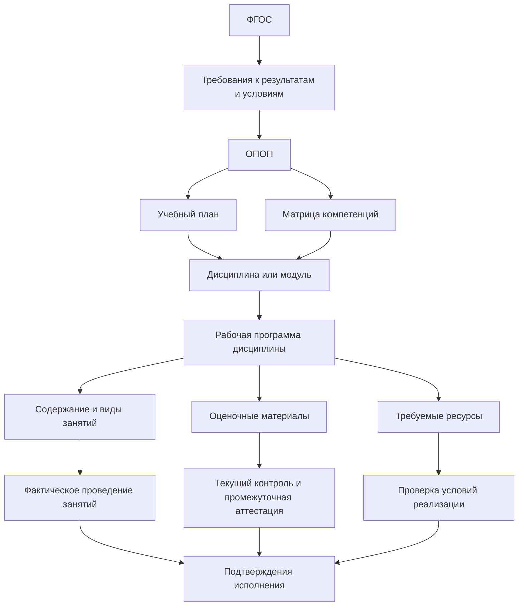
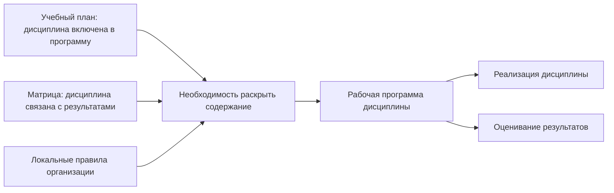
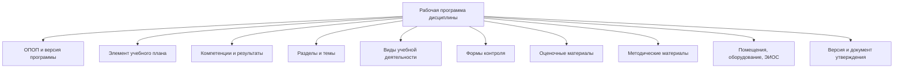
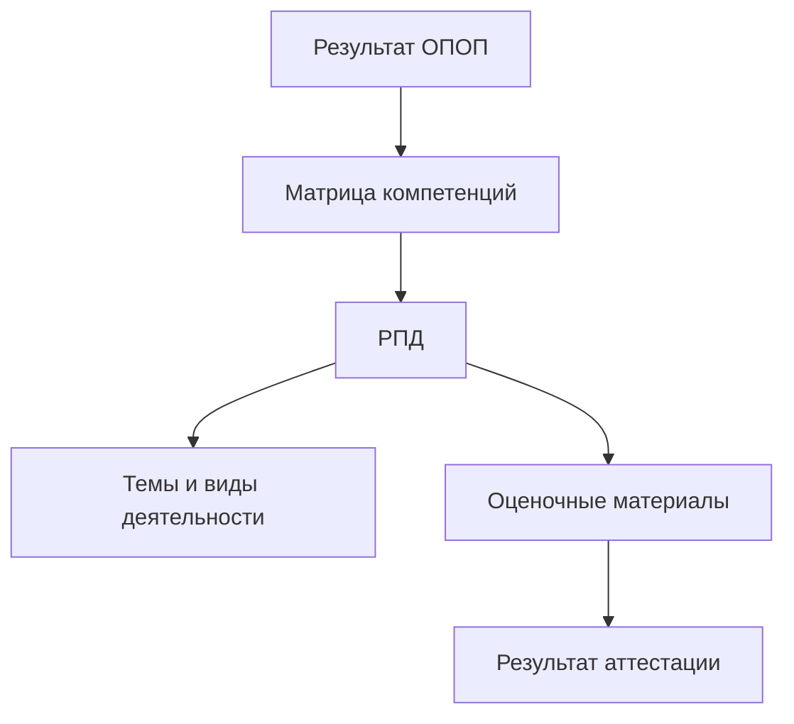
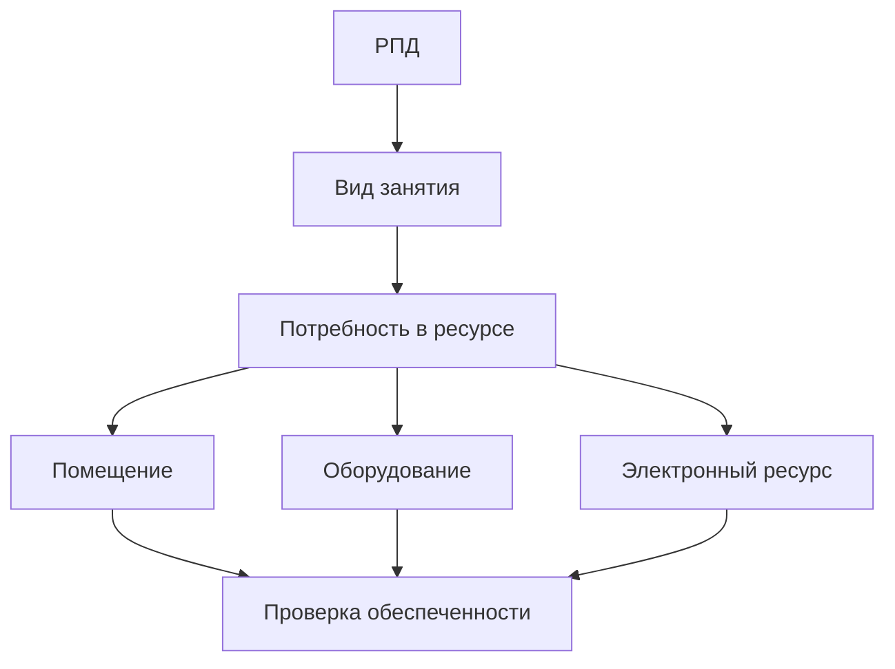
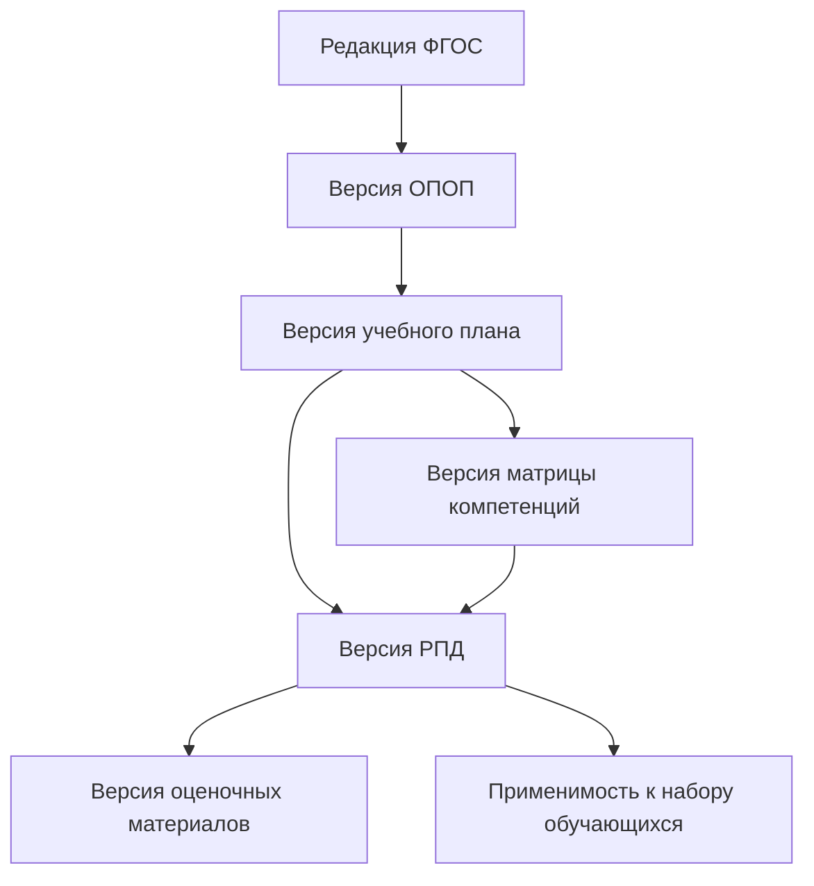
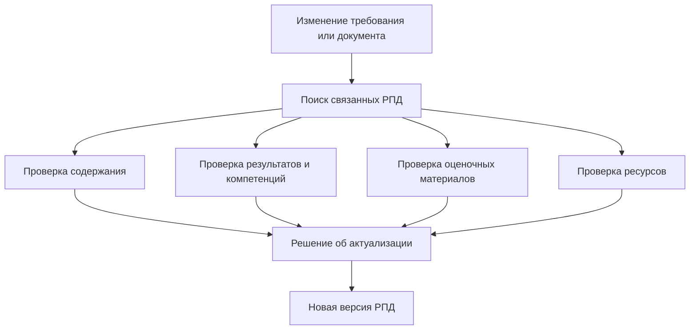

# Рабочая программа дисциплины как документ детализации учебного компонента

## 1. Назначение страницы

Данная страница описывает рабочую программу дисциплины или модуля как документ, посредством которого образовательная организация раскрывает содержание конкретного учебного компонента образовательной программы.

Страница отвечает на следующие вопросы:

- что представляет собой рабочая программа дисциплины;
- почему она возникает на основании ОПОП, учебного плана и матрицы компетенций;
- какую роль она выполняет в трассировке требований ФГОС;
- какие сведения должны быть связаны с дисциплиной;
- чем рабочая программа отличается от учебного плана и оценочных материалов;
- как подтверждается фактическая реализация дисциплины;
- какие проверки РПД могут быть формальными, а какие требуют экспертной оценки;
- как рабочая программа дисциплины может быть представлена в информационной системе.

В рамках текущей версии репозитория рассматриваются рабочие программы дисциплин и модулей образовательных программ высшего образования:

- программ бакалавриата;
- программ специалитета;
- программ магистратуры.

---

## 2. Используемый термин

В нормативных и организационных документах может использоваться формулировка:

```text
рабочая программа дисциплины (модуля)
```

В настоящем репозитории для краткости применяется обозначение:

```text
РПД
```

Под РПД понимается рабочая программа конкретной дисциплины или модуля, предусмотренного учебным планом образовательной программы.

### Важное уточнение

РПД является документом, относящимся к конкретной образовательной программе и её версии.

Одинаковое наименование дисциплины в двух образовательных программах не означает, что для неё автоматически применяется одна и та же РПД. Дисциплина может различаться:

- объёмом;
- местом в учебном плане;
- формируемыми результатами;
- содержанием;
- формами контроля;
- необходимыми ресурсами;
- особенностями реализации для конкретной программы.

---

## 3. Место РПД в системе документов

Рабочая программа дисциплины занимает уровень детализации между учебным планом и фактической реализацией обучения.



В упрощённом виде:

```text
Учебный план показывает, что дисциплина предусмотрена программой.
Матрица компетенций показывает, с какими результатами она связана.
РПД раскрывает, как дисциплина будет реализована.
Оценочные материалы и документы процесса подтверждают её исполнение.
```

---

## 4. Почему возникает рабочая программа дисциплины

Учебный план фиксирует наличие дисциплины, её объём, период освоения и форму контроля.

Однако одного учебного плана недостаточно, чтобы понять:

- чему именно будет обучаться студент;
- какие темы и виды деятельности предусмотрены;
- какие результаты освоения связаны с дисциплиной;
- каким образом дисциплина участвует в формировании компетенций;
- какие задания и критерии используются для оценки;
- какие помещения, оборудование и информационные ресурсы необходимы;
- как реализовать дисциплину в конкретном учебном периоде.

Для решения этих вопросов образовательная организация формирует рабочую программу дисциплины.

### Логика возникновения



---

## 5. Назначение РПД в модели трассировки

РПД не является первичным нормативным источником требований ФГОС. Она является артефактом реализации, посредством которого организация показывает вклад конкретной дисциплины в достижение результатов образовательной программы.

### РПД отвечает на вопрос

> Каким образом конкретная дисциплина, включённая в учебный план, реализуется в составе образовательной программы и участвует в достижении планируемых результатов?

### Роль РПД

| Уровень | Объект | Что определяет |
|---|---|---|
| Нормативный источник | ФГОС | Требования к результатам и условиям реализации программы |
| Центральный документ программы | ОПОП | Планируемые результаты и общую модель подготовки |
| Документ планирования | Учебный план | Наличие дисциплины, её объём и место в программе |
| Артефакт распределения результатов | Матрица компетенций | Связь дисциплины с компетенциями или иными результатами |
| Документ детализации | РПД | Содержание, организацию и оценивание дисциплины |
| Документ оценки | Оценочные материалы | Способ проверки результатов |
| Документы исполнения | Журналы, ведомости, электронные записи | Факт реализации и результаты контроля |

---

## 6. Основания разработки РПД

Рабочая программа дисциплины может быть связана с несколькими основаниями одновременно.

| Основание | Как влияет на РПД |
|---|---|
| ФГОС | Опосредованно задаёт результаты и требования к условиям, которые реализуются через ОПОП |
| ОПОП | Определяет контекст программы и планируемые результаты |
| Учебный план | Закрепляет дисциплину, её объём, период освоения и форму контроля |
| Матрица компетенций | Определяет связь дисциплины с результатами освоения |
| Локальный акт о разработке РПД | Определяет форму, структуру, порядок утверждения и актуализации документа |
| Оценочные материалы | Должны быть согласованы с результатами и формами контроля дисциплины |
| Ресурсное обеспечение | Определяет возможность реализации предусмотренных занятий |
| Электронные ресурсы и технологии | Учитываются при электронной или дистанционной реализации компонентов дисциплины |

### Типы связей

| Исходный объект | Связь | РПД |
|---|---|---|
| ОПОП | `details` | Детализирует компонент образовательной программы |
| Учебный план | `details` | Раскрывает дисциплину, предусмотренную планом |
| Матрица компетенций | `implements` | Реализует вклад дисциплины в достижение результата |
| Локальный акт | `applies_to` | Разрабатывается по внутренним правилам |
| Оценочные материалы | `assesses` | Используются для оценки результатов дисциплины |
| Помещения и оборудование | `uses_resource` | Используются для реализации занятий |

---

## 7. Что РПД должна связывать в модели

В модели трассировки РПД представляет собой узел, соединяющий несколько видов сведений:



### Основное правило

```text
РПД не должна рассматриваться как автономный учебно-методический файл.
Она должна быть связана с конкретной версией ОПОП, элементом учебного плана,
результатами программы, оценочными материалами и условиями реализации.
```

---

## 8. Карточка рабочей программы дисциплины

Для каждой РПД рекомендуется фиксировать структурированную карточку.

### 8.1. Идентификационные сведения

| Поле | Содержание |
|---|---|
| `discipline_program_id` | Уникальный идентификатор РПД |
| `title` | Наименование документа |
| `discipline_id` | Идентификатор дисциплины или модуля |
| `discipline_title` | Наименование дисциплины или модуля |
| `program_id` | Образовательная программа |
| `program_version_id` | Версия ОПОП |
| `curriculum_id` | Связанный учебный план |
| `curriculum_item_id` | Элемент учебного плана, соответствующий дисциплине |
| `education_form` | Форма обучения |
| `admission_year` | Год набора, если применимо |
| `status` | Проект, действует, заменена, архивная |

### 8.2. Нормативные и организационные основания

| Поле | Содержание |
|---|---|
| `fgos_id` | Применимый ФГОС через связь с ОПОП |
| `fgos_version` | Редакция ФГОС |
| `opop_reference` | Ссылка на ОПОП |
| `curriculum_reference` | Ссылка на учебный план |
| `competence_matrix_reference` | Ссылка на матрицу компетенций, если используется |
| `local_regulation_reference` | Локальный акт о разработке и утверждении РПД |
| `approval_document` | Документ об утверждении РПД или комплекта ОПОП |
| `effective_from` | Дата начала применения |
| `effective_to` | Дата окончания применения, если установлена |

### 8.3. Параметры дисциплины

| Поле | Содержание |
|---|---|
| `credits` | Объём дисциплины в зачётных единицах |
| `hours` | Объём дисциплины в часах, если используется |
| `semester` | Период освоения |
| `control_form` | Форма промежуточной аттестации |
| `discipline_block` | Блок или часть образовательной программы |
| `prerequisites` | Предшествующие компоненты, если фиксируются |
| `subsequent_components` | Компоненты, для которых дисциплина является основой, если фиксируются |

---

## 9. Рекомендуемая структура сведений РПД

Конкретная форма рабочей программы определяется документами и правилами образовательной организации. Для модели трассировки рекомендуется учитывать следующие смысловые блоки.

| Раздел РПД | Для чего нужен в трассировке |
|---|---|
| Наименование и идентификация дисциплины | Связать РПД с элементом учебного плана |
| Место дисциплины в структуре программы | Показать принадлежность к ОПОП и связь с другими компонентами |
| Объём и период освоения | Проверить согласованность с учебным планом |
| Планируемые результаты освоения дисциплины | Связать дисциплину с компетенциями и индикаторами |
| Содержание дисциплины | Обосновать вклад дисциплины в формирование результата |
| Виды учебной деятельности | Показать механизм реализации содержания |
| Самостоятельная работа | Учесть деятельность обучающегося вне аудиторных занятий |
| Формы контроля | Связать дисциплину с оцениванием |
| Оценочные материалы | Определить инструменты проверки результатов |
| Учебно-методическое обеспечение | Подтвердить наличие материалов для реализации |
| Материально-техническое обеспечение | Связать занятия с помещениями и оборудованием |
| Электронная среда и ресурсы | Показать цифровое обеспечение, если применяется |
| Особенности реализации | Учитывать специальные условия, ЭО/ДОТ или иные особенности |
| Сведения об утверждении и версии | Обеспечить актуальность и применимость документа |

### Важное ограничение

Данная таблица является моделью анализа, а не универсальной нормативно утверждённой формой РПД для любой организации.

---

## 10. Связь РПД с учебным планом

Учебный план является исходным документом для идентификации дисциплины в составе конкретной программы.

### Что передаётся из учебного плана в РПД

| Учебный план фиксирует | Что должно быть согласовано в РПД |
|---|---|
| Наименование дисциплины | Наименование и идентификация РПД |
| Блок или часть программы | Место дисциплины в ОПОП |
| Объём в зачётных единицах | Общая трудоёмкость дисциплины |
| Объём в часах, если используется | Распределение видов работ |
| Семестр или курс | Период реализации |
| Форма контроля | Раздел контроля и оценочные материалы |

### Проверка согласованности

| Проверка | Тип проверки | Результат |
|---|---|---|
| Дисциплина существует в учебном плане | Структурная | Связь подтверждена / дисциплина не найдена |
| Объём РПД совпадает с объёмом элемента плана | Расчётная | Соответствует / не соответствует |
| Период реализации совпадает | Формальная | Соответствует / требуется проверка |
| Форма контроля совпадает | Формальная | Соответствует / обнаружено противоречие |
| Версии документов согласованы | Версионная | Актуально / устарело |

### Цепочка


---

## 11. Связь РПД с матрицей компетенций

Матрица компетенций фиксирует связь дисциплины с результатами образовательной программы. РПД должна раскрывать эту связь на уровне содержания и оценивания.

### Что передаётся из матрицы в РПД

| Матрица указывает | В РПД необходимо проверить |
|---|---|
| Компетенция связана с дисциплиной | Отражена ли соответствующая компетенция или результат |
| Используется индикатор достижения | Согласован ли он с результатами дисциплины |
| Дисциплина формирует результат | Соответствует ли содержание заявленной роли |
| Дисциплина оценивает результат | Имеются ли формы контроля и оценочные материалы |

### Цепочка трассировки



### Ключевой вывод

```text
Матрица заявляет связь дисциплины с результатом.
РПД должна обосновать эту связь содержанием и способом оценки.
```

---

## 12. РПД и планируемые результаты освоения

### 12.1. Уровни результатов

| Уровень | Что отражает | Где фиксируется |
|---|---|---|
| Результат образовательной программы | Что должен достичь выпускник | ФГОС, ОПОП |
| Связь результата с дисциплиной | Где формируется результат | Матрица компетенций |
| Результат освоения дисциплины | Какой вклад обеспечивает дисциплина | РПД |
| Оценочный критерий | Как проверяется результат дисциплины | Оценочные материалы |
| Фактический результат | Что показал обучающийся | Ведомость, электронная запись, работа обучающегося |

### 12.2. Правило трассировки

Результат дисциплины не должен быть изолирован от результата образовательной программы.

```text
Результат ОПОП
→ связь в матрице компетенций
→ результат дисциплины в РПД
→ оценочное средство
→ результат контроля обучающегося
```

### 12.3. Что проверять аналитику

| Вопрос | Зачем нужен |
|---|---|
| Есть ли у результата дисциплины основание в ОПОП или матрице? | Исключить произвольные связи |
| Соответствует ли содержание дисциплины заявленному результату? | Проверить содержательную достаточность |
| Есть ли оценочные материалы для результата? | Обеспечить проверяемость |
| Можно ли найти факт проведённой оценки? | Перейти от плана к исполнению |

---

## 13. Содержание дисциплины как механизм реализации

РПД должна показывать не только формальную связь с компетенцией, но и содержательный механизм её реализации.

### Объекты содержания

| Объект | Роль в трассировке |
|---|---|
| Раздел дисциплины | Крупный смысловой блок содержания |
| Тема | Конкретный элемент изучаемого содержания |
| Вид занятия | Способ реализации темы: лекция, практическое занятие, лабораторная работа и т. д. |
| Самостоятельная работа | Деятельность обучающегося, необходимая для освоения результата |
| Задание | Практическое или контрольное действие |
| Методический материал | Инструкция или ресурс для выполнения деятельности |
| Электронный курс | Цифровое средство реализации, если используется |

### Пример аналитической связи

| Результат | Содержание дисциплины | Вид деятельности | Оценивание |
|---|---|---|---|
| Результат программы или индикатор | Тема или раздел РПД | Практическое занятие / самостоятельная работа | Задание и критерий оценки |

### Значение для трассировки

Наличие компетенции в заголовке РПД ещё не доказывает её реализацию. Для содержательной проверки необходимо установить, какие элементы дисциплины связаны с результатом и как они оцениваются.

---

## 14. РПД и оценочные материалы

Оценочные материалы являются механизмом проверки результатов, заявленных в РПД.

### Логика связи


### Что необходимо связать

| РПД содержит | Оценочные материалы должны раскрывать |
|---|---|
| Результат освоения дисциплины | Как он будет проверяться |
| Компетенцию или индикатор | Какие задания с ним связаны |
| Форму контроля | Как организуется процедура оценки |
| Темы и виды деятельности | Какое содержание становится предметом проверки |
| Критерии достижения | Как интерпретируется результат |

### Проверки

| Проверка | Уровень |
|---|---|
| Для дисциплины существуют оценочные материалы | Формальный |
| Форма контроля РПД совпадает с учебным планом | Формальный |
| Оценочные материалы связаны с заявленными результатами | Структурный |
| Задания действительно позволяют оценить заявленный результат | Экспертный |
| Контроль фактически проведён | Процессный |
| Результаты зафиксированы | Документарный |

---

## 15. РПД и условия реализации

Рабочая программа дисциплины может содержать или обуславливать требования к ресурсам, необходимым для её реализации.

### Виды ресурсов

| Вид ресурса | Примеры |
|---|---|
| Помещения | Лекционная аудитория, учебная лаборатория, компьютерный класс, симуляционный кабинет |
| Оборудование | Микроскопы, тренажёры, компьютеры, лабораторное оборудование |
| Программное обеспечение | Специализированная программа, информационная система, лицензируемый продукт |
| Электронные ресурсы | Электронный курс, ЭБС, ЭИОС |
| Учебно-методические материалы | Пособия, инструкции, электронные материалы |
| Специальные условия | Доступные средства обучения, адаптированные материалы, особый формат проведения занятий |

### Трассировка ресурсного условия



### Значение для информационной системы

Для 1С данная связь особенно важна:

```text
Образовательная программа
→ учебный план
→ дисциплина
→ РПД
→ вид занятия
→ требуемый тип помещения и оборудование
→ фактически закреплённое помещение
→ результат проверки обеспеченности
```

Таким образом, сведения о помещениях могут использоваться не только как хозяйственный справочник, но и как подтверждение условий реализации конкретной образовательной программы.

---

## 16. РПД и фактическая реализация дисциплины

РПД показывает, как дисциплина должна быть организована. Для подтверждения её фактической реализации нужны дополнительные документы и данные.

| Положение РПД | Возможное подтверждение исполнения |
|---|---|
| Дисциплина должна быть реализована в определённом семестре | Расписание занятий, учебный график |
| Предусмотрены занятия определённого вида | Журнал занятий, электронные записи проведения |
| Предусмотрен электронный курс | Наличие курса и доступа обучающихся |
| Предусмотрена промежуточная аттестация | Экзаменационная или зачётная ведомость |
| Предусмотрены оценочные материалы | Зафиксированное применение заданий или процедуры контроля |
| Необходимы помещения и оборудование | Закрепление ресурсов и сведения об использовании |
| Установлены результаты освоения | Результаты контроля и аттестации |

### Отличие проекта от исполнения

| Проектный документ | Документ или сведения исполнения |
|---|---|
| РПД содержит содержание и порядок реализации | Расписание и журнал показывают проведение занятий |
| РПД предусматривает форму контроля | Ведомость показывает факт и результат контроля |
| РПД устанавливает требования к ресурсам | Карточка помещения и оснащения показывает обеспеченность |
| РПД определяет результат | Результат аттестации фиксирует его проверку |

---

## 17. Версионность рабочей программы дисциплины

### 17.1. Почему РПД должна версионироваться

Рабочая программа дисциплины может изменяться вследствие:

- изменения ФГОС;
- изменения ОПОП;
- изменения учебного плана;
- изменения матрицы компетенций;
- изменения формы контроля;
- актуализации содержания дисциплины;
- изменения оборудования или цифровых ресурсов;
- результатов внутренней оценки качества;
- создания версии программы для нового года набора.

### 17.2. Модель версионности



### 17.3. Минимальные сведения о версии

| Поле | Содержание |
|---|---|
| `discipline_program_version_id` | Идентификатор версии РПД |
| `discipline_program_id` | РПД как объект |
| `version_number` | Номер версии |
| `program_version_id` | Версия ОПОП |
| `curriculum_version_id` | Версия учебного плана |
| `matrix_version_id` | Версия матрицы, если применяется |
| `applicable_cohorts` | Наборы, для которых действует РПД |
| `effective_from` | Дата начала действия |
| `approval_document` | Документ утверждения |
| `change_reason` | Причина изменения |
| `previous_version_id` | Предыдущая версия |
| `status` | Проект, утверждена, заменена, архивная |

---

## 18. Актуализация РПД при изменении связанных требований

### 18.1. Цепочка анализа влияния



### 18.2. Что может потребовать проверки РПД

| Изменение | Что необходимо проверить |
|---|---|
| Изменилась компетенция ФГОС или ОПОП | Результаты дисциплины, содержание и оценочные материалы |
| Изменилась матрица компетенций | Связь дисциплины с результатами |
| Изменился учебный план | Объём, семестр, форма контроля |
| Изменилась форма промежуточной аттестации | Раздел контроля и оценочные материалы |
| Изменилось оборудование | Возможность реализации практических или лабораторных занятий |
| Изменилась цифровая среда | Электронные ресурсы и порядок реализации |
| Выявлено несоответствие при проверке качества | Содержание, методика или оценивание |

---

## 19. Возможные проверки РПД

### 19.1. Проверки, пригодные для автоматизации

| Проверка | Что выявляется |
|---|---|
| РПД привязана к существующему элементу учебного плана | Отсутствующие или ошибочные связи |
| Объём РПД совпадает с учебным планом | Числовое противоречие |
| Семестр и форма контроля совпадают с планом | Несогласованность документов |
| РПД связана с действующей версией ОПОП | Устаревший документ |
| Компетенции РПД присутствуют в матрице или ОПОП | Несогласованные результаты |
| Для РПД существуют оценочные материалы | Пробел в комплекте документов |
| Указанные помещения или ресурсы существуют в справочниках | Ошибочные ссылки на ресурсы |
| РПД утверждена и действует для рассматриваемого набора | Неактуальная версия |

### 19.2. Проверки, требующие эксперта

| Проверка | Почему требуется эксперт |
|---|---|
| Соответствует ли содержание дисциплины заявленной компетенции | Необходим содержательный анализ |
| Достаточен ли объём дисциплины для формирования результата | Требуется профессиональная оценка |
| Соответствуют ли оценочные задания содержанию и результатам | Необходим анализ заданий и критериев |
| Достаточны ли ресурсы для качества обучения | Требуется понимание методики и оборудования |
| Корректна ли последовательность дисциплины в программе | Требуется анализ логики подготовки |

### Принцип проверки

```text
Автоматизация выявляет структурные несоответствия и отсутствие связей.
Эксперт подтверждает содержательную достаточность дисциплины.
```

---

## 20. Матрица трассировки рабочей программы дисциплины

### 20.1. Шаблон

| ID требования | Источник | Требование | Элемент РПД | Связанный артефакт | Подтверждение | Метод проверки | Статус |
|---|---|---|---|---|---|---|---|
|  |  |  |  |  |  |  |  |

### 20.2. Учебный пример

> Формулировки ниже приведены для демонстрации модели. Для реальной программы необходимо использовать конкретную редакцию ФГОС, утверждённую ОПОП, учебный план и действующую РПД.

| ID требования | Требование | Элемент РПД | Связанный артефакт | Подтверждение | Проверка | Статус |
|---|---|---|---|---|---|---|
| `RESULT-001` | Дисциплина должна обеспечивать вклад в достижение закреплённого результата | Раздел планируемых результатов | Матрица компетенций | Оценочные материалы | Структурная и содержательная | `not_analyzed` |
| `CURRICULUM-001` | Параметры дисциплины должны соответствовать учебному плану | Объём, семестр, форма контроля | Учебный план | Результат сопоставления | Формальная | `not_analyzed` |
| `ASSESSMENT-001` | Для заявленных результатов должен быть предусмотрен механизм оценки | Формы контроля | Оценочные материалы | Ведомость или иной результат контроля | Документарная и экспертная | `not_analyzed` |
| `FACILITIES-001` | Для проведения предусмотренных занятий должны быть обеспечены необходимые ресурсы | Материально-техническое обеспечение | Помещения и оборудование | Проверка обеспеченности | Ресурсная | `not_analyzed` |
| `DIGITAL-001` | При использовании цифровой реализации должны быть предусмотрены применимые электронные ресурсы | Электронные ресурсы | ЭИОС или электронный курс | Сведения о доступе | Формальная и процессная | `not_analyzed` |

---

## 21. РПД как объект информационной системы

Рабочую программу дисциплины целесообразно хранить не только как файл, но и как структурированный объект, связанный с другими элементами программы.

### 21.1. Возможные объекты данных

| Объект | Назначение |
|---|---|
| Дисциплина | Единица содержания программы |
| РПД | Документ, раскрывающий дисциплину |
| Версия РПД | Учёт применимости и изменений |
| Элемент учебного плана | Основание включения дисциплины в программу |
| Компетенция или результат | Связь дисциплины с результатами ОПОП |
| Индикатор | Более детальная связь, если применяется |
| Раздел и тема | Структура содержания дисциплины |
| Вид занятия | Форма реализации содержания |
| Оценочный материал | Средство проверки результата |
| Методический материал | Поддержка освоения дисциплины |
| Ресурс | Помещение, оборудование, электронная среда |
| Результат проверки | Соответствие РПД связанным требованиям |

### 21.2. Возможные функции системы

| Функция | Назначение |
|---|---|
| Регистрация РПД | Создать карточку документа и версии |
| Привязка к учебному плану | Подтвердить место дисциплины в программе |
| Автоматическое сравнение параметров | Найти расхождения в объёме, семестре и форме контроля |
| Привязка к компетенциям | Построить трассировку результатов |
| Привязка оценочных материалов | Подтвердить наличие механизма оценки |
| Привязка помещений и оборудования | Проверить условия реализации |
| Управление версиями | Учитывать изменения для разных наборов |
| Анализ влияния изменений | Найти РПД, требующие актуализации |

---

## 22. Возможная модель для 1С

При реализации в 1С рабочая программа дисциплины может быть отражена следующими объектами.

| Объект 1С | Возможное назначение |
|---|---|
| Справочник `ОбразовательныеПрограммы` | Хранение ОПОП |
| Справочник `ВерсииОбразовательныхПрограмм` | Контекст применимости документа |
| Документ или справочник `УчебныеПланы` | Источник дисциплин программы |
| Справочник `Дисциплины` | Единый перечень учебных компонентов |
| Документ или справочник `РабочиеПрограммыДисциплин` | Карточки и версии РПД |
| Табличная часть `ТемыДисциплины` | Содержание РПД |
| Табличная часть `ВидыЗанятий` | Лекции, практические, лабораторные и иные занятия |
| Регистр сведений `РезультатыПоДисциплинам` | Связь дисциплины с компетенциями |
| Справочник `ОценочныеМатериалы` | Средства контроля |
| Регистр сведений `РесурсыДисциплины` | Помещения, оборудование и цифровые ресурсы |
| Регистр сведений `ПроверкиСоответствияРПД` | Результаты формальных и экспертных проверок |
| Документ `АнализВлиянияИзменений` | Пересмотр РПД при изменении требований |

### Сценарий пользователя

```text
Пользователь открывает версию ОПОП
→ выбирает дисциплину из учебного плана
→ открывает связанную РПД
→ система показывает:
   - объём и форму контроля;
   - связанные компетенции;
   - наличие оценочных материалов;
   - требуемые помещения и оборудование;
   - статус согласованности с учебным планом и матрицей;
→ пользователь запускает проверку
→ система выявляет формальные несоответствия
→ эксперт фиксирует результат содержательной проверки.
```

---

## 23. Ограничения страницы

Данная страница описывает рабочую программу дисциплины как тип документа и артефакт трассировки.

Она не устанавливает:

- единую обязательную форму РПД для всех образовательных организаций;
- конкретный перечень разделов РПД, обязательный без учёта применимых нормативных и локальных актов;
- автоматическое доказательство формирования компетенции только на основании наличия записи в документе;
- универсальные требования к ресурсам любой дисциплины.

Для применения модели к реальной образовательной программе необходимо:

- определить применимый ФГОС и версию ОПОП;
- получить действующий учебный план;
- установить, используется ли матрица компетенций;
- изучить локальный порядок разработки и утверждения РПД;
- получить утверждённую РПД;
- проверить оценочные материалы и сведения об условиях реализации;
- зафиксировать результаты формальной и экспертной проверки.

---

## 24. Нормативная и организационная опора страницы

При разработке и последующей актуализации данной страницы должны учитываться:

| Источник | Значение для страницы |
|---|---|
| Федеральный закон от 29.12.2012 № 273-ФЗ «Об образовании в Российской Федерации» | Определяет образовательную программу и учебный план; указывает рабочие программы дисциплин (модулей) в составе представления образовательной программы |
| Федеральный закон № 273-ФЗ, статья 11 | Используется при установлении связи с требованиями ФГОС |
| Федеральный закон № 273-ФЗ, статья 12 | Используется при описании образовательной программы и полномочий организации |
| Приказ Минобрнауки России от 06.04.2021 № 245 | Учитывается при реализации программ бакалавриата, специалитета и магистратуры |
| Конкретный ФГОС по направлению подготовки или специальности | Определяет нормативный контекст конкретной ОПОП |
| Локальный акт организации о порядке разработки и утверждения РПД | Определяет структуру, порядок согласования, утверждения и актуализации конкретной РПД |
| Учебный план конкретной ОПОП | Определяет место, объём, период и форму контроля дисциплины |
| Матрица компетенций, если применяется | Определяет связь дисциплины с планируемыми результатами |
| Оценочные материалы | Позволяют проверить результаты, заявленные в РПД |

> Перед применением модели к реальной РПД необходимо проверить действующие нормативные источники и локальные документы соответствующей образовательной организации.

---

## 25. Следующие связанные страницы

После описания рабочей программы дисциплины необходимо перейти к документам практической подготовки и оценивания.

| Страница | Назначение |
|---|---|
| `docs/02-organization-documents/practice-program.md` | Рабочая программа практики как детализация практической подготовки |
| `docs/02-organization-documents/gia-program.md` | Программа ГИА как документ итоговой оценки подготовки |
| `docs/02-organization-documents/assessment-materials.md` | Оценочные материалы как механизм проверки результатов |
| `docs/02-organization-documents/academic-calendar.md` | Календарный учебный график как распределение реализации программы по периодам |
| `docs/03-traceability-examples/competence-traceability.md` | Практический пример связи компетенции с дисциплиной и оцениванием |
| `docs/03-traceability-examples/facilities-traceability.md` | Пример связи РПД с помещениями и оборудованием |

---

## 26. Итог

Рабочая программа дисциплины является документом, который раскрывает реализацию конкретной дисциплины в составе образовательной программы.

```text
ФГОС и иные нормативные основания
→ ОПОП
→ учебный план и матрица компетенций
→ рабочая программа дисциплины
→ содержание, виды занятий и оценочные материалы
→ фактическое проведение дисциплины
→ результаты контроля и подтверждение условий реализации
```

Для модели трассировки РПД особенно важна, потому что она:

- связывает дисциплину учебного плана с результатами образовательной программы;
- показывает содержательный механизм формирования результатов;
- определяет связь с оценочными материалами;
- позволяет выявлять ресурсные требования к помещениям, оборудованию и цифровой среде;
- должна учитываться при анализе изменений ФГОС, ОПОП, учебного плана и матрицы компетенций;
- в перспективе может стать структурированным объектом информационной системы, а не только прикреплённым файлом.
