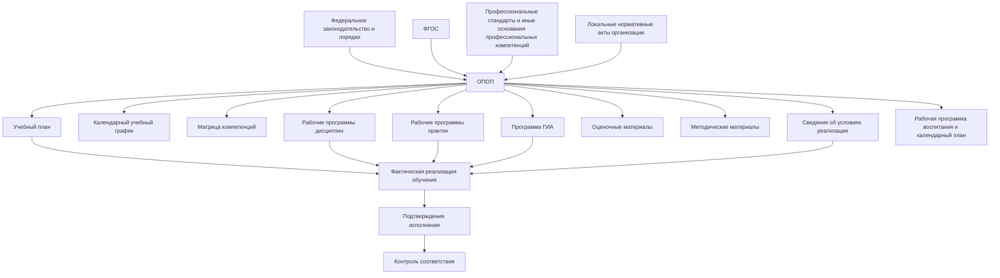
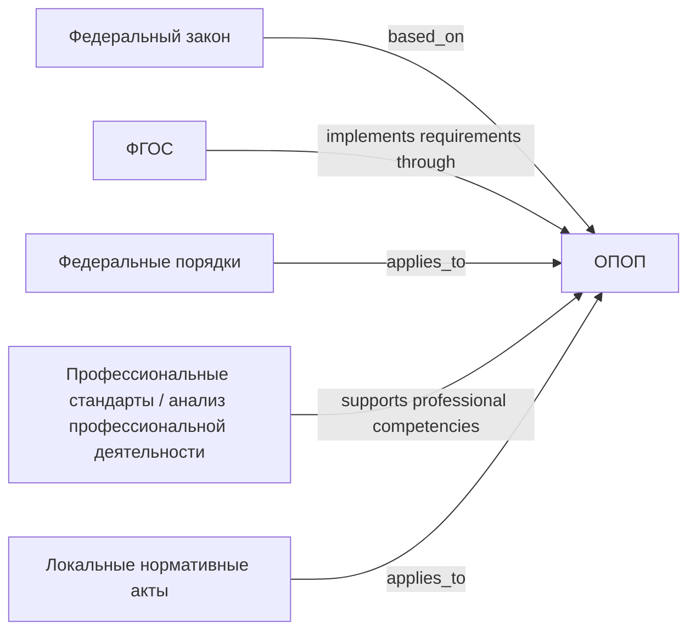
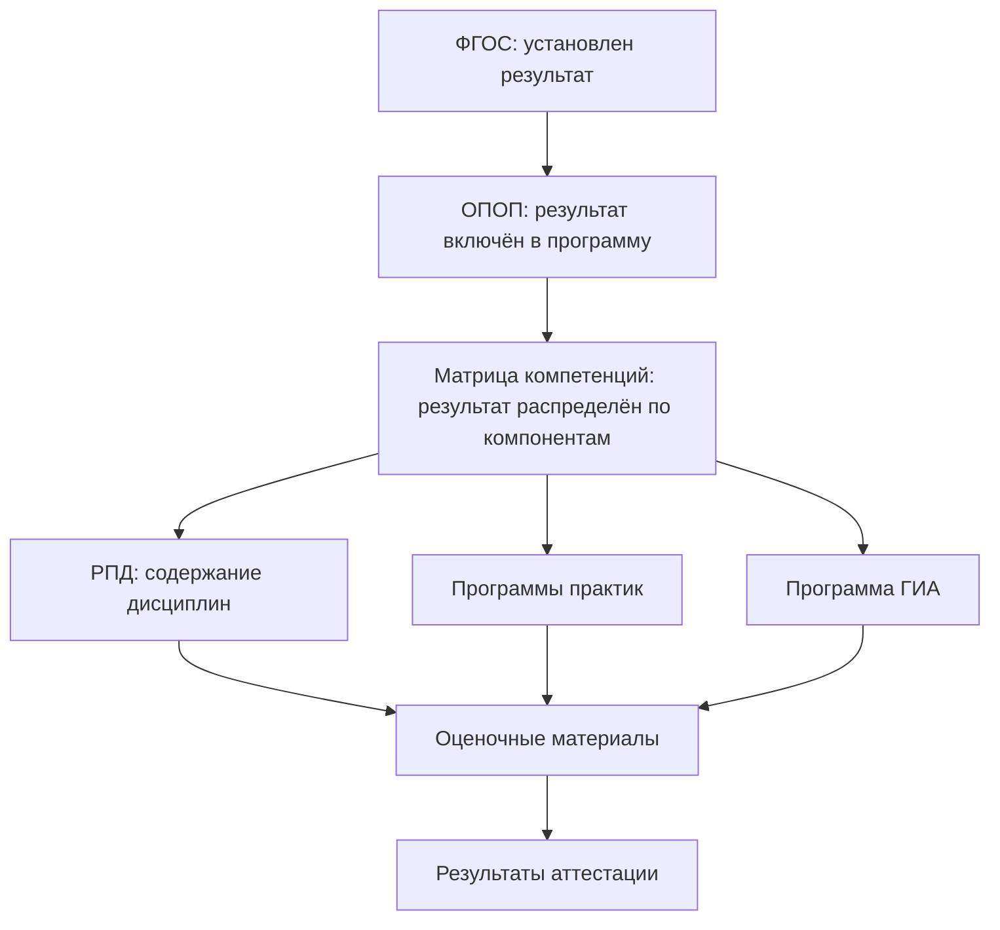
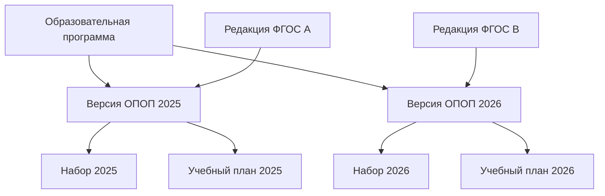

# ОПОП как центральный объект реализации требований

## 1. Назначение страницы

Данная страница описывает основную профессиональную образовательную программу как центральный объект, посредством которого образовательная организация реализует требования ФГОС и иных применимых нормативных источников.

Страница отвечает на следующие вопросы:

- что представляет собой ОПОП в модели трассировки;
- почему ОПОП возникает на основании ФГОС и других нормативных источников;
- почему ОПОП не следует понимать только как один файл;
- какие документы и сведения входят в контур образовательной программы;
- какие требования ФГОС реализуются непосредственно через ОПОП;
- какие требования детализируются в учебном плане, рабочих программах, оценочных материалах и сведениях об условиях реализации;
- как ОПОП должна быть связана с версиями ФГОС и годами набора обучающихся.

В рамках текущей версии репозитория рассматриваются образовательные программы высшего образования:

- программы бакалавриата;
- программы специалитета;
- программы магистратуры.

---

## 2. Место ОПОП в системе документов

ФГОС устанавливает обязательную рамку подготовки выпускника, но не создаёт образовательную программу конкретного университета.

Образовательная организация должна определить, каким образом требования нормативных источников будут реализованы в конкретной программе.

В этой логике ОПОП занимает центральное положение:



Основная логика:

```text
Нормативные требования
→ ОПОП как модель подготовки по конкретной программе
→ компоненты ОПОП и обеспечивающие сведения
→ фактическая образовательная деятельность
→ подтверждение исполнения требований
```

---

## 3. Что такое ОПОП

**Основная профессиональная образовательная программа**, или **ОПОП**, — образовательная программа профессионального образования, разрабатываемая для получения образования определённого уровня по конкретному направлению подготовки или специальности.

В контексте высшего образования ОПОП может соответствовать:

- программе бакалавриата;
- программе специалитета;
- программе магистратуры.

ОПОП определяет, как конкретная образовательная организация организует подготовку выпускника в рамках установленной нормативной рамки.

### ОПОП отвечает на вопросы

| Вопрос | Что должно быть определено в контуре ОПОП |
|---|---|
| Кого готовит организация? | Уровень образования, направление или специальность, квалификация |
| На основании чего реализуется программа? | ФГОС, нормативные акты, локальные акты, при необходимости профессиональные стандарты |
| В каком объёме и в какие сроки идёт обучение? | Объём программы, форма обучения, срок освоения |
| Какие результаты должен получить выпускник? | Компетенции и иные планируемые результаты |
| Из чего состоит подготовка? | Дисциплины, практики, ГИА, иные компоненты |
| Как оцениваются результаты? | Формы контроля, оценочные материалы, ГИА |
| Какие условия обеспечивает организация? | Кадровые, материально-технические, электронные и иные ресурсы |
| Как подтверждается реализация? | Документы учебного процесса, результаты аттестации, сведения об обеспечении |

---

## 4. Важное правило модели: ОПОП — не только один документ

В повседневной работе выражение «ОПОП» часто используется для обозначения отдельного файла с общей характеристикой программы.

Для модели трассировки такого понимания недостаточно.

В данном репозитории ОПОП рассматривается в двух смыслах:

| Уровень понимания | Содержание |
|---|---|
| **ОПОП как образовательная программа** | Вся система взаимосвязанных компонентов и условий реализации конкретной программы |
| **Документ общей характеристики ОПОП** | Центральный описательный документ, содержащий общие сведения о программе и ссылки на её компоненты |

### Почему это важно

Если рассматривать ОПОП только как один файл, невозможно корректно показать исполнение требований:

- объём программы детализируется в учебном плане;
- распределение обучения во времени раскрывается календарным учебным графиком;
- формирование компетенций отображается в матрице компетенций и рабочих программах;
- оценка результатов описывается в оценочных материалах;
- практическая подготовка детализируется программами практик и документами её проведения;
- условия реализации подтверждаются кадровыми, ресурсными и информационными сведениями;
- итоговая подготовка подтверждается документами ГИА.

Поэтому в информационной модели целесообразно создавать объект:

```text
Образовательная программа
```

к которому будут привязаны отдельные документы, ресурсы, версии и связи трассировки.

---

## 5. Почему образовательная организация создаёт ОПОП

ОПОП создаётся потому, что нормативные источники устанавливают требования, но не могут заранее определить все организационные решения конкретного университета.

ФГОС может установить:

- объём программы;
- требования к её структуре;
- результаты освоения;
- требования к условиям реализации;
- сроки обучения.

Но образовательная организация должна самостоятельно определить:

- конкретный набор дисциплин и модулей;
- последовательность их освоения;
- конкретные виды практик;
- способы формирования профессиональных компетенций;
- формы и содержание оценочных материалов;
- ресурсы, используемые для реализации программы;
- правила актуализации программы;
- организационные решения, связанные с особенностями вуза.

### В модели трассировки

| Объект | Функция |
|---|---|
| ФГОС | Устанавливает обязательные требования |
| ОПОП | Определяет способ реализации этих требований в конкретной программе |
| Компоненты ОПОП | Детализируют реализацию по отдельным направлениям |
| Документы и сведения исполнения | Подтверждают фактическую реализацию |

---

## 6. Нормативные и организационные основания ОПОП

ОПОП может быть связана не только с ФГОС.

### 6.1. Основные группы оснований

| Вид основания | Роль для ОПОП | Пример влияния |
|---|---|---|
| Федеральное законодательство | Определяет общие правила образовательной деятельности | Необходимость разработки программы, принятия ЛНА, обеспечения прав обучающихся |
| ФГОС | Устанавливает основные обязательные требования к программе | Объём, структура, результаты, условия и сроки |
| Порядки организации образовательной деятельности | Определяют правила реализации программы | Состав компонентов программы, организация процесса обучения |
| Нормативные требования к практике | Устанавливают правила практической подготовки | Программы практик, базы, договоры и документы прохождения |
| Нормативные требования к ГИА | Устанавливают правила итоговой аттестации | Программа ГИА, комиссии, протоколы |
| Профессиональные стандарты и иные источники профессиональных компетенций | Используются при формировании профессиональной направленности программы | Профессиональные компетенции и содержание подготовки |
| Локальные нормативные акты организации | Определяют единые внутренние правила | Порядок разработки ОПОП, РПД, ФОС, проведения аттестации |
| Стратегические и отраслевые потребности | Могут влиять на профиль и вариативную часть программы | Направленность программы, выбор дисциплин и практик |

### 6.2. Связи оснований с ОПОП



---

## 7. Карточка образовательной программы в модели трассировки

Для каждой конкретной образовательной программы рекомендуется фиксировать карточку.

### 7.1. Идентификационные сведения

| Поле | Содержание |
|---|---|
| `program_id` | Уникальный идентификатор образовательной программы |
| `program_type` | Бакалавриат, специалитет, магистратура |
| `education_level` | Уровень образования |
| `code` | Код направления подготовки или специальности |
| `title` | Наименование направления подготовки или специальности |
| `profile` | Направленность или профиль программы, если применяется |
| `qualification` | Присваиваемая квалификация |
| `education_form` | Форма обучения |
| `implementation_language` | Язык реализации, если требуется учитывать |
| `admission_year` | Год набора, для которого применяется версия программы |
| `status` | Проект, действует, архивная, заменена |

### 7.2. Нормативные основания

| Поле | Содержание |
|---|---|
| `fgos_id` | Применяемый ФГОС |
| `fgos_version` | Редакция ФГОС |
| `professional_standard_links` | Связанные профессиональные стандарты или иные основания профессиональных компетенций |
| `applicable_regulations` | Применимые федеральные порядки |
| `applicable_local_acts` | Применимые локальные нормативные акты |
| `license_reference` | Связь с правом организации реализовывать программу |
| `accreditation_reference` | Связь с аккредитационным статусом, если применимо |

### 7.3. Основные параметры программы

| Поле | Содержание |
|---|---|
| `total_credits` | Общий объём программы в зачётных единицах |
| `duration` | Срок освоения программы |
| `education_form` | Форма обучения |
| `planned_results` | Планируемые результаты освоения |
| `structure_summary` | Состав основных блоков программы |
| `practice_summary` | Краткие сведения о практической подготовке |
| `gia_summary` | Сведения об итоговой аттестации |
| `conditions_summary` | Краткое описание условий реализации |

### 7.4. Управление версией

| Поле | Содержание |
|---|---|
| `version_id` | Идентификатор редакции ОПОП |
| `version_number` | Номер версии |
| `effective_from` | Дата начала применения |
| `effective_to` | Дата завершения применения |
| `applies_to_cohorts` | Наборы обучающихся, к которым применяется версия |
| `approval_document` | Документ об утверждении |
| `change_reason` | Причина изменения |
| `previous_version` | Предыдущая версия |
| `change_status` | Утверждена, проект изменений, архивная |

---

## 8. Состав контура ОПОП

В модели трассировки рекомендуется выделить следующие группы компонентов образовательной программы.

| Группа компонентов | Назначение | Примеры артефактов |
|---|---|---|
| Общая характеристика | Описывает программу в целом | Документ общей характеристики ОПОП |
| Планирование содержания | Определяет состав и объём обучения | Учебный план |
| Планирование сроков | Распределяет реализацию по периодам | Календарный учебный график |
| Планируемые результаты | Показывает, какие результаты должны быть достигнуты | Перечень компетенций, индикаторы, матрица компетенций |
| Дисциплины и модули | Детализируют содержание учебных компонентов | РПД |
| Практическая подготовка | Детализирует получение практических навыков | Рабочие программы практик |
| Итоговая аттестация | Описывает итоговую проверку подготовки | Программа ГИА |
| Оценивание | Устанавливает способы проверки результатов | Оценочные материалы / ФОС |
| Методическое обеспечение | Поддерживает обучение и выполнение заданий | Методические указания |
| Воспитательный компонент | Планирует воспитательную деятельность | Рабочая программа воспитания, календарный план |
| Условия реализации | Подтверждает наличие необходимых ресурсов | Сведения о ППС, помещениях, оборудовании, ЭИОС |
| Управление и актуализация | Фиксирует утверждение и изменения | Приказы, протоколы согласования, листы изменений |

---

## 9. Связь ОПОП с требованиями ФГОС

### 9.1. Требования к идентификации и параметрам программы

| Требование ФГОС | Как реализуется в ОПОП | Где детализируется |
|---|---|---|
| Уровень образования | Указывается в общей характеристике | Карточка программы |
| Направление подготовки или специальность | Указывается код и наименование | Карточка программы, учебный план |
| Квалификация | Указывается результат завершения программы | Документы ГИА и выпуска |
| Форма обучения | Указывается для конкретной реализации | Учебный план, календарный график |
| Срок обучения | Фиксируется как параметр программы | Календарный учебный график |
| Общий объём | Фиксируется как норматив программы | Учебный план и расчёт зачётных единиц |

---

### 9.2. Требования к структуре и объёму

| Требование | Роль ОПОП | Документ детализации | Подтверждение |
|---|---|---|---|
| Программа имеет установленный общий объём | Закрепляет общий параметр программы | Учебный план | Расчёт суммы зачётных единиц |
| Программа содержит необходимые блоки | Описывает общую структуру | Учебный план | Наличие разделов и их объёмов |
| Предусмотрена практика | Определяет её место в подготовке | Учебный план, программы практик | Документы прохождения практики |
| Предусмотрена итоговая аттестация | Определяет её роль | Учебный план, программа ГИА | Протоколы ГИА |

---

### 9.3. Требования к результатам освоения

| Требование | Роль ОПОП | Документ детализации | Подтверждение |
|---|---|---|---|
| Достижение универсальных компетенций | Включает их в планируемые результаты | Матрица компетенций, РПД | Оценочные материалы и результаты контроля |
| Достижение общепрофессиональных компетенций | Включает их в модель подготовки | Матрица компетенций, РПД, практики | Аттестационные материалы |
| Формирование профессиональных компетенций | Формулирует их с учётом применимых оснований | Матрица, профильные РПД, практики, ГИА | ФОС, отчёты практики, ГИА |

---

### 9.4. Требования к условиям реализации

| Требование | Роль ОПОП | Артефакты детализации | Подтверждение |
|---|---|---|---|
| Кадровые условия | Указывает необходимость кадрового обеспечения | Сведения о ППС, распределение нагрузки | Документы о квалификации, расчёт показателей |
| Материально-технические условия | Описывает ресурсную обеспеченность | Помещения, оборудование, базы практики | Карточки объектов и проверки обеспеченности |
| Электронная среда | Указывает цифровые условия реализации | ЭИОС, ЭБС, электронные курсы | Сведения о доступности ресурсов |
| Условия для отдельных категорий обучающихся | Определяет специальные условия, если применимо | Адаптированные компоненты, специальные ресурсы | Подтверждения доступности и применения |

---

## 10. Матрица связи ОПОП с компонентами

| Компонент | Какую функцию выполняет | Какой тип связи используется |
|---|---|---|
| ФГОС | Устанавливает требования к программе | `based_on`, `implements` на уровне требований |
| Положение о разработке ОПОП | Устанавливает внутренний порядок создания программы | `applies_to` |
| Документ общей характеристики ОПОП | Описывает программу и связывает компоненты | `represents` |
| Учебный план | Детализирует структуру и объём обучения | `details`, `implements` |
| Календарный учебный график | Детализирует сроки реализации | `details`, `implements` |
| Матрица компетенций | Распределяет результаты по компонентам | `allocates` |
| РПД | Детализирует содержание дисциплины | `details`, `implements` |
| Рабочая программа практики | Детализирует практическую подготовку | `details`, `implements` |
| Программа ГИА | Детализирует итоговую оценку подготовки | `details`, `assesses` |
| Оценочные материалы | Проверяют достижение результатов | `assesses` |
| Методические материалы | Поддерживают реализацию содержания | `supports` |
| Сведения об обеспечении | Подтверждают условия реализации | `evidences` |
| Приказ об утверждении | Вводит версию ОПОП в действие | `approves` |
| Документы фактического процесса | Подтверждают реализацию программы | `evidences` |

### Дополнение к типам связей

Для описания ОПОП целесообразно дополнить ранее предложенный перечень двумя типами связей:

| Код связи | Значение | Пример |
|---|---|---|
| `represents` | Документ представляет объект образовательной программы в описательной форме | Общая характеристика представляет ОПОП |
| `supports` | Артефакт обеспечивает реализацию другого артефакта | Методические материалы поддерживают реализацию РПД |

---

## 11. ОПОП и локальные нормативные акты организации

ОПОП относится к конкретной программе, тогда как локальные нормативные акты обычно задают правила для множества программ.

### Пример разграничения

| Локальный нормативный акт | Документ конкретной ОПОП |
|---|---|
| Положение о порядке разработки и утверждения ОПОП | ОПОП по конкретной специальности |
| Положение о рабочих программах дисциплин | РПД конкретной дисциплины в составе программы |
| Положение о практической подготовке | Рабочая программа конкретной практики |
| Положение о ГИА | Программа ГИА конкретной ОПОП |
| Положение о текущем контроле и промежуточной аттестации | Формы контроля и ФОС дисциплины |

### Тип связи

```text
Локальный нормативный акт --applies_to--> ОПОП или её компонент
```

### Значение для трассировки

При анализе документа ОПОП необходимо учитывать два направления требований:

```text
Внешние требования: ФГОС и федеральные нормативные акты
+
Внутренние требования: локальные нормативные акты организации
→ компоненты конкретной ОПОП
```

---

## 12. ОПОП и учебный план

Учебный план является одним из ключевых компонентов ОПОП.

### Что остаётся на уровне ОПОП

| Содержание | Пример |
|---|---|
| Общая характеристика | Специальность, квалификация, направленность |
| Нормативные основания | ФГОС и применимые акты |
| Цели и результаты программы | Компетенции и общая модель выпускника |
| Общая структура | Наличие дисциплин, практик и ГИА |
| Условия реализации | Общие сведения о ресурсах |

### Что детализируется в учебном плане

| Содержание | Пример |
|---|---|
| Перечень дисциплин | Конкретные дисциплины и модули |
| Объём каждого компонента | Зачётные единицы и часы |
| Распределение по периодам | Семестры и курсы |
| Формы промежуточной аттестации | Зачёт, экзамен, иные формы |
| Перечень практик | Типы и объёмы практической подготовки |
| Место ГИА | Период и объём итоговой аттестации |

### Трассировка


---

## 13. ОПОП и компетенции

ОПОП фиксирует планируемые результаты освоения программы, но одной записи о компетенции недостаточно для доказательства её реализации.

### Цепочка реализации результата



### Матрица трассировки результата

| Уровень | Артефакт | Что должно быть видно |
|---|---|---|
| Источник требования | ФГОС | Код и формулировка результата |
| Общая реализация | ОПОП | Результат включён в планируемые результаты |
| Распределение | Матрица компетенций | Определены компоненты программы |
| Детализация | РПД и программы практик | Установлены результаты освоения компонентов |
| Оценивание | Оценочные материалы | Определены задания и критерии |
| Подтверждение | Ведомости, отчёты, протоколы | Зафиксированы результаты проверки |

---

## 14. ОПОП и условия реализации

Требования к условиям реализации должны быть связаны с ОПОП, но не обязательно полностью описываться в её центральном текстовом документе.

### Типы условий

| Вид условий | Примеры артефактов |
|---|---|
| Кадровые | Преподаватели, квалификация, учёные степени, практический опыт, нагрузка |
| Материально-технические | Аудитории, лаборатории, симуляционные помещения, оборудование |
| Учебно-методические | Литература, методические материалы, электронные ресурсы |
| Информационные | ЭИОС, электронные курсы, доступы, ЭБС |
| Практическая подготовка | Базы практики, договоры, оснащение, ответственные лица |
| Специальные условия | Доступная среда и адаптированные компоненты при применимости |

### Роль информационной системы

Для будущей реализации в 1С этот блок является одним из наиболее перспективных:

```text
ОПОП
→ дисциплина или практика
→ требование к ресурсу
→ помещение / оборудование / база практики
→ проверка обеспеченности
```

Пример:

| Объект | Связь |
|---|---|
| ОПОП «Лечебное дело» | включает дисциплину или практику |
| Дисциплина | предусматривает практическое занятие определённого вида |
| Вид занятия | требует помещения и оборудования |
| Помещение | закреплено за реализацией компонента |
| Оборудование | подтверждает возможность проведения занятия |
| Проверка | фиксирует соответствие ресурсного обеспечения |

---

## 15. ОПОП и фактическая реализация

ОПОП описывает, как должна реализовываться программа. Для подтверждения исполнения необходимы документы и сведения фактического процесса.

| Положение ОПОП | Документ или факт реализации |
|---|---|
| Программа утверждена | Приказ или иной документ об утверждении |
| Учебный план применяется | Привязка к набору обучающихся и учебному году |
| Дисциплина реализована | Расписание, журнал, ведомость |
| Практика проведена | Приказ, договор, дневник, отчёт, аттестационный лист |
| Аттестация проведена | Экзаменационная или зачётная ведомость |
| ГИА проведена | Приказ о допуске, протокол комиссии |
| Условия обеспечены | Данные о сотрудниках, помещениях, оборудовании и цифровых ресурсах |
| Обучение завершено | Документы о завершении обучения и квалификации |

### Главное правило

```text
Документ ОПОП показывает запланированную реализацию требований.
Документы исполнения показывают факт реализации.
```

---

## 16. Версионность ОПОП

### 16.1. Почему одной действующей версии недостаточно

Образовательная программа может изменяться, но обучающиеся разных лет набора могут продолжать обучение по различным версиям документов.

Следовательно, необходимо различать:

- программу как объект;
- версию программы;
- документы, входящие в конкретную версию;
- наборы обучающихся, для которых версия применяется.

### 16.2. Модель версионности



### 16.3. Причины создания новой версии

| Причина изменения | Что может быть затронуто |
|---|---|
| Новая редакция ФГОС | Вся программа или отдельные компоненты |
| Изменение профессиональных компетенций | Матрица компетенций, профильные РПД, практики, ГИА |
| Изменение нормативных порядков | Практики, ГИА, формы реализации |
| Изменение ресурсного обеспечения | Сведения об условиях реализации |
| Результаты внутреннего контроля качества | РПД, ФОС, учебный план |
| Организационное решение вуза | Вариативные дисциплины, профиль, методы обучения |

---

## 17. Карточка трассировки ОПОП

Для анализа конкретной программы может использоваться следующая карточка.

| Поле | Значение |
|---|---|
| `program_id` | Идентификатор программы |
| `program_version_id` | Идентификатор версии |
| `program_title` | Наименование программы |
| `education_level` | Уровень образования |
| `program_type` | Бакалавриат / специалитет / магистратура |
| `code` | Код направления или специальности |
| `profile` | Направленность, если применяется |
| `education_form` | Форма обучения |
| `admission_year` | Год набора |
| `fgos_id` | Связанный ФГОС |
| `fgos_version` | Редакция ФГОС |
| `approval_artefact` | Документ об утверждении |
| `included_components` | Перечень компонентов ОПОП |
| `covered_requirements_count` | Число покрытых требований |
| `not_covered_requirements_count` | Число непокрытых требований |
| `requires_review_count` | Число требований, требующих экспертной проверки |
| `status` | Статус версии программы |

---

## 18. Матрица трассировки требований на ОПОП

### 18.1. Шаблон

| ID требования | Источник | Требование | Компонент ОПОП | Элемент компонента | Подтверждение | Метод проверки | Статус |
|---|---|---|---|---|---|---|---|
|  |  |  |  |  |  |  |  |

### 18.2. Учебный пример

> Формулировки приведены в демонстрационных целях. Для реальной матрицы они должны быть извлечены из конкретной редакции ФГОС.

| ID требования | Требование | Компонент ОПОП | Подтверждение | Метод проверки | Статус |
|---|---|---|---|---|---|
| `FGOS-VO-XX.XX.XX-VOLUME-001` | Общий объём программы должен соответствовать установленному значению | Общая характеристика ОПОП, учебный план | Расчёт суммы зачётных единиц | Расчётная проверка | `not_analyzed` |
| `FGOS-VO-XX.XX.XX-STRUCT-001` | В структуре программы должны быть предусмотрены обязательные компоненты | Учебный план | Наличие и объём разделов | Структурная проверка | `not_analyzed` |
| `FGOS-VO-XX.XX.XX-COMPETENCE-001` | Программа должна обеспечивать достижение установленной компетенции | ОПОП, матрица компетенций, РПД | ФОС и результаты контроля | Содержательная проверка | `not_analyzed` |
| `FGOS-VO-XX.XX.XX-PRACTICE-001` | Программа должна предусматривать практическую подготовку при наличии такого требования | Учебный план, программа практики | Документы прохождения практики | Документарная и процессная проверка | `not_analyzed` |
| `FGOS-VO-XX.XX.XX-ASSESSMENT-001` | Программа должна предусматривать итоговую аттестацию в применимой форме | Учебный план, программа ГИА | Протоколы ГИА | Документарная проверка | `not_analyzed` |
| `FGOS-VO-XX.XX.XX-FACILITIES-001` | Должны быть обеспечены необходимые материально-технические условия | Сведения об обеспечении | Помещения и оборудование | Ресурсная проверка | `not_analyzed` |

---

## 19. ОПОП как объект будущей автоматизации

При реализации модели в информационной системе ОПОП не следует хранить исключительно как прикреплённый PDF или Word-файл.

### 19.1. Какие сведения целесообразно структурировать

| Объект данных | Для чего нужен |
|---|---|
| Программа | Хранит общую идентификацию ОПОП |
| Версия программы | Позволяет учитывать изменения и годы набора |
| ФГОС | Определяет нормативное основание |
| Требование ФГОС | Позволяет строить трассировку |
| Компонент программы | Учебный план, РПД, практика, ГИА и т. д. |
| Компетенция | Позволяет связывать результат с компонентами |
| Связь трассировки | Показывает реализацию требования |
| Ресурс | Подтверждает условия реализации |
| Проверка | Фиксирует результат соответствия |
| Задача актуализации | Управляет изменениями при обновлении требований |

### 19.2. Возможные функции системы

| Функция | Значение |
|---|---|
| Создание карточки ОПОП | Регистрация программы и её параметров |
| Привязка ФГОС и редакции | Фиксация нормативного основания |
| Загрузка или создание компонентов | Формирование комплекта документов программы |
| Связывание требований с компонентами | Построение матрицы трассировки |
| Поиск непокрытых требований | Выявление пробелов |
| Проверка структурных и числовых параметров | Частичная автоматизация контроля |
| Связь с помещениями и оборудованием | Проверка условий реализации |
| Управление версиями | Учёт изменений для разных наборов |
| Анализ влияния новой редакции ФГОС | Формирование перечня документов на пересмотр |

---

## 20. Ограничения страницы

Данная страница описывает ОПОП как тип объекта и документа образовательной организации.

Она не заменяет:

- локальное положение конкретного университета о порядке разработки образовательных программ;
- анализ конкретного ФГОС;
- разработку конкретной ОПОП;
- экспертную проверку компетенций, дисциплин и оценочных материалов;
- юридическую экспертизу состава и оформления документов.

При анализе реальной программы необходимо использовать:

- действующую редакцию ФГОС;
- применимые федеральные нормативные акты;
- действующие локальные акты организации;
- утверждённые документы конкретной программы;
- фактические сведения о её реализации.

---

## 21. Нормативная опора страницы

При разработке и последующей актуализации данной страницы должны учитываться:

| Документ | Значение для страницы |
|---|---|
| Федеральный закон от 29.12.2012 № 273-ФЗ «Об образовании в Российской Федерации» | Определяет понятие образовательной программы, основные профессиональные образовательные программы и полномочия организации по разработке программ |
| Федеральный закон № 273-ФЗ, статья 11 | Определяет роль ФГОС и группы требований к образовательным программам |
| Федеральный закон № 273-ФЗ, статья 12 | Определяет общие положения об образовательных программах |
| Федеральный закон № 273-ФЗ, статья 12.1 | Используется при описании воспитательной составляющей образовательной программы |
| Федеральный закон № 273-ФЗ, статья 30 | Используется при описании локальных нормативных актов организации |
| Приказ Минобрнауки России от 06.04.2021 № 245 | Определяет порядок реализации программ бакалавриата, специалитета и магистратуры |
| Конкретный ФГОС по направлению подготовки или специальности | Определяет требования, реализуемые конкретной ОПОП |
| Применимые профессиональные стандарты и иные основания профессиональных компетенций | Учитываются при формировании профессиональной направленности программы |

> Перед применением модели к реальной образовательной программе необходимо проверить актуальные редакции нормативных источников и состав документов конкретной организации.

---

## 22. Следующие связанные страницы

После страницы об ОПОП логично последовательно описать её ключевые компоненты.

| Страница | Назначение |
|---|---|
| `docs/02-organization-documents/curriculum.md` | Учебный план как детализация структуры и объёма программы |
| `docs/02-organization-documents/academic-calendar.md` | Календарный учебный график как распределение реализации программы во времени |
| `docs/02-organization-documents/competence-matrix.md` | Матрица компетенций как связь результатов и компонентов обучения |
| `docs/02-organization-documents/discipline-program.md` | РПД как детализация содержания дисциплины |
| `docs/02-organization-documents/practice-program.md` | Рабочая программа практики как детализация практической подготовки |
| `docs/02-organization-documents/gia-program.md` | Программа ГИА как документ итоговой проверки подготовки |
| `docs/03-traceability-examples/fgos-to-opop.md` | Первый прикладной пример трассировки требований |

---

## 23. Итог

ОПОП является центральным объектом внутреннего уровня в системе трассировки требований.

```text
ФГОС и иные нормативные основания
→ требования к образовательной программе
→ ОПОП как модель реализации требований в конкретной организации
→ компоненты ОПОП и сведения об условиях реализации
→ фактическая образовательная деятельность
→ подтверждения исполнения
→ контроль соответствия и актуализация
```

Для аналитической модели важно учитывать, что ОПОП:

- не сводится к одному файлу;
- имеет конкретные версии и область применения;
- связана с редакцией ФГОС;
- включает или объединяет множество компонентов;
- должна позволять проследить реализацию каждого применимого требования;
- в перспективе может быть представлена в информационной системе как структурированный объект, а не только как документ-вложение.
