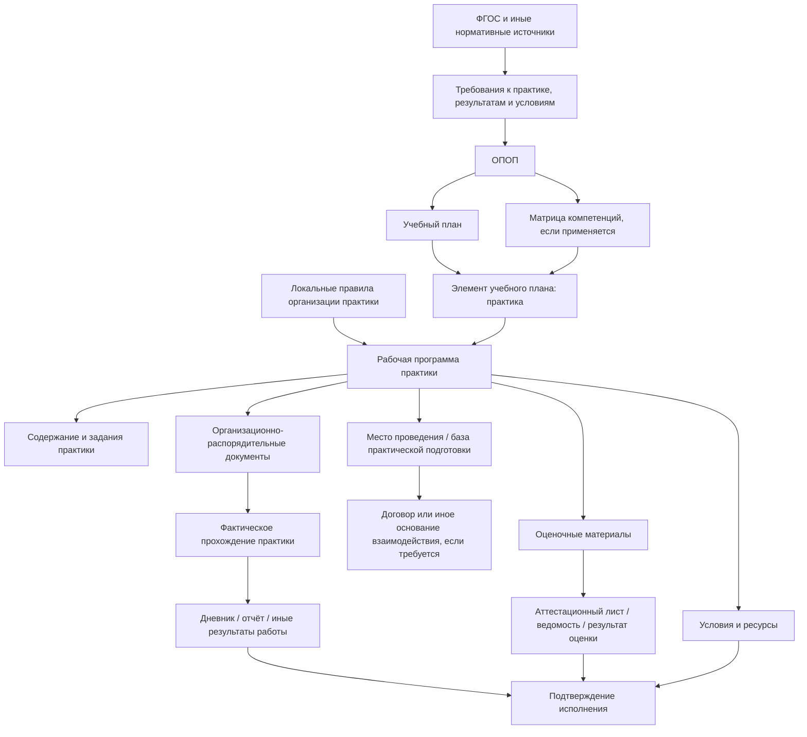
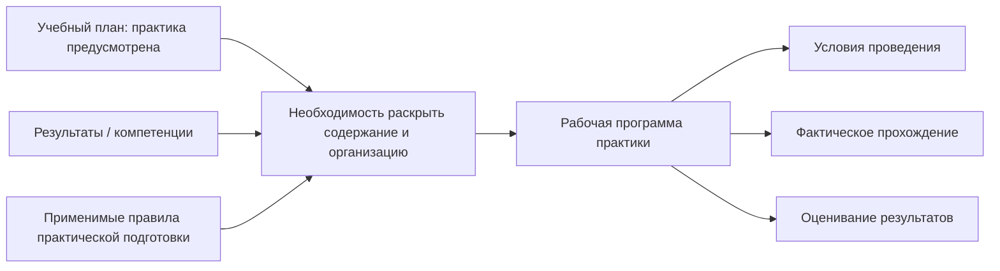
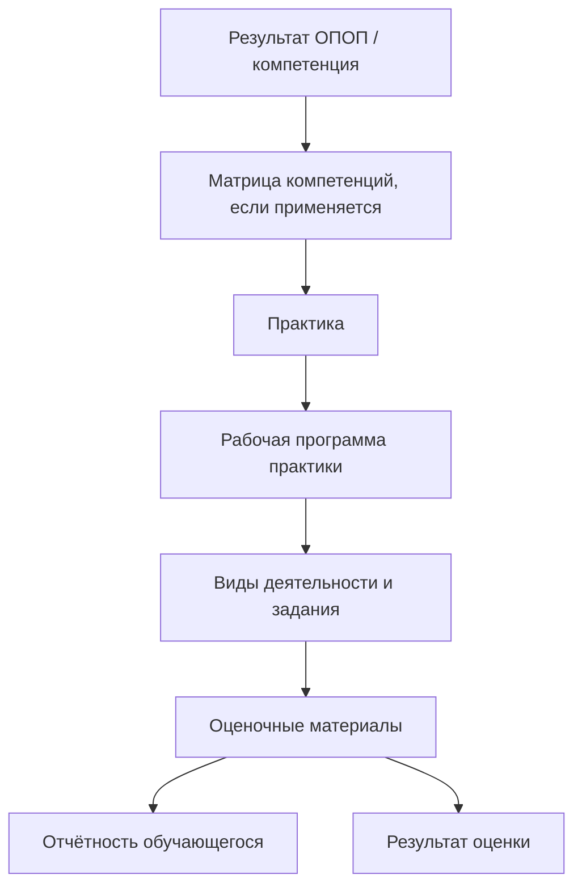
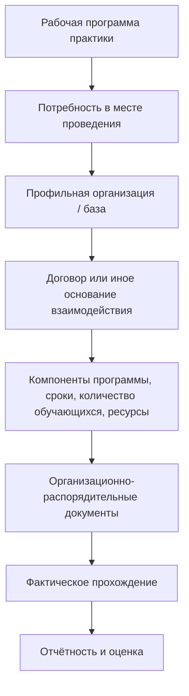
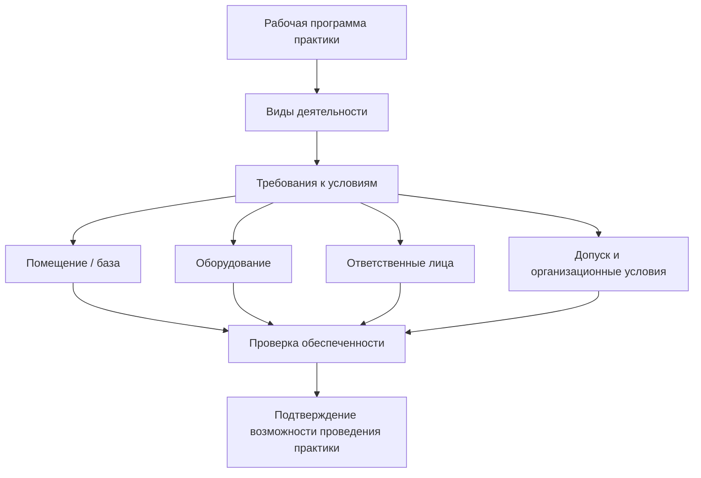
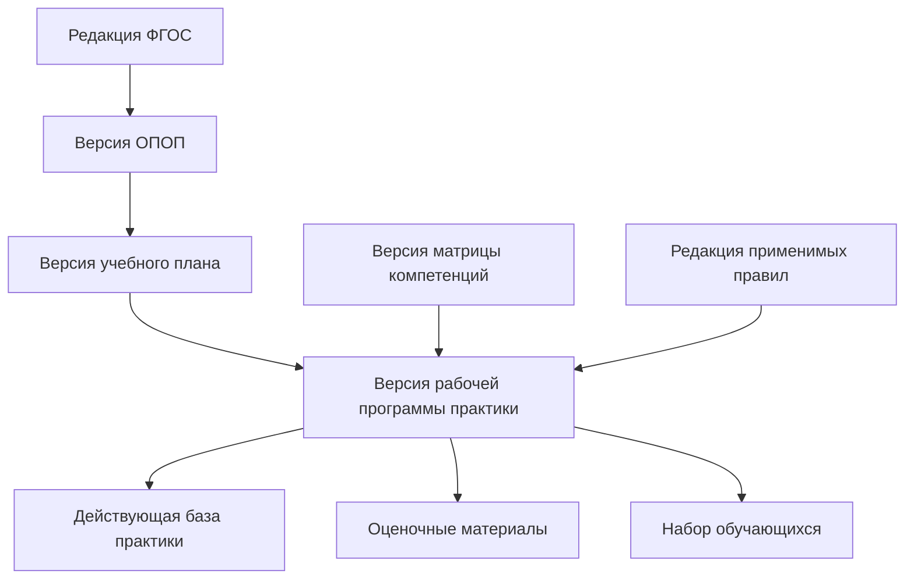
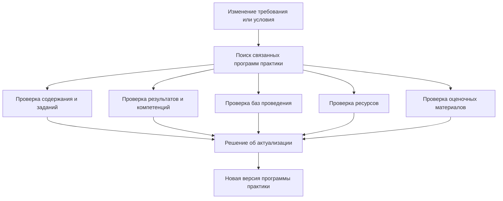

# Рабочая программа практики как документ детализации практической подготовки

## 1. Назначение страницы

Данная страница описывает рабочую программу практики как документ, посредством которого образовательная организация раскрывает содержание, организацию и оценивание конкретной практики, предусмотренной образовательной программой и учебным планом.

Страница отвечает на следующие вопросы:

- что представляет собой рабочая программа практики;
- чем практика отличается от практической подготовки;
- почему программа практики возникает на основании ОПОП, учебного плана, результатов освоения и применимых правил организации практической подготовки;
- какие документы и сведения связаны с проведением практики;
- как проследить путь от требования ФГОС до фактического прохождения практики обучающимся;
- какие условия реализации практики должны быть подтверждены;
- какие проверки могут быть автоматизированы;
- как учитывать специфику медицинского и фармацевтического образования;
- как программа практики и её связи могут быть представлены в информационной системе.

В рамках основной ветки модели рассматриваются образовательные программы высшего образования:

- программы бакалавриата;
- программы специалитета;
- программы магистратуры.

Для профессиональных образовательных программ медицинского и фармацевтического образования должна применяться отдельная ветка анализа с учётом специальных нормативных требований.

---

## 2. Используемые термины

В сфере организации обучения необходимо различать два связанных, но не тождественных понятия:

| Понятие | Содержание в модели репозитория |
|---|---|
| **Практика** | Компонент образовательной программы и учебного плана, имеющий вид, объём, сроки, содержание, планируемые результаты и форму оценки |
| **Практическая подготовка** | Форма организации образовательной деятельности, при которой обучающийся выполняет виды работ, связанные с будущей профессиональной деятельностью и направленные на формирование, закрепление и развитие практических навыков и компетенций |

### Важное правило

```text
Практика может реализовываться в форме практической подготовки.
Практическая подготовка описывает способ организации деятельности обучающегося,
а практика — конкретный компонент образовательной программы.
```

### Почему различие важно для трассировки

Если использовать данные понятия как синонимы, становится трудно установить:

- какое требование относится к структуре учебного плана;
- какое требование относится к условиям фактической работы обучающегося;
- нужен ли договор с профильной организацией;
- какие помещения и оборудование должны быть подтверждены;
- какие документы относятся к планированию, а какие — к фактическому проведению.

---

## 3. Статус рабочей программы практики

Рабочая программа практики рассматривается в данном репозитории как документ детализации практики, включённой в образовательную программу.

В зависимости от нормативной и локальной модели конкретной организации она может:

- оформляться как отдельная рабочая программа практики;
- включаться в комплект документов ОПОП;
- быть приложением к образовательной программе;
- утверждаться отдельно либо в составе комплекта документов;
- храниться в информационной системе как структурированный объект и версия документа.

### Важное уточнение

Не следует утверждать, что единая форма рабочей программы практики одинакова для всех образовательных организаций и всех видов программ.

Для реальной программы необходимо проверить:

- конкретный ФГОС;
- применимый порядок организации образовательной деятельности;
- применимые правила практической подготовки;
- локальные нормативные акты образовательной организации;
- утверждённый комплект документов конкретной ОПОП.

---

## 4. Место программы практики в системе документов

Рабочая программа практики находится на уровне детализации между учебным планом и фактической деятельностью обучающегося.



В упрощённом виде:

```text
ФГОС и иные требования
→ ОПОП
→ учебный план
→ рабочая программа практики
→ место и условия проведения
→ фактическая деятельность обучающегося
→ отчётность и оценка результата
→ подтверждение исполнения требования
```

---

## 5. Почему возникает рабочая программа практики

Учебный план может показать:

- что практика входит в программу;
- какой объём за ней закреплён;
- в каком периоде она проводится;
- какая форма контроля предусмотрена.

Однако учебный план сам по себе не отвечает на вопросы:

- какие конкретные виды деятельности выполняет обучающийся;
- какие результаты и компетенции формируются в ходе практики;
- где практика проводится;
- какие ресурсы необходимы;
- как организована практическая подготовка;
- какие задания выполняются;
- как оцениваются результаты;
- какими документами подтверждается факт прохождения.

Для ответа на эти вопросы формируется рабочая программа практики и связанные с ней документы.

### Логика возникновения



---

## 6. Назначение рабочей программы практики в модели трассировки

Рабочая программа практики является артефактом реализации требований, относящихся к практическому компоненту образовательной программы.

### Она отвечает на вопрос

> Каким образом конкретная практика, предусмотренная учебным планом, организуется, обеспечивает достижение планируемых результатов и подтверждается документами фактической реализации?

### Роль документа

| Уровень | Объект | Что определяет |
|---|---|---|
| Нормативный источник | ФГОС и применимые нормативные акты | Требования к структуре, результатам и условиям реализации программы |
| Центральный объект | ОПОП | Место практической подготовки в общей модели программы |
| Планирование | Учебный план | Наличие практики, объём, период и форму контроля |
| Распределение результатов | Матрица компетенций, если применяется | Связь практики с компетенциями или иными результатами |
| Детализация | Рабочая программа практики | Содержание, задания, организацию и оценивание практики |
| Обеспечение | База практической подготовки, помещения, оборудование, договоры | Возможность проведения практики |
| Исполнение | Приказы, дневники, отчёты, выполненные задания | Фактическое прохождение практики |
| Оценка | Аттестационный лист, ведомость, оценочные материалы | Результат освоения практики |

---

## 7. Основания разработки рабочей программы практики

Рабочая программа практики может быть связана с несколькими основаниями.

| Основание | Как влияет на программу практики |
|---|---|
| ФГОС | Задаёт применимые требования к структуре, результатам и условиям реализации ОПОП |
| ОПОП | Определяет общую модель подготовки и место практики |
| Учебный план | Закрепляет вид практики, объём, период и форму контроля |
| Матрица компетенций, если применяется | Определяет связь практики с результатами освоения |
| Порядок практической подготовки | Устанавливает правила организации практической подготовки в применимой области |
| Локальный акт организации | Определяет внутреннюю процедуру разработки, согласования и проведения практики |
| Договор с профильной организацией, если требуется | Определяет условия проведения практической подготовки вне образовательной организации |
| Ресурсные сведения | Подтверждают наличие места, оборудования и иных условий проведения |
| Оценочные материалы | Определяют механизм оценки результатов практики |

### Типы связей

| Исходный объект | Тип связи | Рабочая программа практики |
|---|---|---|
| ФГОС | `implements` через требования | Реализует относящиеся к практике требования |
| ОПОП | `details` | Детализирует практический компонент программы |
| Учебный план | `details` | Раскрывает практику, предусмотренную планом |
| Матрица компетенций | `implements` / `maps_to` | Раскрывает вклад практики в достижение результатов |
| Общий локальный акт | `applies_to` | Разрабатывается и реализуется по установленным правилам |
| Место проведения | `uses_resource` | Использует базу или подразделение для выполнения работ |
| Договор | `enables` | Обеспечивает возможность проведения практической подготовки во внешней организации |
| Оценочные материалы | `assesses` | Позволяют оценить результаты практики |

### Дополнение к типам связей

Для практической подготовки полезно добавить тип связи:

| Код связи | Значение | Пример |
|---|---|---|
| `enables` | Артефакт создаёт организационную или правовую возможность реализации другого артефакта | Договор с профильной организацией обеспечивает проведение практической подготовки на её базе |

---

## 8. Рабочая программа практики и учебный план

Учебный план является исходным компонентом, в котором практика фиксируется как часть образовательной программы.

### Что передаётся из учебного плана

| Учебный план фиксирует | Что должно быть согласовано в программе практики |
|---|---|
| Наименование практики | Наименование рабочей программы практики |
| Тип или вид практики, если отражается | Идентификация и содержание практики |
| Объём в зачётных единицах | Общая трудоёмкость |
| Объём в часах, если используется | Продолжительность деятельности |
| Семестр, курс или иной период | Сроки реализации |
| Форма контроля | Процедура оценки и итоговые документы |
| Блок программы | Место практики в структуре ОПОП |

### Проверки согласованности

| Проверка | Тип проверки | Возможный результат |
|---|---|---|
| Практика существует в учебном плане | Структурная | Найдена / отсутствует |
| Наименование и вид практики согласованы | Формальная | Соответствует / требуется уточнение |
| Объём совпадает с учебным планом | Расчётная | Соответствует / обнаружено расхождение |
| Период проведения совпадает | Формальная | Соответствует / противоречие |
| Форма контроля согласована | Формальная | Соответствует / противоречие |
| Версии документов совместимы | Версионная | Актуально / устарело |

### Цепочка


---

## 9. Практика и планируемые результаты освоения

Практика может играть особую роль в формировании результатов, поскольку позволяет обучающемуся выполнять действия, приближённые к будущей профессиональной деятельности либо непосредственно связанные с ней.

### Цепочка трассировки результата



### Что должно быть проверено

| Уровень | Что проверяется |
|---|---|
| ОПОП | Результат включён в планируемые результаты программы |
| Матрица компетенций, если используется | Практика связана с результатом |
| Рабочая программа практики | Указаны соответствующие результаты и содержание деятельности |
| Задания практики | Деятельность обучающегося позволяет формировать или оценивать результат |
| Оценочные материалы | Установлены критерии оценки |
| Документы исполнения | Зафиксированы выполненные задания и результат оценки |

### Ключевой вывод

```text
Наличие практики в учебном плане подтверждает, что практический компонент предусмотрен.
Рабочая программа и документы исполнения позволяют проверить,
каким образом практический результат достигается и оценивается.
```

---

## 10. Возможное содержание рабочей программы практики

Конкретная форма рабочей программы практики определяется применимыми нормативными и локальными документами организации.

Для модели трассировки рекомендуется учитывать следующие смысловые блоки.

| Раздел | Значение для трассировки |
|---|---|
| Наименование практики | Связь с элементом учебного плана |
| Вид и тип практики, если используется | Идентификация практического компонента |
| Место практики в структуре ОПОП | Связь с образовательной программой |
| Объём и продолжительность | Проверка согласованности с учебным планом |
| Период проведения | Связь с календарным учебным графиком |
| Цель и задачи практики | Понимание назначения практического компонента |
| Планируемые результаты | Связь с компетенциями и ОПОП |
| Содержание практики | Описание выполняемой деятельности |
| Индивидуальные или типовые задания | Механизм достижения и проверки результатов |
| Форма практической подготовки | Способ организации деятельности обучающегося |
| Место проведения | Образовательная или профильная организация, подразделение, база |
| Требуемые ресурсы | Помещения, оборудование, цифровые ресурсы и иные условия |
| Форма отчётности | Дневник, отчёт, иные результаты работы |
| Форма контроля | Механизм итоговой оценки |
| Оценочные материалы | Критерии и инструменты оценки |
| Документы утверждения и версия | Актуальность документа и область применения |

### Ограничение

Данная структура является аналитической моделью страницы, а не универсальной обязательной формой рабочей программы практики для любой организации.

---

## 11. Карточка рабочей программы практики

### 11.1. Идентификационные сведения

| Поле | Содержание |
|---|---|
| `practice_program_id` | Уникальный идентификатор рабочей программы практики |
| `title` | Наименование документа |
| `practice_id` | Идентификатор практики как компонента программы |
| `practice_title` | Наименование практики |
| `practice_kind` | Вид практики, если используется в документах программы |
| `practice_type` | Тип практики, если используется в документах программы |
| `program_id` | Образовательная программа |
| `program_version_id` | Версия ОПОП |
| `curriculum_id` | Связанный учебный план |
| `curriculum_item_id` | Элемент учебного плана, соответствующий практике |
| `education_form` | Форма обучения |
| `admission_year` | Год набора, если учитывается |
| `status` | Проект, действует, заменена, архивная |

### 11.2. Нормативные и организационные основания

| Поле | Содержание |
|---|---|
| `fgos_id` | Применимый ФГОС |
| `fgos_version` | Редакция ФГОС |
| `opop_reference` | Ссылка на ОПОП |
| `curriculum_reference` | Ссылка на учебный план |
| `competence_matrix_reference` | Ссылка на матрицу компетенций, если используется |
| `practical_training_regulation` | Применимое нормативное или локальное основание практической подготовки |
| `local_regulation_reference` | Локальный акт организации |
| `approval_document` | Документ об утверждении |
| `effective_from` | Дата начала применения |
| `effective_to` | Дата окончания применения, если установлена |

### 11.3. Параметры практики

| Поле | Содержание |
|---|---|
| `credits` | Объём в зачётных единицах |
| `hours` | Объём в часах, если используется |
| `period` | Период проведения |
| `control_form` | Форма контроля |
| `results` | Связанные планируемые результаты |
| `indicators` | Индикаторы достижения, если применяются |
| `activity_types` | Виды деятельности обучающегося |
| `reporting_forms` | Формы отчётности |
| `assessment_materials` | Оценочные материалы |
| `resource_requirements` | Требования к ресурсам и условиям |

---

## 12. Организация практической подготовки

Практическая подготовка может быть организована:

- непосредственно в образовательной организации, в том числе в её структурном подразделении, предназначенном для практической подготовки;
- в организации, осуществляющей деятельность по профилю соответствующей образовательной программы, если это допускается применимой нормативной моделью.

### В модели трассировки необходимо зафиксировать

| Вопрос | Возможный артефакт или поле |
|---|---|
| Где проводится практическая подготовка? | Карточка места проведения / базы |
| На каком основании используется внешняя организация? | Договор или иной применимый документ |
| Какие компоненты программы реализуются на базе? | Связь базы с практикой и версией ОПОП |
| Какие виды работ выполняются? | Рабочая программа практики и задания |
| Какие ресурсы предоставляет база? | Помещения, оборудование, иные условия |
| Кто отвечает за организацию? | Ответственные лица или подразделения |
| Какие сроки установлены? | График, приказ или приложение к договору |
| Чем подтверждается результат? | Отчётность, аттестационные документы |

### Цепочка при внешней базе



---

## 13. Место проведения и база практической подготовки

Для трассировки недостаточно зафиксировать только наименование организации, в которой проводится практика.

Необходимо понимать, какие конкретные условия она обеспечивает для реализации программы.

### Карточка базы практической подготовки

| Поле | Содержание |
|---|---|
| `practice_base_id` | Уникальный идентификатор базы |
| `organization_name` | Наименование организации |
| `organization_type` | Образовательная организация, профильная организация, иное допустимое место |
| `structural_unit` | Конкретное подразделение или площадка |
| `address` | Место проведения, если необходимо учитывать |
| `related_programs` | Образовательные программы, для которых используется база |
| `related_practices` | Практики, проводимые на базе |
| `available_resources` | Помещения, оборудование и иные ресурсы |
| `responsible_persons` | Ответственные лица |
| `agreement_reference` | Ссылка на договор или иное основание |
| `valid_from` | Начало применимости |
| `valid_to` | Окончание применимости |
| `status` | Действует, требует проверки, недоступна, архивная |

### Важное правило

```text
База практики подтверждает исполнение требования только тогда,
когда установлена её связь с конкретной практикой, версией программы,
необходимыми ресурсами и сроком применимости.
```

---

## 14. Договор или иное основание взаимодействия

При организации практической подготовки во внешней профильной организации может потребоваться документ, закрепляющий условия взаимодействия сторон.

### Что необходимо трассировать

| Содержание взаимодействия | Что должно быть связано в модели |
|---|---|
| Образовательная программа | ОПОП и её версия |
| Компонент программы | Конкретная практика или иной компонент |
| Количество обучающихся | Планируемая или фактическая группа |
| Сроки проведения | Период практики |
| Место проведения | База и подразделение |
| Предоставляемые ресурсы | Помещения, оборудование, технические средства |
| Ответственные стороны | Подразделения и сотрудники |
| Документальное основание | Договор, приложение, соглашение или иной применимый документ |

### Цепочка связи

```text
Рабочая программа практики
→ потребность во внешней базе
→ договор / приложение
→ закреплённое место и ресурсы
→ направление обучающихся
→ прохождение практики
→ оценка результата
```

---

## 15. Ресурсное обеспечение практики

Практика особенно тесно связана с условиями реализации образовательной программы.

### Виды ресурсов

| Вид ресурса | Примеры |
|---|---|
| Помещения | Лаборатория, мастерская, компьютерный класс, клиническое подразделение, симуляционный центр |
| Оборудование | Приборы, тренажёры, медицинское или лабораторное оборудование, программно-аппаратные комплексы |
| Материалы | Расходные материалы, образцы, учебные наборы |
| Информационные системы | Профессиональные системы, образовательная платформа, ЭИОС |
| Методические материалы | Задания, инструкции, формы дневников и отчётов |
| Кадровое сопровождение | Руководители практики от организации и от базы |
| Безопасность и допуск | Условия допуска к видам работ, инструктажи, иные применимые подтверждения |

### Трассировка условия



### Значение для 1С

Этот слой напрямую связан с учётом помещений, который уже развивается в вашем приложении:

```text
ОПОП
→ практика
→ рабочая программа практики
→ требуемый вид помещения и оборудования
→ конкретное помещение в справочнике
→ оснащение и доступность
→ проверка соответствия условиям реализации
```

---

## 16. Документы фактической реализации практики

Рабочая программа практики описывает запланированную организацию практики. Для подтверждения факта реализации необходимы дополнительные документы и записи.

| Этап | Возможные документы или сведения |
|---|---|
| Утверждение программы практики | Приказ, протокол или документ утверждения комплекта ОПОП |
| Определение базы | Договор, приложение, карточка базы, подтверждение доступности |
| Планирование сроков | Календарный учебный график, расписание или график практики |
| Направление обучающихся | Приказ или иной распорядительный документ |
| Назначение руководителей | Приказ, распоряжение, сведения в системе |
| Выполнение заданий | Дневник, записи о выполненных работах, результаты деятельности |
| Подготовка отчётности | Отчёт обучающегося, приложения, материалы практики |
| Оценивание | Аттестационный лист, ведомость, результаты контроля |
| Завершение | Зафиксированный результат освоения практики |

### Отличие планирования от исполнения

| Плановый артефакт | Подтверждение исполнения |
|---|---|
| Учебный план предусматривает практику | Приказ подтверждает направление обучающегося |
| Рабочая программа описывает задания | Дневник или отчёт подтверждает их выполнение |
| Программа устанавливает форму оценки | Ведомость фиксирует результат |
| Указана база проведения | Документы и записи подтверждают фактическое проведение на базе |
| Указаны требуемые ресурсы | Проверка показывает их наличие и применимость |

---

## 17. Оценивание результатов практики

Практика должна быть связана с механизмом проверки результатов, которые она формирует или оценивает.

### Цепочка оценивания


### Возможные элементы оценки

| Элемент | Роль |
|---|---|
| Задание практики | Определяет деятельность, которую должен выполнить обучающийся |
| Дневник | Отражает ход выполнения деятельности |
| Отчёт | Обобщает результаты практики |
| Характеристика или отзыв, если используется | Содержит оценку деятельности со стороны руководителя |
| Аттестационный лист | Фиксирует оценку результатов по установленным критериям |
| Ведомость | Подтверждает итоговый результат контроля |

### Проверки

| Проверка | Тип |
|---|---|
| Для практики предусмотрена форма контроля | Формальная |
| Для результатов практики имеются оценочные материалы | Документарная |
| Задания связаны с заявленными результатами | Структурная и экспертная |
| Критерии позволяют оценить результат | Экспертная |
| Обучающийся предоставил требуемую отчётность | Документарная |
| Результат зафиксирован | Документарная / процессная |

---

## 18. Особая ветка: медицинское и фармацевтическое образование

Для образовательных программ медицинского и фармацевтического образования практическая подготовка имеет специальную нормативную и ресурсную значимость.

### Правило репозитория

```text
Общая страница о программе практики описывает универсальную модель трассировки.
Для медицинского и фармацевтического образования требуется отдельная страница,
учитывающая специальные правила, кадровые условия,
материально-техническое обеспечение и процедуры подтверждения соответствия.
```

### Почему выделяется отдельная ветка

| Причина | Значение для трассировки |
|---|---|
| Общий порядок практической подготовки имеет исключение для медицинских и фармацевтических программ | Нельзя автоматически переносить общий процесс на медицинскую ОПОП |
| Практическая подготовка связана с медицинской или фармацевтической деятельностью | Требуется учитывать особенности допуска, базы и условий |
| Установлен специальный контур подтверждения соответствия кадровым и материально-техническим требованиям | В модели должны появиться заключения, сведения и проверки обеспеченности |
| Помещения и оборудование приобретают критическое значение | Учёт ресурсов в информационной системе становится частью трассировки требований |

### Будущая страница

Для развития репозитория рекомендуется предусмотреть файл:

```text
docs/04-special-cases/medical-pharmaceutical-practical-training.md
```

В нём должны быть отдельно описаны:

- специальные нормативные источники;
- применимость к медицинским и фармацевтическим образовательным программам;
- требования к базе практической подготовки;
- кадровые и материально-технические сведения;
- подтверждение соответствия организации;
- связь с помещениями, оборудованием и медицинскими подразделениями;
- возможная автоматизация в 1С.

---

## 19. Версионность рабочей программы практики

### 19.1. Почему программа практики должна версионироваться

Рабочая программа практики может изменяться вследствие:

- изменения ФГОС;
- изменения ОПОП;
- изменения учебного плана;
- изменения матрицы компетенций;
- изменения нормативных правил практической подготовки;
- изменения базы проведения;
- изменения оборудования и условий реализации;
- изменения формы контроля;
- результатов внутренней оценки качества;
- создания документов для нового года набора.

### 19.2. Модель версионности



### 19.3. Минимальные сведения о версии

| Поле | Содержание |
|---|---|
| `practice_program_version_id` | Идентификатор версии рабочей программы практики |
| `practice_program_id` | Рабочая программа как объект |
| `version_number` | Номер версии |
| `program_version_id` | Версия ОПОП |
| `curriculum_version_id` | Версия учебного плана |
| `matrix_version_id` | Версия матрицы компетенций, если применяется |
| `regulation_version` | Редакция применимого порядка или локального акта |
| `practice_base_links` | Действующие базы проведения |
| `applicable_cohorts` | Наборы, для которых применяется версия |
| `effective_from` | Дата начала применения |
| `approval_document` | Документ утверждения |
| `change_reason` | Причина изменения |
| `previous_version_id` | Предыдущая версия |
| `status` | Проект, утверждена, заменена, архивная |

---

## 20. Актуализация при изменении требований или условий

### 20.1. Сценарий анализа влияния



### 20.2. Что вызывает проверку документа

| Изменение | Что необходимо проверить |
|---|---|
| Изменился ФГОС | Объём практики, результаты, условия реализации |
| Изменилась ОПОП | Назначение и место практики в программе |
| Изменился учебный план | Вид, объём, период и форма контроля |
| Изменилась матрица компетенций | Связь практики с результатами |
| Изменились правила практической подготовки | Организационную процедуру и документы исполнения |
| Изменилась база практики | Возможность проведения и ресурсную обеспеченность |
| Изменилось оборудование | Выполнимость предусмотренных видов деятельности |
| Изменились оценочные материалы | Проверяемость результатов |
| Выявлено несоответствие | Необходимость корректирующих действий |

---

## 21. Возможные проверки рабочей программы практики

### 21.1. Проверки, пригодные для автоматизации

| Проверка | Что выявляется |
|---|---|
| Практика существует в учебном плане | Ошибочные или отсутствующие связи |
| Объём и период совпадают с планом | Числовые и временные противоречия |
| Форма контроля согласована с планом | Формальные несоответствия |
| Программа связана с действующей версией ОПОП | Устаревшая редакция |
| Указанные результаты присутствуют в ОПОП или матрице | Несогласованные результаты |
| Для практики указана база проведения, когда она требуется | Пробел в организационном обеспечении |
| Для внешней базы имеется действующее основание взаимодействия | Отсутствующий или недействующий договор |
| Для практики имеются оценочные материалы | Пробел в оценивании |
| Указанные помещения и оборудование существуют в справочнике | Ошибочные ссылки на ресурсы |
| Имеются документы фактического прохождения | Неполная доказательная база |

### 21.2. Проверки, требующие эксперта

| Проверка | Почему требуется эксперт |
|---|---|
| Соответствуют ли виды деятельности заявленным результатам | Нужен анализ содержания практики |
| Достаточны ли задания для формирования компетенции | Нужна профессиональная оценка |
| Подходит ли база практической подготовки для программы | Нужна оценка профиля и условий |
| Достаточно ли оборудования для выполнения работ | Нужна оценка конкретной деятельности |
| Корректны ли критерии оценки | Нужен анализ оценочных материалов |
| Выполнены ли специальные условия медицинской программы | Требуется профильная и правовая проверка |

### Принцип автоматизации

```text
Система может выявить отсутствие документов, несогласованность параметров
и неполноту связей.
Содержательное соответствие практики профессиональной подготовке
подтверждается экспертной проверкой.
```

---

## 22. Матрица трассировки рабочей программы практики

### 22.1. Шаблон

| ID требования | Источник | Требование | Элемент программы практики | Связанный артефакт | Подтверждение | Метод проверки | Статус |
|---|---|---|---|---|---|---|---|
|  |  |  |  |  |  |  |  |

### 22.2. Учебный пример

> Формулировки приведены для демонстрации модели. Для реального применения необходимо использовать конкретную редакцию ФГОС, утверждённую ОПОП, учебный план, применимые правила и действующую рабочую программу практики.

| ID требования | Требование | Элемент программы практики | Связанный артефакт | Подтверждение | Проверка | Статус |
|---|---|---|---|---|---|---|
| `PRACTICE-STRUCT-001` | Практика должна быть предусмотрена образовательной программой | Идентификация и место практики | Учебный план | Наличие практики в утверждённом плане | Структурная | `not_analyzed` |
| `PRACTICE-VOLUME-001` | Объём практики должен соответствовать учебному плану и применимым требованиям | Объём и продолжительность | Учебный план | Результат сопоставления объёма | Расчётная | `not_analyzed` |
| `PRACTICE-RESULT-001` | Практика должна обеспечивать вклад в закреплённые результаты | Раздел планируемых результатов и задания | Матрица компетенций / ОПОП | Оценочные материалы и отчётность | Структурная и содержательная | `not_analyzed` |
| `PRACTICE-BASE-001` | Для проведения практики должна быть обеспечена применимая база | Место проведения | Карточка базы / договор | Действующее основание использования базы | Ресурсная и документарная | `not_analyzed` |
| `PRACTICE-RESOURCE-001` | Для выполнения заданий должны быть доступны необходимые ресурсы | Условия реализации | Помещения и оборудование | Проверка обеспеченности | Ресурсная | `not_analyzed` |
| `PRACTICE-ASSESS-001` | Результаты практики должны быть оценены | Форма контроля и критерии | Оценочные материалы | Аттестационный лист / ведомость | Документарная и экспертная | `not_analyzed` |
| `PRACTICE-FACT-001` | Факт прохождения практики должен быть подтверждён | Отчётность | Приказ, дневник, отчёт | Комплект документов исполнения | Документарная | `not_analyzed` |

---

## 23. Рабочая программа практики как объект информационной системы

Для автоматизации рабочую программу практики целесообразно хранить как структурированный объект, связанный с требованиями, учебным планом, ресурсами, документами проведения и результатами.

### 23.1. Возможные объекты данных

| Объект | Назначение |
|---|---|
| Практика | Компонент образовательной программы |
| Рабочая программа практики | Документ детализации компонента |
| Версия программы практики | Учёт актуальности и применимости |
| Учебный план | Основание включения практики |
| Компетенция или результат | Связь практики с планируемыми результатами |
| Вид деятельности | То, что выполняет обучающийся |
| Задание практики | Конкретизация деятельности |
| База практической подготовки | Место проведения |
| Договор или основание | Правовое и организационное обеспечение внешней базы |
| Помещение | Ресурс проведения практики |
| Оборудование | Ресурс выполнения работ |
| Ответственное лицо | Руководитель или координатор практики |
| Оценочный материал | Механизм оценки |
| Документ прохождения | Приказ, дневник, отчёт, ведомость |
| Проверка соответствия | Результат контроля покрытия и обеспеченности |

### 23.2. Возможные функции системы

| Функция | Назначение |
|---|---|
| Регистрация программы практики | Создать карточку и версию документа |
| Привязка к учебному плану | Подтвердить наличие практики в ОПОП |
| Привязка к результатам | Построить трассировку компетенций |
| Регистрация базы проведения | Зафиксировать место практической подготовки |
| Учёт договоров | Проверить возможность использования внешней базы |
| Привязка помещений и оборудования | Подтвердить ресурсные условия |
| Учёт приказов и отчётности | Подтвердить фактическое прохождение |
| Привязка оценочных материалов | Подтвердить механизм оценки |
| Проверка комплектности | Выявить недостающие документы и связи |
| Анализ влияния изменений | Найти программы практик и базы, требующие пересмотра |

---

## 24. Возможная модель для 1С

При реализации в 1С рабочая программа практики и связанные артефакты могут быть отражены следующими объектами.

| Объект 1С | Возможное назначение |
|---|---|
| Справочник `ОбразовательныеПрограммы` | Хранение ОПОП |
| Справочник `ВерсииОбразовательныхПрограмм` | Контекст применимости документов |
| Документ или справочник `УчебныеПланы` | Источник практик программы |
| Справочник `Практики` | Единый перечень практик |
| Документ или справочник `РабочиеПрограммыПрактик` | Карточки и версии программ практик |
| Справочник `БазыПрактическойПодготовки` | Организации и подразделения, где проводится практика |
| Справочник `Помещения` | Учёт помещений, используемых для практической подготовки |
| Справочник `Оборудование` | Учёт ресурсов баз и помещений |
| Документ `ДоговорСПрофильнойОрганизацией` | Основание внешней практической подготовки, если применяется |
| Документ `НаправлениеНаПрактику` | Фиксация направления обучающихся |
| Документ `РезультатыПрактики` | Отчётность и итоговая оценка |
| Регистр сведений `РезультатыПоПрактикам` | Связь практик с компетенциями |
| Регистр сведений `РесурсыПрактик` | Связь практик с базами, помещениями и оборудованием |
| Регистр сведений `ПроверкиОбеспеченностиПрактики` | Результаты ресурсных проверок |
| Документ `АнализВлиянияИзменений` | Пересмотр документов при изменении требований |

### Пример пользовательского сценария

```text
Пользователь открывает версию ОПОП
→ выбирает практику из учебного плана
→ открывает связанную рабочую программу практики
→ система показывает:
   - объём и период проведения;
   - связанные результаты освоения;
   - базу проведения;
   - действующие договоры или иные основания;
   - требуемые помещения и оборудование;
   - оценочные материалы;
   - документы фактического прохождения;
→ система выполняет формальные проверки комплектности
→ эксперт фиксирует результат содержательной и ресурсной оценки.
```

---

## 25. Ограничения страницы

Данная страница описывает рабочую программу практики как тип документа и артефакт трассировки.

Она не устанавливает:

- единую обязательную форму рабочей программы практики для всех организаций;
- универсальный перечень документов проведения практики независимо от применимых правил;
- применимость общего порядка практической подготовки к медицинским и фармацевтическим программам;
- автоматическое доказательство качества практической подготовки только на основании наличия документов;
- универсальные требования к помещениям, оборудованию и базам для всех специальностей.

Для применения модели к реальной образовательной программе необходимо:

- определить конкретный ФГОС;
- установить тип программы и применимые нормативные правила;
- проверить, относится ли программа к медицинскому или фармацевтическому образованию;
- получить утверждённую ОПОП и учебный план;
- изучить локальные правила организации практики;
- проверить рабочую программу практики;
- установить основания использования базы проведения;
- сопоставить практику с ресурсами и документами фактической реализации;
- зафиксировать результаты формальной и экспертной проверки.

---

## 26. Нормативная и организационная опора страницы

При разработке и последующей актуализации данной страницы должны учитываться:

| Источник | Значение для страницы |
|---|---|
| Федеральный закон от 29.12.2012 № 273-ФЗ «Об образовании в Российской Федерации» | Определяет образовательную программу, практическую подготовку и общие требования к реализации образовательных программ |
| Федеральный закон № 273-ФЗ, статья 13 | Определяет общие положения об организации практической подготовки |
| Конкретный ФГОС по направлению подготовки или специальности | Определяет применимые требования к структуре, результатам и условиям конкретной ОПОП |
| Приказ Минобрнауки России от 06.04.2021 № 245 | Учитывается для программ бакалавриата, специалитета и магистратуры |
| Приказ Минобрнауки России № 885 и Минпросвещения России № 390 от 05.08.2020 | Устанавливает общий порядок организации практической подготовки в области своей применимости |
| Локальный акт образовательной организации о практической подготовке | Определяет внутренний порядок разработки, проведения и документирования практики |
| Учебный план конкретной ОПОП | Определяет наличие, объём, период и форму контроля практики |
| Матрица компетенций, если применяется | Определяет связь практики с планируемыми результатами |
| Оценочные материалы практики | Позволяют проверить результаты практики |

### Специальное примечание для медицинских и фармацевтических программ

Для профессиональных образовательных программ медицинского и фармацевтического образования необходимо отдельно проверять специальные нормативные источники, поскольку общий порядок практической подготовки не должен автоматически применяться к данной категории программ.

При дальнейшем развитии репозитория медицинская и фармацевтическая ветка должна учитывать специальные требования к кадровому и материально-техническому обеспечению образовательной деятельности в части практической подготовки и документы, подтверждающие соответствие организации таким требованиям.

> Перед применением модели к реальной программе необходимо проверить действующие редакции нормативных источников и локальные документы конкретной образовательной организации.

---

## 27. Следующие связанные страницы

После описания рабочей программы практики логично перейти к документам итоговой оценки и к специальной ветке, значимой для медицинского университета.

| Страница | Назначение |
|---|---|
| `docs/02-organization-documents/gia-program.md` | Программа ГИА как документ итоговой оценки подготовки |
| `docs/02-organization-documents/assessment-materials.md` | Оценочные материалы как механизм проверки результатов |
| `docs/02-organization-documents/academic-calendar.md` | Календарный учебный график как распределение периодов обучения, практик и ГИА |
| `docs/03-traceability-examples/practice-traceability.md` | Практический пример трассировки требования к практике |
| `docs/03-traceability-examples/facilities-traceability.md` | Пример связи практики с помещениями и оборудованием |
| `docs/04-special-cases/medical-pharmaceutical-practical-training.md` | Специальная модель практической подготовки для медицинского и фармацевтического образования |

---

## 28. Итог

Рабочая программа практики является документом, раскрывающим реализацию конкретного практического компонента образовательной программы.

```text
ФГОС и иные применимые требования
→ ОПОП
→ учебный план и результаты освоения
→ рабочая программа практики
→ база, ресурсы, задания и оценочные материалы
→ фактическое прохождение практики
→ отчётность и оценка
→ подтверждение исполнения требований
```

Для модели трассировки программа практики особенно важна, потому что она:

- связывает структурное требование о наличии практики с её реальным содержанием;
- показывает вклад практики в достижение планируемых результатов;
- связывает образовательные документы с базами, помещениями и оборудованием;
- выводит модель от планирования к фактическим подтверждениям исполнения;
- требует отдельной нормативной ветки для медицинского и фармацевтического образования;
- в перспективе может стать одним из основных объектов автоматизации контроля условий реализации ОПОП в информационной системе.
